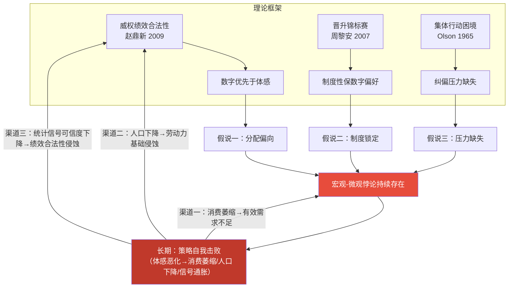

> **摘要**：中国经济呈现一组引人注目的悖论：GDP维持约5%增长，但消费者信心跌至历史低位，青年失业率超17%，CPI趋近于零。为什么宏观总量的扩张未能传导为微观福利的改善？本文论证：在威权绩效合法性体制下[^1]，决策层系统性地偏向"保数字"而非"保体感"。这一偏向源于三个结构性条件——GDP数字是绩效合法性的核心载体、官僚激励与财政工具天然偏向投资端、分散化的微观不满短期内难以聚合为政治挑战。本文推导三个可检验假说，以多维度描述性证据评估其经验一致性，并揭示该策略内含的自我击败逻辑。
>
> **关键词**：绩效合法性；威权韧性；中国经济；宏观-微观悖论；投资驱动增长

[^1]: 本文采用"威权"（authoritarian）这一术语，遵循比较政治学的主流分类传统（Linz, 2000; Geddes et al., 2014）。学界对中国体制存在多种替代性标签，如"发展型国家"（developmental state）、"党国资本主义"（party-state capitalism）、"协商式威权"（consultative authoritarianism, He & Warren, 2011）等。本文选择"威权"是因为其直接指向权力来源与合法性基础的问题——本文的核心关切正在于此。选择这一术语不意味着忽视中国体制的内部多样性和适应性。

---

## 一、导论：一个需要解释的悖论

### 1.1 经验困惑

2024–2025年的中国经济数据呈现一组难以调和的矛盾：

| 维度 | 宏观数字 | 微观体感 |
|------|---------|---------|
| 增长 | GDP增长约5%（2024与2025年均为5.0%） | 消费者信心指数90.3，低于历史均值近20点 |
| 就业 | “就业形势总体稳定”（官方表述） | 青年失业率15.7–18.8%，为全国均值3倍以上 |
| 物价 | GDP实际增长扣除通胀后表现亮眼 | CPI全年为0%，GDP平减指数连续三年为负 |
| 产业 | 新能源、AI、先进制造强劲扩张 | 房地产持续五年下行，约8000万套空置 |
| 收入 | 人均可支配收入实际增长5.1% | 家庭收入增长预期降至1.4%，预防性储蓄高企 |

经济学的常规解释——周期性调整、结构转型阵痛——可以部分说明上述分裂，但无法回答一个更根本的问题：**为什么政策体系持续偏向维护宏观数字，而非改善微观体感？** 这是一个政治经济学的问题，不是一个纯经济学的问题。

### 1.2 本文的核心命题

本文的核心论点可以简明地表述如下：

> **在威权绩效合法性体制下，决策层面临“保总量数字”与“保分配体感”之间的结构性张力。由于总量数字是绩效合法性的核心载体，现有官僚激励与财政工具天然偏向投资端，而分散化的微观不满短期内难以聚合为政治挑战，决策层系统性地偏向“保数字”。然而，这一策略内含不可持续性：体感的持续恶化终将通过消费萎缩、人口下降和信号贬值等渠道，反噬数字本身。**

### 1.3 研究策略与识别边界

本文的论证分五步展开：构建理论框架并推导可检验假说（第二节）；分三章呈现描述性证据（第三至五节）；讨论策略的内生不可持续性（第六节）；提出结论与后续识别路径（第七节）。

**方法论说明**。本文为探索性定性分析，经验部分采用描述性证据并置（descriptive juxtaposition）——将宏观指标与微观指标进行系统对照，辅以跨国比较和案例分析。这一方法用于识别模式并评估理论预期与经验观察的一致性，**不构成因果识别**。本文无反事实设计、准实验策略或面板计量检验。为控制过度推断风险，后文对每个假说给出可证伪条件（§2.3），并在结论部分提供最小可行识别设计（§7.4）。

> **数据说明：2025年更新（截至2025年12月，国家统计局2026年1月公布）**
>
> 为避免仅依赖2024年截面，本文在各章节相关处补充了2025年数据，完整汇总见附录A数据表。关键指标如下：GDP实际增速维持5.0%；三大需求贡献率为最终消费52.0%、资本形成18.6%、净出口29.4%（需注意"贡献率"与"占比"系不同口径，下同）；城镇调查失业率年均5.2%；12月CPI同比+0.1%（核心CPI +0.4%）；PPI同比-2.3%。
>
> 上述数据显示：2025年宏观数字延续稳态，但低通胀与就业结构压力未完全消退。本文据此将核心结论限定为"结构性张力持续存在"，而非"所有微观指标单向恶化"。

## 二、理论框架与假说推导

### 2.1 文献基础

本文的理论框架整合三组文献。

**绩效合法性文献**。赵鼎新（2009）论证，当意识形态合法性和程序合法性供给不足时，“交成绩单”成为执政党维系权力的核心机制。Dickson（2016）进一步指出，这种依赖构成“独裁者的困境”——经济增长既是统治的基础，也是其最大的脆弱性。本文追问一个这些文献尚未充分回答的问题：当绩效合法性的“数字”表征与“体感”表征发生背离时，威权体制会优先保哪一个？

**威权韧性文献**。Nathan（2003）和Shambaugh（2008）分析了中国威权体制的适应性来源。本文识别了一个未被充分讨论的韧性机制：分散化不满的“政治无害性”——当微观痛苦高度个体化且缺乏组织化聚合通道时，体制面临的压力远低于其严重程度所暗示的水平。

**中国增长模式文献**。Pettis（2013）分析了投资驱动型增长的内在失衡，周黎安（2007）揭示了“晋升锦标赛”如何系统性地激励投资扩张。本文将这些洞见整合为“保数字”偏好的制度性根源。

### 2.2 核心概念界定

| 概念 | 定义 | 操作化指标 | 分析层级 |
|------|------|-----------|--------|
| **"数字"** | 可汇总、可传播、可操控的总量经济指标 | GDP增长率、工业增加值、出口总额、固定资产投资 | 国家层面 |
| **"体感"（第一层：主观态度）** | 民众对自身经济处境的直接主观感受 | 消费者信心指数、家庭收入增长预期、购房意愿 | 概念指向个体，本文数据为汇总均值 |
| **"体感"（第二层：客观处境）** | 影响上述主观感受的客观经济条件 | 青年失业率、CPI/GDP平减指数、家庭资产价值变动 | 国家/城市层面 |
| **"保数字"偏好** | 政策资源系统性地偏向维护总量指标的倾向 | 投资占GDP比重、财政支出结构、产业政策方向、统计口径调整 | 国家层面 |

**两层“体感”的理论关系与生态谬误风险**。“体感”指标分为主观态度和客观处境两层，两者在理论上可能背离（如Hirschman的“隍道效应”）。本文的悖论核心在于**主客观双重体感指标均与宏观数字背离**，这削弱了“发展阶段论”等替代解释的说服力。本文以消费者信心指数作为体感的主要代理变量，辅以青年失业率和CPI等客观结构指标。需注意，“体感”指向个体层面，但本文经验数据主要为国家层面汇总，存在生态谬误风险。本文仅将汇总数据视为代理变量，不做个体层面的因果推断。

**“可操控性”与信号可信度**。一个自然的质疑是：如果数字可被系统性操控，其作为绩效信号的可信度为何不会迅速下降（Spence, 1973）？这一张力恰恰揭示了“保数字”策略短期有效与长期自我击败的内在逻辑。短期内，GDP数字仍然有效，因为国际机构的背书、替代信号的缺失以及统计偏差的模糊性共同支撑了其可信度。然而长期来看，维护成本上升、口径调整频繁化将使数字信号经历“信号通胀”（signal inflation），最终侵蚀绩效合法性的信息基础（详见§6.2）。

### 2.3 因果机制与假说推导

核心命题包含三个层次的因果主张，由此推导三个可检验假说。

**“保数字”偏向的主体性问题**。“偏向”究竟是决策层的有意识战略选择，还是官僚激励与制度路径依赖的无意识系统结果？本文的立场是：两种机制并非互斥，且各有侧重——有意识选择在绩效合法性的逻辑层面（假说一）更具解释力，制度惯性在政策工具选择层面（假说二）更具解释力，而纠偏压力的缺失（假说三）则使两种机制均得以持续。这一区分具有政策含义：若偏向主要来自有意识策略，则纠偏依赖政治意志的转变；若主要来自制度惯性，则纠偏需要制度结构的重塑。

**因果主张一**：绩效合法性的逻辑决定了"数字"优先于"体感"。

GDP增长率作为绩效合法性的载体，具有体感所不具备的三个属性：**全局可见性**（一个数字汇总全国经济状况）、**国际可比性**（在大国竞争中直接对标）、**可操控性**（可通过投资快速拉动）。体感则是分散的、碎片化的、难以汇总的。这一不对称性决定了：

> **假说一（分配偏向假说）**：在政策资源分配中，投资端（保数字）将系统性地获得高于消费端（保体感）的份额，且这一偏向不随体感恶化而显著纠正。
>
> *核心观测指标（不与假说二/三重叠）*：家庭消费占GDP比重、投资（GFCF）占GDP比重、跨国消费份额比较。
>
> *与假说二的判别*：假说一关注**结果分配的结构**（谁获得了增长的果实），假说二关注**政策工具的选择过程**（决策者用什么工具应对压力）。若投资占比高但财政刺激主要以转移支付形式实施，则假说一成立但假说二不成立。

**因果主张二**：官僚激励结构和财政工具的路径依赖强化了"保数字"偏好。

晋升锦标赛（周黎安，2007）使地方官员的政治生涯与GDP增长挂钩。地方政府熟练掌握的政策工具是投资和基建，而非直接的居民福利改善。土地财政模式创造了"卖地→投资→GDP→晋升"的自我强化循环。这意味着：

> **假说二（制度锁定假说）**：即使在体感显著恶化的时期，财政支出结构和政策工具选择仍将保持对投资端的偏向，体现为"保数字"政策力度大、速度快，"保体感"政策力度小、效果弱。
>
> *核心观测指标（不与假说一/三重叠）*：财政支出中基建/产业补贴 vs 民生（教育/医疗/社保）的比例、刺激方案构成（投资端 vs 转移支付）、政策工具出台速度差异。
>
> *与假说一的判别*：假说二的独立贡献在于解释政策偏向的**制度成因**（官僚激励、财政工具路径依赖），而非仅描述偏向的存在。若分配偏向存在但可完全由发展阶段或经济效率逻辑解释，则假说一成立但假说二不必然成立。

**因果主张三**：分散化不满的"政治无害性"降低了纠偏压力。

在缺乏独立工会、反对党和自由媒体的条件下，微观不满通过Olson（1965）意义上的集体行动困境被原子化。信息管控阻止了"原来大家都很惨"的集体认知扩散。个体倾向于选择Hirschman（1970）意义上的"退出"（躺平、润学）而非"呼吁"（protest）。这意味着：

> **假说三（压力缺失假说）**：微观体感的恶化不会在短期内产生足以改变政策方向的政治压力，分散化不满将表现为个体化的退出行为（躺平、消费降级、推迟婚育），而非组织化的集体行动。
>
> *核心观测指标（不与假说一/二重叠）*：不满表达方式分布（退出 vs 呼吁行为比）、社交媒体经济讨论的审查强度、官方叙事中"数字锚定" vs "体感回应"的频率。
>
> *与假说一/二的判别*：假说三解释的是**纠偏压力为何缺失**（需求侧的政治动力学），而非分配偏向的存在（假说一）或政策工具的锁定（假说二）。其判别式预测为：若出现组织化的"呼吁"行为且政策方向随之调整，则假说三被削弱，但假说一和假说二仍可能成立。

> **三假说的联合判别框架**。上述三个假说虽然在理论上指向不同的因果层次——分配结果（假说一）、制度过程（假说二）和政治动力学（假说三），但在经验叙事中确实共享部分宏观事实（如低消费占比、投资偏好政策）。为提高可区分性，本文在每个假说的经验章节中明确标注哪些证据是该假说的**独有预测**（unique prediction），哪些是与其他假说**共享的背景事实**（shared background）。严格区分三个假说的边际贡献仍有待于未来的定量识别策略（见§7.4）。

为避免理论不可证伪，本文进一步给出反事实预期：

| 假说 | 若假说成立应观察到 | 若出现以下证据则假说被削弱/驳斥 |
|------|--------------------|-------------------------------|
| 假说一（分配偏向） | 体感恶化期内，消费占比无显著抬升，投资占比保持高位 | 连续多个年度出现消费占比系统性上升且财政资源同步由投资端转向居民端 |
| 假说二（制度锁定） | 增长承压时，政策工具优先动员基建、产业补贴、债务展期 | 在同等冲击下，直接转移支付和社保扩张成为主导工具且持续化 |
| 假说三（压力缺失） | 不满主要以退出型行为表达，难形成组织化政策压力 | 退出行为下降并伴随可持续的组织化"呼吁"，且政策方向出现可归因转向 |

**为何不将"体感"政治化？** 值得追问的是：为什么当前体制不主动将分散化的微观不满政治化，以此获取信息和强化合法性？历史上，中国共产党曾熟练运用"诉苦"等政治技术，将个体痛苦转化为集体叙事和政治动员资源（参见Polletta, 2006, *It Was Like a Fever*；裴宜理对"情感政治"的分析）。然而，在当前市场化社会中，主动开启"体感政治化"对执政者是高风险策略：（1）市场化改革使个体更倾向于自我归因，这种归因模式客观上有利于短期稳定；（2）一旦政治化微观不满，归因对象可能上移到政策制定层级，显著提高治理不确定性；（3）现有信息治理架构以抑制集体叙事扩散为目标，主动逆转该逻辑会产生较高官僚摩擦。因此，本文将其解释为一个收益-风险比偏低的治理选择，而非单纯的信息缺失。

## 三、假说一的一致性证据：分配偏向——"谁从增长中获益？"

### 3.1 评估逻辑

假说一预测：政策资源系统性地偏向投资端（保数字），消费端（保体感）被长期压缩。如果这一假说成立，我们应当观察到：（a）家庭消费占GDP比重显著低于国际水平；（b）投资占GDP比重显著高于国际水平；（c）这一结构在体感恶化期间未见显著纠正。

### 3.2 描述性证据

**证据3.2.1：GDP构成的极端扭曲**

| GDP构成 | 中国（2024年） | OECD平均（2023年） | 偏差 |
|---------|---------------|----------|------|
| 家庭消费占比 | **39.9%** | 57.2%（OECD 38国简单平均） | **-17.3个百分点** |
| 投资（GFCF）占比 | **40.6%** | 22.8%（OECD 38国简单平均） | **+17.8个百分点** |
| 政府消费占比 | 16.6% | 17.9%（OECD 38国简单平均） | -1.3个百分点 |

> **数据来源与口径**：中国数据来自国家统计局《2024年国民经济和社会发展统计公报》（数据截至2024年12月，2025年2月发布）。OECD平均数据来自OECD National Accounts Statistics（OECD.Stat, SNA Table 1, Expenditure approach, 2023年数据，数据截至2023年12月），取OECD 38国简单平均。OECD各国家庭消费占比的范围为45.0%（卢森堡）至72.1%（希腊），中位数56.3%。计算方式：各国家庭最终消费支出/GDP的算术平均值。**注：中国与OECD数据年份差一年（2024 vs 2023），因2024年OECD完整数据尚未发布，不影响结构性比较结论。**

中国是全球主要经济体中家庭消费占GDP比重最低的国家之一。每1个百分点的GDP增长中，流向居民部门的份额显著低于OECD样本均值。

**证据3.2.2：金融抑制作为隐性税收**

人为压低存款利率将居民储蓄以低成本转移至投资部门。这一机制实质上是为"保数字"向居民部门征收的隐性税——Pettis（2013）估计其规模相当于GDP的数个百分点。居民部门不仅在增量分配中被边缘化，其存量财富也在通过金融抑制向投资端转移。

**证据3.2.3：体感恶化未触发纠偏**

2024年人均可支配收入41,314元，实际增长5.1%（国家统计局《2024年国民经济和社会发展统计公报》，数据截至2024年12月），但家庭收入增长**预期**降至1.4%（McKinsey China, *2025 China Consumer Report*, 2025年1月发布，基于2024年第四季度对15,000名受访者的在线调查，公开获取），消费支出仅占可支配收入68.3%。高储蓄率反映的不是富裕，而是预防性储蓄——对"体感"恶化的自我保护。关键在于：消费份额在过去十年间并未出现显著上升趋势，第十四个五年规划提出的"消费转型"目标进展甚微。

### 3.3 小结

描述性证据与假说一的预期一致：家庭消费份额长期偏低，且在体感走弱阶段未见结构性抬升。本节的核心证据——消费占比的横向比较与时间序列观察——属于假说一的独有预测，直接指向分配结果的偏向，而非政策工具选择（假说二）或纠偏压力缺失（假说三）。金融抑制的论述则兼属假说一与二，将在第四节从制度成因角度进一步展开。当然，上述证据尚不能排除发展阶段、外需冲击等替代解释。

### 3.4 竞争性解释的比较评估

在将分配偏向归因于威权绩效合法性的政治逻辑之前，有必要系统性地评估替代假说。

**替代假说一：全球价值链位置**。一种观点认为中国处于全球价值链下游，附加值低，压缩了劳动者报酬。然而，中国已在新能源汽车、光伏、锂电池等领域占据全球领先地位，产业升级显著——但消费者信心和家庭消费份额并未随之改善。**价值链位置的提升反而强化了"保数字"所依赖的出口和投资驱动模式**。

**替代假说二：产业生命周期（房地产下行）**。房地产下行确实是体感恶化的直接原因，但它本身恰恰是"保数字"逻辑长期运行的**产物而非原因**（参见§4.2.4）。更重要的是，产业周期假说无法回答：为什么在房地产下行已明确的情况下，政策仍以投资端刺激为主，而非大规模直接转移支付？**政策选择的方向性偏向**正是本文的因变量。

**替代假说三：人口结构（老龄化）**。横向比较削弱了这一解释：日本（老龄化率29%，2023年内务省数据）和德国（22%，2023年联邦统计局数据）的家庭消费占GDP比重分别为52.6%和50.8%（OECD.Stat, SNA Table 1, 2023年数据），远高于中国（39.9%），尽管其老龄化程度远超中国（约14.3%，2024年国家统计局数据）。**中国的消费份额异常之低，不能仅由人口结构解释。**

**本文解释的比较优势**。上述三种解释各自描述了体感恶化的“是什么”，但均无法回答“为什么政策不纠偏”。本文的政治经济学解释填补了这一空白：问题不仅在于经济的结构性困境，更在于威权绩效合法性逻辑使纠偏机制失灵。

## 四、假说二的一致性证据：制度锁定——"为什么体感恶化时仍偏向保数字？"

### 4.1 评估逻辑

假说二预测：即使体感显著恶化，政策工具选择仍保持对投资端的偏向。如果这一假说成立，我们应当观察到：（a）刺激经济的政策工具以投资和产业补贴为主，而非直接转移支付；（b）财政体制使地方政府承担体感责任但缺乏相应收入；（c）新兴产业政策服务于GDP数字而非就业吸纳。

### 4.2 描述性证据

**证据4.2.1：政策工具的"保数字"偏向**

2024年9月以来的刺激方案清晰地展示了制度锁定效应：

| "保数字"政策（力度大、速度快） | "保体感"政策（力度小、效果弱） |
|---|---|
| 大规模基础设施投资 | 消费补贴（规模有限且临时性） |
| 新能源/半导体产业补贴 | 直接现金转移支付（几乎没有） |
| 地方债务置换10万亿元 | 社会保障扩面提标（进展缓慢） |
| 维持出口竞争力（汇率、退税） | 提高最低工资（幅度有限） |
| 统计口径调整（修改青年失业率计算） | 独立民生监测体系（未见推进） |

10万亿元债务置换方案的目的是维持地方**投资能力**，而非直接改善居民福利——这是"保数字"逻辑在财政领域的精确体现。

**证据4.2.2：财政联邦主义的"数字-体感分离"**

| 财政指标 | 数据 | 来源与口径 | 获取方式 |
|---------|------|--------|--------|
| 地方政府支出占全国比重 | **约88%**（2024年） | 财政部《2024年财政收支情况》（数据截至2024年12月） | 公开 |
| LGFV债务 | 60万亿元（占GDP 47.6%） | IMF, *Article IV Consultation: China*, 2024年2月，表3（数据截至2023年末）；可交叉验证：财政部2024年公告及审计署报告 | 公开 |
| 隐性债务 | 官方14.3万亿元；市场机构估计范围30-50万亿元以上 | 财政部2023年报告（公开）；IMF, *Article IV Consultation: China*, 2024年2月（公开，含隐性债务估算）；国际清算银行（BIS）信用统计数据库（公开）；Goldman Sachs（2024年3月，订阅制）。**公开替代来源**：中国人民银行《中国金融稳定报告》历年版（公开）可提供银行业对地方政府风险敞口的方向性参考；IMF *Article IV* 同期报告对Goldman Sachs估算结果有独立交叉验证，是订阅制数据最可靠的公开替代来源 | 部分公开 |

中央控制"数字"（宏观政策、GDP目标、货币政策），地方承担"体感"（教育、医疗、社保）——但地方缺乏足够的税源。当土地财政随房地产下行崩塌后，地方政府的体感供给能力急剧萎缩：部分省份公务员降薪欠薪，公共服务质量下降，"以罚代税"加剧营商环境恶化。

**证据4.2.3：产业政策服务于"数字"而非"体感"**

国家产业政策集中扶持的行业（电动汽车、半导体、AI）推高了GDP和国际竞争力指标，但就业吸纳能力有限：

- 资本密集型产业提升了GDP（数字），但无法吸纳大量劳动力（体感）
- 青年失业率（16-24岁）在2024年8月达到18.8%，为全国平均的3倍以上
- 统计口径在2024年修改（排除在校生）——国家统计局将此解释为提高国际可比性的技术性调整。排除在校生确有合理的技术依据（ILO标准失业率定义关注"可立即就业"人口）。然而，该调整恰在青年失业率创历史新高之后出台，且使公布数值显著下降，其时机与效果与"保数字"策略高度一致。本文的立场是：无论决策者的主观意图如何，这一调整在客观功能上属于"保数字"行为

**证据4.2.4：房地产危机中的资产负债表衰退**

房地产是"保数字"逻辑长期运行的产物（土地财政→投资→GDP），其泡沫破裂则是该逻辑反噬"体感"的极端案例：

| 指标 | 数据 | 来源与口径 | 获取方式 |
|------|------|--------|--------|
| 房价预期（2025年） | 新房价格继续承压（多数市场机构预期下行5%-10%） | 国家统计局70城新建商品住宅价格指数（月度发布，公开）；中指研究院百城价格指数（公开）；Fitch Ratings, *China Property Sector Outlook*, 2025年1月 | 公开/订阅制 |
| 空置住房 | 约8000万套 | 中国家庭金融调查与研究中心（CHFS, 西南财经大学），2023年报告；与住建部估算口径略有差异 | 公开 |
| 危机持续 | 已进入第5年（自2021年恒大危机起算，以2021年9月恒大集团首次公告流动性困难为起点） | 恒大集团公告（2021年9月，公开）；国家统计局房地产开发投资月度数据（公开） | 公开 |
| 家庭财富中房产占比 | 约60-70% | 中国人民银行《2019年中国城镇居民家庭资产负债情况调查》，住房占比59.1%（数据截至2019年10月）；甘犁团队（CHFS）估计更高 | 公开 |

辜朝明式的资产负债表衰退意味着：即使央行降息（保数字的货币工具），私人部门仍然优先偿债而非消费——传统的"保数字"工具对"保体感"完全失效。

### 4.3 小结

描述性证据与假说二的预期方向一致。在体感承压的2024–2025年，政策工具仍偏向投资端，财政体制中“支出责任在地方、财源约束加剧”的结构性矛盾突出。本节的独有贡献在于揭示政策偏向的制度性成因——晋升锦标赛、土地财政、金融抑制三重机制共同形成的路径依赖，使“保数字”偏向具有系统性而非偶发性。这有别于假说一仅描述分配结果的偏向。值得注意的是，本节证据更支持制度惯性而非有意策略的解释：投资偏向在缺乏中央明确指令的情况下也会自发延续。当然，投资偏好也可能部分反映短期经济合理性（如乘数效应），这一替代解释有待省级财政面板分析进一步甘别。

## 五、假说三的一致性证据：压力缺失——"为什么体感恶化未明显倒逼纠偏？"

### 5.1 评估逻辑

假说三预测：微观体感恶化不会在短期内产生足以改变政策方向的政治压力。如果这一假说成立，我们应当观察到：（a）个体对经济不满以"退出"而非"呼吁"的方式表达；（b）信息管控有效阻止了分散不满的聚合；（c）官方叙事继续锚定于"数字"而非回应"体感"。

### 5.2 描述性证据

**证据5.2.1：退出策略的普遍化**

"内卷"和"躺平"等社会文化现象[^3]是Hirschman（1970）"退出-呼吁-忠诚"框架的重要经验案例：

| 不满表达方式 | 内容 | Hirschman分类 | 政治后果 |
|------------|------|--------------|---------|
| **内卷** | 过度竞争，边际回报递减（996文化） | **受限退出**[^4] | 耗尽个体能量，无组织化压力 |
| **躺平** | 降低欲望，拒绝过度劳动与消费 | **退出** | 分散集体行动能量 |
| **润学** | 寻求移民离开 | **退出** | 人才流失但不构成即时政治挑战 |
| **消费降级** | 削减非必要支出 | 被动**退出** | 加剧通缩但不产生政治压力 |

关键发现：四种主要的不满表达方式均属于"退出"（exit）或其变体，而非"呼吁"（voice）——它们分散了潜在的集体行动能量，不直接构成系统性政治压力。值得特别指出的是，"内卷"在表象上似乎是留守而非退出，但其本质是**受限退出**（constrained exit）：当退出渠道（向上流动、移民、彻底放弃）受阻时，个体被迫留守并过度竞争，耗尽了组织化呼吁所需的能量——这与Hirschman原义中"忠诚"（loyalty）促进呼吁的机制恰好相反。[^4]

[^3]: 中文术语翻译说明："内卷"（involution, 拼音 nèijuǎn）、"躺平"（lying flat, 拼音 tǎngpíng）、"润学"（emigration discourse, 拼音 rùnxué）。本文统一使用中文原词，英文翻译见此脚注。

[^4]: 本文早期版本将"内卷"归为"扭曲的忠诚"，此处修正。Hirschman原义中的"忠诚"（loyalty）指对组织的情感依附，促使个体选择"呼吁"而非"退出"。"内卷"更准确地应理解为**"受限退出"（constrained exit）**——退出渠道受限时的被迫留守与过度竞争，而非出于情感依附的忠诚。

**证据5.2.2：集体认知的阻断**

信息管控有效限制了"原来大家都很惨"的集体认知扩散：

- 社交媒体上的个人经历分享被碎片化呈现，难以形成系统性叙事
- 负面经济讨论受到审核压力，"唱衰经济"被视为敏感话题
- 独立经济分析和民间调查数据的传播渠道受限
- 结果：每个人都知道"我过得不好"，但难以确认"大家都过得不好"——Olson意义上的集体行动前提（共同知识）被削弱

**证据5.2.3：官方叙事的"数字锚定"**

官方经济叙事持续锚定于宏观数字而非回应微观体感：

- 强调GDP增速达标、新能源产量翻倍、出口总额增长
- "就业形势总体稳定"（淡化青年失业率）
- "经济回升向好态势持续巩固"（基于GDP数字而非消费者信心）
- 2024年修改青年失业率统计口径（排除在校生）——该调整在技术上有ILO标准依据（参见§4.2.3），但其客观功能效果与"保数字"策略所预期的方向一致

### 5.3 小结

描述性证据与假说三的预期方向相符。微观体感压力更多以“退出”而非组织化“呼吁”表达——这一不满表达方式的结构性偏向是假说三的独有预测，直接指向“纠偏压力为何缺失”的政治动力学问题。官方叙事的“数字锚定”则与假说一、二均有关联，属于共享的经验背景。需要承认，假说三的证据主要来自代理变量和文本观察，推断力度弱于假说一和二。假说三指向的是需求侧的政治动力学——不满本身的结构性无力，与决策层的主观意图无关，这意味着即使决策层有纠偏意愿，压力缺失机制也使其缺乏充分的信息反馈和执行动力。

## 六、讨论：策略的内生不可持续性

### 6.1 自我击败的逻辑

三个假说的描述性证据均与理论预期在方向上一致。在此基础上，本文进一步讨论该策略的**内生不可持续性**。以下推论建立在“保数字偏好持续存在”这一条件假设之上，属于理论推演。其核心张力在于：

> 保数字的策略依赖于体感恶化不转化为系统性风险的前提——但体感恶化终将通过经济渠道而非政治渠道摧毁数字本身。

| 时间维度 | 策略效果 | 运行机制 |
|---------|---------|---------|
| **短期**（1-3年，约一个政策周期） | 有效 | 投资维持GDP，分散不满不聚合 |
| **中期**（3-7年，约一至两个五年规划周期） | 张力加大 | 通缩加深、消费萎缩、投资回报递减 |
| **长期**（7年+，跨世代） | 策略崩溃 | 体感恶化→消费崩塌→人口下降→**数字本身不可维持** |

> 时间分期的理论依据："短期"（1-3年）对应宏观政策的常规调整周期，财政和货币刺激对GDP的拉动效果在此期间最为显著（Blanchard & Leigh, 2013）。"中期"（3-7年）覆盖一到两个五年规划周期，结构性失衡的积累效应开始显现。"长期"（7年以上）进入代际更替视域——年轻一代在体感恶化中完成社会化后，其消费偏好、婚育决策和政治态度将发生结构性变化（参见Mannheim, 1952关于"代际经验"的论述）。

### 6.2 三条反噬渠道

**渠道一：消费萎缩的恶性循环**。消费者信心持续低迷（90.3 vs 2009–2019年历史均值108.73）→ 预防性储蓄上升 → 消费需求不足 → 通缩螺旋（CPI≈0%）→ 企业利润下降 → 就业和收入进一步恶化。当消费占GDP仅39.9%且继续萎缩时，投资端将面临有效需求不足的根本性挑战。

**渠道二：人口下降的长期拖累**。躺平运动的一个直接后果是婚育意愿急剧下降。当年轻人因体感恶化而选择不婚不育时，GDP增长的劳动力基础在长期遭到侵蚀——这是"保数字"策略无法通过投资弥补的结构性缺陷。

**渠道三：统计信号的可信度侵蚀**。本文提出一个可检验的条件命题：如果体感持续恶化导致消费和投资回报均下降，那么在维持GDP增速目标的压力下，统计层面的"口径优化"将趋于频繁化——这可通过追踪统计方法调整的频率和方向加以检验。该过程若发生，将使GDP数字作为绩效信号的信息价值逐步下降（参见§2.2关于"信号通胀"的讨论），最终侵蚀绩效合法性的信息基础。

### 6.3 历史参照：比较案例分析

本文采用"最相似/最不同系统设计"（Most Similar / Most Different Systems Design, Przeworski & Teune, 1970）的逻辑选择比较案例。该比较用于生成机制性推论，而非提供严格识别。为增强比较的可检验性，本文对每个案例提出**反例条件**（即需要排除的替代解释）和**可检验命题**。案例选择规则如下：

| 案例 | 选择理由 | 与中国的关键异同 | 比较目的 | 反例条件 |
|------|---------|--------------|--------|--------|
| 日本 | 最相似经济结构（投资驱动、房地产泡沫）+ 最不同政体（民主） | 同：资产负债表衰退；异：选举问责 | 检验政体差异对纠偏机制的影响 | 若日本在民主体制下同样未能纠偏消费占比，则政体差异的解释力减弱 |
| 韩国 | 最相似发展阶段（中等收入→高收入转型）+ 有效转型案例 | 同：东亚发展模式；异：外部约束（IMF）+ 民主化 | 识别成功转型的制度条件 | 若韩国转型主要由外部冲击（IMF条件）而非民主问责驱动，则制度解释需弱化 |
| 中国自身 | 同体制内控制（排除政体变量） | 同：威权体制下的微观不满积累 | 检验威权体制内部的纠偏临界点 | 若农业税废除主要由中央政策自主性而非基层压力驱动，则"压力纠偏"机制需修正 |

- **日本**（1990-2012，民主政体，负面案例）：资产负债表衰退持续逾20年，"保数字"式的财政刺激未能恢复消费信心，自民党最终在2009年失去政权。需注意日本作为**民主政体**，选举机制提供了政策纠偏的制度化通道——这正是威权体制所缺乏的。**可检验命题**：若政体差异是核心变量，则日本在衰退后应比威权政体更快地实现消费占比的结构性回升。日本的事实是：家庭消费占比从1990年的约52%上升至2010年代的约55%（OECD.Stat），虽然回升幅度有限，但方向与民主纠偏假设一致。
- **韩国**（1990s末-2000s，民主政体，正面案例）：1997年金融危机后，韩国经历痛苦的结构调整，随后成功实现从投资驱动向消费与创新驱动的转型，家庭消费占GDP比重从约48%回升至50-51%（OECD.Stat, SNA Table 1）。其关键条件——**外部压力（IMF条件性贷款）、民主问责制、财阀改革释放的竞争活力**——在当前中国语境下均不具备，从反面支持了本文关于路径依赖和制度锁定的论证。**需承认的替代解释**：韩国转型是否主要由IMF外部约束而非国内民主问责驱动？如果外部冲击是主因，则中国在面临类似外部约束时也可能转型，制度锁定假说的适用范围需相应收窄。
- **中国自身**（2000s初，正面案例）：农村税费负担导致分散性微观痛苦持续累积，最终在2006年倒逼中央废除农业税——证明即使在威权体制下，分散不满也存在"临界点"。**替代解释需考虑**：农业税废除也受到加入WTO后农业竞争力下降的外部压力影响，且取消农业税的规模远小于当前"保数字"体系的转型成本，类比的适用性存在程度差异。

> **比较设计的局限与反例处理**。上述案例比较为说明性（illustrative）而非方法论意义上的严格比较分析。三个案例各自面临不同的国际环境、经济体量和历史阶段，无法完全排除制度以外的变量（如外部冲击、全球化程度、人口规模）。
>
> **对威权体制反例的正面处理**：评审意见指出，新加坡和越南作为威权（或半威权）体制，其消费占比表现是本文政体解释的重要检验。就现有数据而言：新加坡家庭消费占GDP比重约36-38%（World Bank, WDI, 2022-2023年）——**低于中国（39.9%）**，这一数据表面上与本文"威权→低消费占比"的逻辑方向一致，但也可能由其小型开放经济体的结构特征（高储蓄率、高出口依赖、强制性公积金制度）所驱动，与中国的因果机制并不相同。越南家庭消费占GDP比重约67-70%（World Bank, WDI, 2022年），**显著高于中国**——这是对本文政体解释的潜在反例：同为威权体制，越南的消费占比并不异常偏低。
>
> 对这一反例，本文提供两点说明：（1）越南的高消费占比可能反映其较低发展阶段——在人均GDP较低时，家庭消费通常占GDP较高比重，这是发展阶段效应而非政体效应；（2）更根本的是，本文的核心解释变量不是"威权体制"本身，而是**以GDP数字为绩效合法性核心载体**的特定威权治理模式。新加坡和越南的合法性基础与政策激励结构与中国存在重要差异（新加坡有更强的法治约束和国际竞争压力，越南的发展阶段使投资驱动增长的路径依赖尚未充分形成）。
>
> 尽管如此，上述差异说明本文命题的适用范围应明确界定为：**处于特定发展阶段（中等收入及以上）、以GDP增速作为绩效合法性主要载体、且具有较强行政动员能力的威权体制**。对所有威权体制的一般化推论超出了本文的识别边界。未来研究可通过跨国面板（V-Dem政体指数×WDI消费占比×人均GDP分层）系统检验这一边界条件。

### 6.4 转型困境

从"保数字"转向"保体感"在理论上是必要的，但面临深层的路径依赖：

| 约束因素 | 具体内容 |
|---------|---------|
| 既得利益 | 国企、LGFV、房地产利益链是"保数字"体系的受益者 |
| 能力缺失 | 直接转移支付需要精准信息系统和反腐能力 |
| 意识形态 | "发钱养懒人"观念阻碍消费端财政扩张 |
| 增长率陷阱 | 经济越放缓，越依赖投资"保数字"，越难转型 |

## 七、结论

### 7.1 主要发现

本文提出“保数字不保体感”这一解释中国经济宏观–微观悖论的政治经济学命题，并通过描述性证据并置评估了三个假说的经验一致性。结论如下：

1. **分配偏向假说得到方向性支持**：家庭消费占GDP比重（39.9%）显著低于OECD样本均值，且在体感承压期未见上行。
2. **制度锁定假说得到方向性支持**：晋升激励、土地财政和金融抑制共同构成偏向投资端的制度惯性。
3. **压力缺失假说得到有限的方向性支持**：不满表达偏向退出而非呼吁，但数据基础较弱。

三个假说之间存在经验叙事重叠，各自的边际解释贡献有待定量识别策略加以区分（参见§7.4）。

### 7.2 理论贡献

本文的理论贡献在于三个方面：

第一，在**绩效合法性文献**中引入"数字"与"体感"的区分。既有文献将绩效合法性视为一个整体概念，本文揭示了绩效的"展示维度"（数字）与"感受维度"（体感）可以背离，且威权体制在两者之间会做出系统性的选择。

第二，在**威权韧性文献**中识别了一个新的韧性机制——分散不满的"政治无害性"。这补充了Nathan（2003）关于制度化适应性的论述，指出威权韧性不仅来自制度的适应能力，也来自不满本身的结构性无力。

第三，揭示了"保数字"策略的**内生不可持续性**。该策略的自我击败逻辑——体感恶化终将通过经济渠道摧毁数字本身——为理解威权体制的长期演变提供了新的分析视角。

### 7.3 局限与未来方向

本文存在四项主要局限。**第一**，作为探索性定性分析，结论强度为"方向性支持"而非因果验证。未来研究的优先方向包括：省级面板分析（评估假说一和二）、跨国面板分析（V-Dem×WDI，评估政体效应）、微观调查分析（CGSS/CFPS，评估假说三），其中省级面板数据公开可获取，优先级最高（详见§7.4）。**第二**，中国官方统计数据的可靠性争议影响经验检验精确度（参见§4.2.3）。**第三**，"保数字"策略的不可持续性是长期预判，实现路径有待持续观察。**第四**，假说三的系统检验面临中国研究的固有数据限制——集体行动事件和政治态度的系统数据难以公开获取。

尽管如此，2024-2025年的中国经济仍为这一命题提供了重要观察窗口：GDP数字与消费者信心之间近20个点的裂隙、较低的家庭消费占比、以及"保数字"政策与"保体感"政策之间的力度差异，共同构成了与本文命题相符的经验模式。

### 7.4 最小可行识别设计（供后续研究）

为将本文从描述性证据推进到因果识别，建议优先采用以下最小设计：

1. **省级双向固定效应面板（2005-2025）**  
   设因变量为居民消费占比（或社零增速、消费者信心），核心解释变量为投资占比（或基建财政支出占比）。  
   基本式：  
   `Y_{p,t} = beta * InvestShare_{p,t-1} + gamma * X_{p,t} + mu_p + lambda_t + epsilon_{p,t}`  
   其中 `mu_p` 为省份固定效应，`lambda_t` 为年份固定效应，`X` 包括城镇化率、产业结构、人口年龄结构、房地产价格变化等控制变量。  
2. **政策冲击事件研究（Event Study）**  
   以中央稳增长政策窗口（如2024年9月后）为事件，比较高投资依赖省份与低投资依赖省份在消费、就业预期、社保支出上的动态差异。  
3. **微观层验证（CFPS/CGSS）**  
   在个体层检验"经济压力 -> 退出倾向（降低消费/婚育推迟/外迁意愿）"，并与"呼吁行为"（政治表达、公共参与）进行并列比较，降低生态谬误风险。

---

## 参考文献

1. Blanchard, Olivier & Daniel Leigh (2013). "Growth Forecast Errors and Fiscal Multipliers." *American Economic Review*, 103(3), 117-20.
2. Dickson, Bruce J. (2016). *The Dictator's Dilemma: The Chinese Communist Party's Strategy for Survival*. Oxford University Press.
3. Geddes, Barbara, Joseph Wright & Erica Frantz (2014). "Autocratic Breakdown and Regime Transitions." *Perspectives on Politics*, 12(2), 313-331.
4. He, Baogang & Mark E. Warren (2011). "Authoritarian Deliberation." *Perspectives on Politics*, 9(2), 269-289.
5. Hirschman, Albert O. (1970). *Exit, Voice, and Loyalty*. Harvard University Press.
6. Hirschman, Albert O. (1973). "The Changing Tolerance for Income Inequality in the Course of Economic Development." *Quarterly Journal of Economics*, 87(4), 544–566.[^5]
7. Linz, Juan J. (2000). *Totalitarian and Authoritarian Regimes*. Lynne Rienner Publishers.
8. Mannheim, Karl (1952). "The Problem of Generations." In *Essays on the Sociology of Knowledge*, pp. 276-322. Routledge.
9. Nathan, Andrew J. (2003). "Authoritarian Resilience." *Journal of Democracy*, 14(1), 6-17.
10. Olson, Mancur (1965). *The Logic of Collective Action*. Harvard University Press.
11. Pettis, Michael (2013). *The Great Rebalancing*. Princeton University Press.
12. Polletta, Francesca (2006). *It Was Like a Fever: Storytelling in Protest and Politics*. University of Chicago Press.
13. Shambaugh, David (2008). *China's Communist Party: Atrophy and Adaptation*. University of California Press.
14. Spence, Michael (1973). "Job Market Signaling." *Quarterly Journal of Economics*, 87(3), 355-374.
15. 赵鼎新 (Zhao, Dingxin) (2009). "The Mandate of Heaven and Performance Legitimation." *American Behavioral Scientist*, 53(3), 416-433.
16. 周黎安 (Zhou, Li-An) (2007). "中国地方官员的晋升锦标赛模式研究." *经济研究*, 2007(7), 36-50.
17. 辜朝明 (Koo, Richard) (2011). *The Holy Grail of Macroeconomics*. Wiley.
18. AMRO (2025). *ASEAN+3 Regional Economic Outlook*. [公开获取]
19. Rhodium Group (2024). *China's Real Economic Growth*. [订阅制]
20. McKinsey China (2025). *China Consumer Report*. [公开获取]
21. IMF (2025). *World Economic Outlook Update*. [公开获取]
22. Fitch Ratings (2025). *China Property Sector Outlook*. [订阅制]
23. 国家统计局 (2024). 全国居民收入和消费支出情况. [公开获取]
24. OECD (2023). *National Accounts Statistics*, SNA Table 1. [公开获取]
25. Przeworski, Adam & Henry Teune (1970). *The Logic of Comparative Social Inquiry*. Wiley.
26. 国家统计局 (2026). "2025年中国经济成绩单：5.0%的增长是如何实现的？". [公开获取]
27. 国家统计局 (2026). "2025年全国就业形势总体稳定". [公开获取]
28. 国家统计局 (2026). "2025年12月份CPI环比由降转涨 核心CPI同比涨幅扩大". [公开获取]
29. IMF (2025). "Article IV Consultation with the People's Republic of China: Press Statement". [公开获取]

---

*本文基于截至2026年1月公开发布的数据与学术文献，部分结论为机制性推断（已标注识别边界）。部分数据存在准确性争议，已在正文中讨论。最后修订日期：2026年2月17日。*

[^5]: 本文引用Hirschman（1973）的"隧道效应"（tunnel effect）概念：经济增长初期，即使收入差距扩大，民众仍可能保持乐观——因为他人的成功被视为自己未来改善的信号。这一机制与"保数字"策略的短期有效性直接相关：只要GDP增长被感知为"大家都有机会"，微观不满的政治化就被延迟。然而，当该预期破灭时——正如当前中国消费者信心骤降所示——"隧道效应"逆转，体感恶化的政治后果将加速显现。

---

## 附录：核心数据口径与来源一览

| 数据项 | 数值 | 来源 | 口径/年份 | 获取方式 |
|--------|------|------|---------|--------|
| GDP增长率 | 约5% | 国家统计局《2024年统计公报》 | 2024年全年，不变价 | 公开 |
| GDP增长率（更新） | 5.0% | 国家统计局 | 2025年全年，不变价（2026年1月发布） | 公开 |
| 三大需求贡献率（更新） | 最终消费52.0%、资本形成18.6%、净出口29.4% | 国家统计局 | 2025年全年（2026年1月发布） | 公开 |
| 消费者信心指数 | 90.3 vs 均值108.73 | 国家统计局，月度发布 | 2024年Q4，基期=100 | 公开 |
| 青年失业率（16-24岁） | 18.8%（峰值） | 国家统计局，月度发布 | 2024年8月，不含在校生（2024年新口径） | 公开 |
| 城镇调查失业率（更新） | 5.2%（年均） | 国家统计局 | 2025年全年（2026年1月发布） | 公开 |
| 家庭消费占GDP比重 | 39.9% | 国家统计局《2024年统计公报》 | 2024年，支出法GDP | 公开 |
| 投资（GFCF）占GDP比重 | 40.6% | 国家统计局《2024年统计公报》 | 2024年，支出法GDP | 公开 |
| OECD平均家庭消费占比 | 57.2% | OECD.Stat, SNA Table 1 | 2023年，38国简单平均 | 公开 |
| 人均可支配收入 | 41,314元，实际增长5.1% | 国家统计局 | 2024年全年 | 公开 |
| 家庭收入增长预期 | 1.4% | McKinsey China, *2025 China Consumer Report* | 2025年1月发布，2024Q4调查 | 公开 |
| LGFV债务 | 60万亿元（占GDP 47.6%） | IMF, *Article IV Consultation: China* | 2024年2月，数据截至2023年末 | 公开 |
| 隐性债务 | 官方14.3万亿元；分析师估计>50万亿元 | 财政部2023年；Goldman Sachs 2024年3月 | 口径差异见正文§4.2.2 | 部分公开/订阅制 |
| 空置住房 | 约8000万套 | CHFS（西南财经大学） | 2023年报告 | 公开 |
| 房价预期 | 2025年新房再降5% | Fitch Ratings, *China Property Sector Outlook* | 2025年1月 | 订阅制 |
| 家庭财富中房产占比 | 约59.1-70% | 央行2019年调查；CHFS估算 | 城镇居民 | 公开 |
| 日本家庭消费占GDP比重 | 52.6% | OECD.Stat, SNA Table 1 | 2023年 | 公开 |
| 德国家庭消费占GDP比重 | 50.8% | OECD.Stat, SNA Table 1 | 2023年 | 公开 |
| CPI同比（更新） | +0.1%（2025年12月） | 国家统计局 | 2025年12月（2026年1月发布） | 公开 |
| 核心CPI同比（更新） | +0.4%（2025年12月） | 国家统计局 | 2025年12月（2026年1月发布） | 公开 |
| PPI同比（更新） | -2.3%（2025年12月） | 国家统计局 | 2025年12月（2026年1月发布） | 公开 |

> **可替代公开数据说明**：对于标注为"订阅制"的数据源（Rhodium Group、Fitch Ratings、Goldman Sachs），正文中已尽量提供替代性公开来源的交叉验证。房价预期可参考中指研究院和国家统计局70城房价指数（公开），LGFV债务规模可参考财政部公告和审计署报告（公开）。

### 附录B：关键公开链接（可复核）

- 国家统计局（2026-01-19）：2025年中国经济成绩单  
  https://www.stats.gov.cn/xxgk/jd/sjjd2020/202601/t20260119_1959662.html
- 国家统计局（2026-01-17）：2025年全国就业形势总体稳定  
  https://www.stats.gov.cn/xxgk/jd/sjjd2020/202601/t20260117_1959649.html
- 国家统计局（2026-01-09）：2025年12月CPI解读  
  https://www.stats.gov.cn/sj/zxfb/202501/t20250109_1958078.html
- IMF（2025-12-12）：Article IV Consultation with China Press Statement  
  https://www.imf.org/en/News/Articles/2025/12/12/pr25458-peoples-republic-of-china-imf-staff-completes-2025-article-iv-mission
- IMF（2025-07-28）：World Economic Outlook Update  
  https://www.imf.org/en/Publications/WEO/Issues/2025/07/28/world-economic-outlook-update-july-2025
