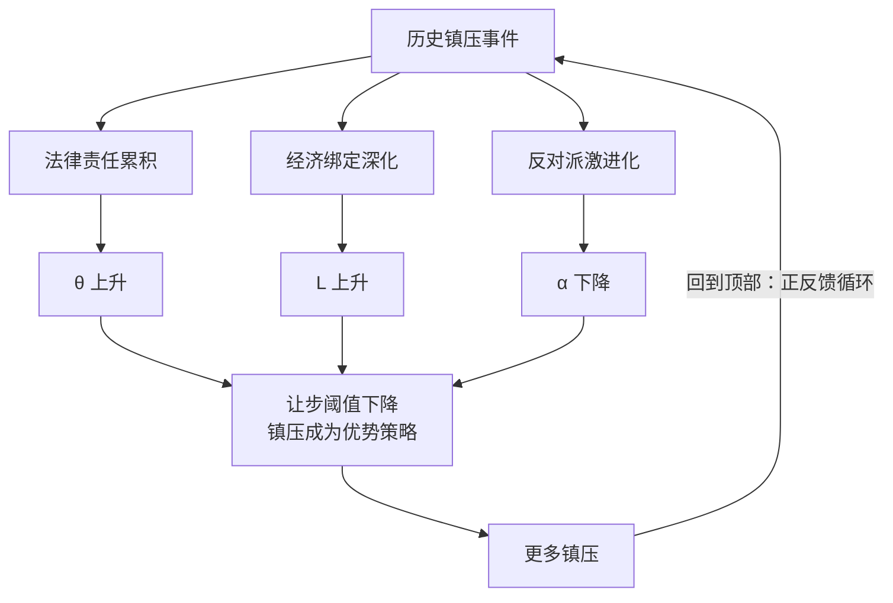

## 摘要

伊朗自2009年以来经历四次大规模民主化抗议，为何始终未能实现政权更迭？本文提出双重承诺问题框架：政权精英无法可信承诺让步后不会报复，反对派也无法可信承诺胜利后不会清算，这种互不信任将双方锁定在稳定的镇压均衡之中。革命卫队掌控的经济帝国与政权深度捆绑，使其命运与体制存亡等同；历次镇压累积的法律责任使精英陷入没有退路的困境。本文通过四节点时序分析，追踪1989年以来的均衡演化，并基于突尼斯、埃及、西班牙、南非、委内瑞拉五国案例进行比较反事实检验。研究表明，伊朗在军队-政权绑定程度、资产可转移性、追诉恐惧、反对派统一程度和外部担保可能性等关键参数上均处于最不利于协商转型的极端位置。本文的核心贡献在于识别承诺问题的双向性和自我强化动态：镇压提高追诉风险，追诉恐惧又激励更多镇压，形成难以内生打破的锁定。

---

## I. 导言

2022年9月，马赫萨·阿米尼之死引发了伊朗四十多年来最具意识形态冲击力的抗议浪潮。数百万人涌上街头，高呼"女性·生命·自由"，直指伊斯兰共和国的意识形态根基。然而，政权的回应冷酷无情：大规模杀戮、逮捕与公开处决。一年后，头巾依旧强制，革命卫队依旧巡逻，最高领袖依旧掌权。

这样的结果令人费解。按照民主化理论的常规预测，伊朗早该走上转型之路：75%的城市化率、受过良好教育的年轻一代、活跃的公民社会，以及被制裁重创的经济。自2009年以来，伊朗经历了四次大规模抗议，每一次都动员了数百万人，每一次都以残酷镇压收场。为什么？

从比较视野来看，这个谜题更加尖锐。2011年突尼斯和埃及的民众成功迫使独裁者下台。为何相似规模的社会动员在伊朗始终无法撼动政权？

现有文献提供了多种解释：租金国家理论（Ross 2001）强调石油收入对民主压力的缓冲；强制能力模型（Bellin 2012）强调安全机构的镇压能力；意识形态合法性理论（Parsa 2016）强调宗教动员力量。这些解释各有洞见，却都忽略了一个核心维度：策略互动。民主化不仅取决于结构性条件，更是政权精英与反对派之间策略博弈的结果。

基于此，本文提出一个双重承诺问题的解释框架。伊朗威权韧性的核心机制既非单纯的镇压能力，也非石油财富，而是政权精英与反对派之间互不信任所锁定的均衡。这种互不信任体现在两个层面：政权精英无法可信承诺让步后不会报复；反对派无法可信承诺胜利后不会清算。这种双向猜疑将双方锁定在镇压-激进化的恶性循环中。

这种承诺问题在伊朗格外严重，源于革命卫队（IRGC）的独特地位。IRGC 不仅是军事力量，更是掌控巨额国家资产的商业帝国。民主化将直接威胁这些资产与特权。经济利益与政治权力的深度捆绑，以及历次镇压累积的法律责任，忠诚"成为自我执行的均衡：精英不仅是在守卫政权，更是在守卫自己的身家性命。

本文结构如下：第二部分回顾现有文献并确立本文的理论定位；第三部分构建分析框架，阐明双重承诺问题如何锁定镇压均衡；第四部分将框架应用于伊朗案例，追踪1989年哈梅内伊继位至2022年"女性·生命·自由"运动期间四个关键节点如何强化承诺问题；第五部分进行比较分析，解释为何伊朗的威权均衡比突尼斯、埃及更为稳固，并与西班牙、南非、委内瑞拉等案例对照；第六部分讨论测量挑战与证据策略；第七部分总结主要发现并讨论政策含义。

## II. 文献回顾与理论定位

### 威权韧性的既有解释

为什么某些威权政权能够在大规模社会抗议面前存续？现有文献提供了三种主要解释路径。

**租金国家理论** 认为，石油等自然资源收入使国家得以通过庇护网络和福利分配维持社会支持，同时规避无代表不纳税式的民主化压力（Ross 2001; Mahdavy 1970）。这一理论在解释海湾君主国的稳定性方面颇具说服力，但难以解释伊朗的情况：自2012年以来，国际制裁使伊朗石油出口骤降80%以上，经济严重衰退，但政权反而更加稳固。如果租金是威权稳定的关键，租金枯竭应当导致政权脆弱化——但这并未发生。

**强制能力模型** 强调安全机构的规模、凝聚力和专业化程度（Bellin 2012; Greitens 2016）。革命卫队和巴斯基民兵确实构成了强大的镇压力量（Golkar 2015; Alfoneh 2013），但这一解释面临一个关键问题：为什么这些安全力量在每次危机中都选择站在政权一边？埃及军队同样强大，却在2011年选择放弃穆巴拉克。单纯的镇压能力无法解释镇压意愿的差异。

**意识形态合法性理论** 强调革命伊斯兰的动员力量及其对精英和民众的凝聚作用（Parsa 2016; Arjomand 2022）。但调查数据显示，伊朗人（尤其是年轻一代）的宗教虔诚度已显著下降（Maleki & Arab 2020）。2022年"女性·生命·自由"运动直接攻击强制头巾这一政权的意识形态核心，表明官方意识形态的社会吸引力已大为减弱。意识形态或许在部分基层执行者中仍起作用，但难以解释精英层面的持续忠诚。

此外，近年研究还关注**竞争性威权主义**的制度特征（Levitsky & Way 2010）和中东威权体制的区域特殊性（Brownlee 2007）。这些研究揭示了威权政权如何通过有限选举和制度操控维持合法性外壳，但较少分析精英在面临大规模抗议时的策略选择。

### 承诺问题传统

本文的理论基础来自比较政治学中关于承诺问题的研究传统。Fearon（1995）在战争研究中揭示，冲突往往并非源于利益不可调和，而是源于各方无法可信承诺遵守协议的未来条款。这一洞见被 Acemoglu & Robinson（2006）应用于民主转型分析：当精英无法可信承诺不在民主化后被追诉，或民众无法可信地承诺不在获取政权后重新分配精英财富时，谈判失败便不可避免。Svolik（2012）进一步分析了威权政权内部的承诺问题，即独裁者与支持联盟之间的互信困境。Kalyvas（2000）则通过南欧转型案例展示，承诺问题如何影响民主化的时机与路径。

### 本文的理论贡献

本文在三个方面推进了上述研究传统。

**第一，强调承诺问题的双向性**。现有文献多聚焦单向承诺问题：或是精英担心被追诉（Huntington 1991），或是民众担心改革被撤回（Acemoglu & Robinson 2006）。但本文认为，伊朗案例的独特之处在于双向承诺失败的同时性：精英既不信任反对派的特赦承诺，反对派也不信任精英的改革承诺。这种双向猜疑形成了比单向承诺问题更难打破的锁定。

**第二，识别追诉恐惧的自我强化动态**。现有模型多将追诉概率视为外生参数，但本文强调 **θ**（追诉概率）是内生于镇压历史的。每一次镇压都增加精英的法律责任，从而提高未来追诉的确定性，进一步削弱让步激励。这种正反馈机制解释了为何伊朗威权均衡随时间推移愈加稳固，而非因改革派上台而松动。

**第三，提供机制组合的分析框架**。本文识别出三个相互强化的机制，即追诉恐惧、经济绑定、协调失败，并阐明它们如何共同作用形成"锁定"。这一框架不仅解释伊朗，也为理解其他类似案例（如叙利亚、委内瑞拉）提供了分析工具。

需要强调的是，本文的解释与租金国家理论、强制能力模型、意识形态理论并非互斥。石油收入、镇压能力、意识形态都是重要的背景条件，本文的贡献在于提供一个策略互动框架，使我们能够理解这些因素如何通过行为者的理性选择共同作用于威权稳定。

### 替代解释存在的问题

**国际孤立作为独立解释？**

伊朗自1979年以来持续面临国际孤立，尤其是与美国的敌对关系。有人可能认为，国际环境本身就足以解释威权韧性：孤立的政权无法获得外部转型担保，因此转型变得不可能。

这一解释的问题在于因果顺序。伊朗的国际孤立很大程度上是政权行为的结果而非外生条件。1979年人质危机、核武开发、支持恐怖组织——这些选择导致了孤立，而这些选择本身反映了政权的安全计算。更重要的是，国际孤立与承诺问题是相互强化的：孤立使外部担保不可能，而承诺问题的加剧（如镇压升级）又导致更多制裁和孤立。本文的框架将国际环境视为背景条件而非独立的因果因素，解释了为何外部特赦担保不可行。

如果伊朗拥有良好的国际关系会发生什么？这一反事实难以检验，但委内瑞拉案例提供了某种近似：尽管委内瑞拉获得俄罗斯、中国等国的支持，承诺问题仍然阻碍转型。这表明国际环境是必要条件之一，但非充分条件。

**革命遗产与意识形态忠诚？**

1979年革命的遗产可能创造了超越物质利益的路径依赖。革命卫队的成员可能是烈士的子女或孙辈，对伊斯兰共和国有情感认同；基层巴斯基成员可能真正相信"保卫革命"的使命。

本文并不否认意识形态因素的存在，而是对其相对重要性提出质疑。证据显示意识形态对不同层级的作用不同：

- **高层精英**：IRGC将领的行为模式（商业逐利、派系争资源、制裁规避）更符合物质利益假设。他们的忠诚可能有意识形态成分，但物质利益足以单独解释其行为。
- **中层执行者**：可能存在意识形态与物质激励的混合。但关键在于，即使某些个体有意识形态动机，集体行动的协调仍依赖利益结构，也就是说，当所有人都面临同归于尽的风险时，个体的意识形态差异被压缩。
- **基层巴斯基**：意识形态可能更重要，但他们不是关键决策者。决定镇压与否的是高层，而非基层。

更重要的是，意识形态解释无法说明动态变化：为何1997年改革派可以当选总统，而2009年后改革派被系统边缘化？意识形态如果是恒定的背景条件，就无法解释这种变化。本文的框架通过追踪θ的累积性上升提供了解释。

**区域示范效应？**

2011年后，阿拉伯之春的暴力结局（叙利亚内战、利比亚混乱、也门战争）可能更新了伊朗精英和反对派对转型成本的预期。这是一种学习效应，但通过国际扩散运作。

这一因素可能确实强化了承诺问题。叙利亚案例尤其具有警示意义：阿萨德政权的残酷镇压导致内战，但政权存活下来。伊朗精英可能从中学到：镇压是可行的策略。反对派可能也学到：温和诉求得不到国际支持，只有彻底推翻才是出路。

然而，区域示范效应是补充性机制而非替代解释。它解释了2011年后承诺问题为何加速恶化，但承诺问题本身在2009年甚至更早就已存在。绿色运动发生在阿拉伯之春之前，其镇压并非受叙利亚启发。

### 理论的适用条件

本文的框架在什么条件下适用？明确适用条件可以增强理论的可检验性。

**必要条件一：中等以上的国家能力**。本框架假设政权有能力实施镇压，且精英有资产可保护。对于极弱国家（如索马里），政权可能根本没有能力镇压，或没有资产可保护，这种情况下本解释框架不适用。

**必要条件二：存在可识别的精英群体**。框架假设存在一个与政权命运捆绑的精英群体，其集体行动决定镇压与否。在高度个人化的独裁政权（如土库曼斯坦），独裁者个人的计算可能比精英群体的集体计算更重要。

**必要条件三：存在可观测的反对派动员**。框架假设反对派的存在和诉求是精英计算的输入变量。在完全压制反对派的情境（如朝鲜），精英的追诉恐惧可能较低——因为没有可见的追诉诉求者。

**框架最适用的案例**：军队/安全力量与政权深度绑定、精英拥有大量不可转移资产、存在历史镇压记录、反对派活跃但分散、外部环境不利于担保的威权政权。除伊朗外，可能适用的案例包括叙利亚（阿萨德政权）、委内瑞拉（马杜罗政权）、以及在一定程度上适用于缅甸（军政府）。

**框架不适用或需要修改的案例**：军队与政权相对独立（如埃及、突尼斯）、精英资产市场化且可转移（如韩国、智利转型前）、存在可信的外部或内部担保人（如西班牙、南非）。这些案例中，承诺问题可能存在但可被化解。

## III. 分析框架：双重承诺问题与威权均衡

本部分构建一个分析框架，用以理解双重承诺问题如何锁定威权均衡。需要在此明确的是：本框架是启发式工具而非严格的形式化模型。其目的是结构化我们对机制的理解，为后续的历史分析和比较研究提供概念锚点，而非生成可精确检验的量化预测。

### 核心概念界定

在展开分析之前，需要界定几个关键术语。

**承诺问题**（commitment problem）指的是：即便各方都可能从达成协议中获益，但由于无法可信地承诺遵守协议的未来条款，谈判仍会失败。这一概念源于博弈论，已被广泛应用于战争起源（Fearon 1995）和民主转型（Acemoglu & Robinson 2006）的研究。

**均衡**（equilibrium）在本文中指一种稳定的行为模式：给定其他参与者的策略，每个参与者都没有单方面改变策略的激励。镇压均衡意味着，政权选择镇压、反对派选择激进化的行为模式是自我维持的。本文的均衡指行为模式的自我维持性：给定其他行为者的策略，单方面偏离的激励为负。这是纳什均衡概念的核心，但本文不做形式化证明。

**自执行**（self-enforcing）指的是一种安排，其遵守不依赖外部强制，而是源于各方自身的激励。当违约成本高于收益时，协议便是自执行的。

### 双向承诺失败的逻辑

民主转型本质上是一场谈判：政权精英握有政治权力，反对派寻求制度变革。理论上，双方可通过协商达成互利安排 —— 政权交出部分权力以换取和平退场，反对派获得改革以换取承认精英的某些利益。但在现实中，这种理想化的契约往往无法达成。

症结不在于利益冲突本身，因为利益冲突可以通过让步与补偿化解。真正的问题在于无法做出可信承诺：即便双方都偏好达成协议而非冲突，但只要任何一方无法可信地承诺遵守协议的未来条款，谈判就会破裂。

**政权面临的承诺困境**：即便承诺让步，如何让反对派相信他们不会反悔？1979年伊朗革命提供了警示：霍梅尼与自由派、马克思主义者结成反巴列维联盟；革命成功后系统性地清洗了这些盟友。这种历史记忆使反对派对政权的任何让步承诺都抱有高度怀疑。因此，理性的反对派更倾向于拒绝局部改革，转而追求彻底的政权更迭。这反过来又强化了政权的镇压激励。

**反对派面临的承诺困境**：即便承诺宽恕，如何让政权精英相信他们不会清算？民主化运动几乎不可避免地包含追究旧政权罪行的诉求。即便反对派领袖私下愿意提供特赦，他们也无法代表未来的民选政府做出可信承诺——阿根廷、希腊、韩国等转型后追诉的案例表明，今日的承诺可能被明日的民选政府推翻。

反对派的内部异质性进一步加剧了这一问题。海外流亡者与国内公民社会的策略偏好存在差异——前者或许更倾向于彻底清算，后者可能更为务实。但恰恰是这种分散性使任何集体承诺都不可信：即便国内温和派愿意妥协，他们也无法约束海外激进派的立场。

### 简化模型：逻辑阐释

为了结构化上述逻辑，可以用一个简化的决策框架来思考政权的选择。

设想政权面临抗议时有两个选项：镇压或让步。镇压意味着支付一定成本（动员安全力量、国际声誉损失等）但维持权力。让步则进入一个不确定的未来：以一定概率安全退场并保留部分利益，以另一概率被追诉并损失一切。

令 **θ** 表示让步后被追诉的概率，**L** 表示被追诉的损失（包括资产、自由、生命），**α** 表示民主化后精英可能保留的权力份额。政权愿意让步的条件是：让步的期望收益超过镇压的收益。这意味着追诉概率必须低于某个阈值——这个阈值由镇压成本、资产规模和预期保留份额共同决定。

这一简化框架揭示了几个关键洞见：

**第一，追诉恐惧的锁定效应**。当精英确信让步将导致追诉（ θ 趋近于 1 ）时，无论抗议规模多大，镇压都是理性选择。更重要的是，**镇压本身会提高 θ**：每一次镇压都增加精英的法律责任，使未来追诉更加确定。这形成了正反馈循环——镇压导致更多人权侵犯，人权侵犯提高追诉风险，追诉风险上升又使政权更依赖镇压。这是本文强调的自我强化动态，也是区别于静态承诺问题分析的关键。

**第二，资产绑定效应**。损失L越高，让步所需的低追诉概率门槛就越严格。革命卫队掌控伊朗经济30-50%的份额，其资产并非可转移的私人财富，而是与国家权力深度绑定的合同、特许权和没收财产。民主化几乎必然意味着这些资产的重新分配。与之对比，埃及军队虽然也有经济利益，但这些利益是相对独立于政治权力的市场化资产，在政权更迭后更可能得到保护。

**第三，权力份额效应**。民主化后精英保留的权力份额 **α** 越高，让步的激励越强。这解释了西班牙转型中"遗忘协议"（Pacto del Olvido）的作用 —— 通过承诺保留旧精英的部分权力与特权，降低了他们的让步门槛。但在伊朗，反对派明确拒绝任何形式的"黄金降落伞"，使 **α** 趋近于零。

**第四，协调失败**。一个统一的反对派领导层至少有可能做出某种承诺——如南非的曼德拉或西班牙的胡安·卡洛斯。但分散的抗议运动无人能够代表整体做出承诺。政权面对的是匿名的街头愤怒，而非可以谈判的对手。

### 三机制的因果结构

综合以上分析，可识别出锁定威权均衡的三个核心机制。更重要的是，需要明确这些机制之间的因果关系：

这一因果图揭示了几个重要特征：

**机制的独立性与互补性**：三个机制可以独立运作——即使只有追诉恐惧（θ 高），没有经济绑定，镇压也可能是优势策略。但三个机制同时作用时，均衡更加稳固。在伊朗，三个机制同时处于极端值（θ 极高、L 极高、α 趋近于零），这解释了均衡的高度稳定性。

**时序与累积**：三个机制不是静态的背景条件，而是随时间演化的动态过程。1989年时θ相对较低（镇压记录较少）；经过2009年、2019年、2022年的累积镇压，θ已趋近于1。这种累积过程是不可逆的——法律责任只会增加，不会减少。

**单一机制的不充分性**：任何单一机制都不足以解释伊朗的威权韧性。委内瑞拉军队也控制石油产业（L 高），但追诉恐惧较低，反对派也相对统一。叙利亚追诉恐惧极高（θ 高），但阿萨德家族的资产相对集中。伊朗的独特之处在于三个机制的组合强度。

### 均衡的稳定性与潜在脆弱点

上述分析表明，伊朗的威权均衡高度稳定但并非不可打破。稳定性来自三个机制的相互强化和正反馈循环。但均衡也依赖特定条件，存在潜在的脆弱点：

**外部特赦担保**：如果某个有公信力的外部力量（如联合国安理会决议、大国联合担保）能够提供可信的特赦保障，θ可能降至临界值以下。但这需要克服反对派的"正义诉求"与"和平转型"之间的张力。

**精英内部分裂**：如果革命卫队内部出现严重派系冲突，部分将领可能寻求单独的"黄金降落伞"，即以出卖同僚换取个人安全。这种囚徒困境动态可能瓦解集体行动。

**继承危机**：哈梅内伊作为最高领袖，既是派系平衡者也是合法性外壳。他的去世将引发继承危机，可能打开不确定性窗口。如果继承者的权威不如哈梅内伊稳固，精英内部的协调焦点可能消失。

**经济崩溃**：当经济恶化到镇压机器无法维持的程度（安全力量薪资无法发放、基层执行者叛逃），镇压成本将急剧上升。但目前的制裁虽然严厉，尚未达到这一临界点。

至于革命卫队政变（即革命卫队抛弃最高领袖建立军事独裁），这一可能性在伊朗相对较低。原因有二：哈梅内伊作为派系平衡者和合法性外壳不可替代；革命卫队内部的派系竞争需要一个超脱的仲裁者来协调。但这一可能性也并非完全不存在，尤其在政权出现继承危机时。

## IV. 伊朗案例：锁定机制的历史演化

本部分将前文建立的理论框架（见第III部分）应用于伊朗1989年以来的历史轨迹。我追踪四个关键历史节点如何逐步强化双重承诺问题，使威权均衡从可能的不稳定状态演变为今天的高度锁定状态。

### 制度背景：双轨权力结构

理解伊朗政治首先需要理解其独特的"双轨权力结构"。1979年宪法建立了一套复杂的制度安排：一方面是民选机构（总统、议会、地方议会），另一方面是非民选机构（最高领袖、监护委员会、司法部长）。真正的权力掌握在后者手中。

最高领袖是这一结构的核心。他终身任职，控制武装力量、司法系统、国家媒体，并通过监护委员会否决任何不合意的立法或候选人。总统看似由普选产生，实际上只是最高领袖意志的执行者——任何试图挑战这一边界的总统都会发现自己被系统性地阻挠。

革命卫队（IRGC）是维持这一结构的关键力量。它成立于1979年，最初是为了保护革命免受正规军可能的政变威胁。但在此后四十多年中，IRGC 经历了深刻的转型：从革命民兵变成控制国家经济命脉的企业帝国。其旗下的 "Khatam al-Anbia" 建设集团业务涵盖石油、天然气、基础设施、电信等领域。

这一经济帝国为本文的理论框架提供了关键的经验基础：IRGC 不是普通的军队，而是一个拥有巨额资产、因此对政权更迭代价极为敏感的利益集团。他们的忠诚不是出于意识形态热忱，而是出于理性的自我保护——尽管意识形态因素可能在部分基层巴斯基成员中仍起作用。

### 节点一：1989年继承 —— 政治-安全型领袖的确立

1989年6月3日，霍梅尼去世。继承问题成为政权面临的第一次重大考验。

按照伊斯兰什叶派传统，最高领袖应该是"玛尔贾"（Marja），即最高宗教权威。但当时唯一具备这一资格的候选人（大阿亚图拉蒙塔泽里）因批评1988年政治犯大屠杀而被霍梅尼废黜。取而代之的阿里·哈梅内伊只是中级教士，宗教资格远远不足。

为解决这一尴尬，专家会议在霍梅尼去世当天紧急修改宪法，降低了最高领袖的宗教资格要求。这一决定的表面意义是解决继承危机，但其深远意义是：最高领袖的权威来源从宗教魅力转向政治-安全控制。哈梅内伊不是通过宗教学识赢得地位，而是通过对安全机器的掌控维持权力。

这一转型为日后的承诺问题埋下了种子。如果最高领袖的权威基础是宗教，那么体制改革可以与宗教正统性分离。但当权威基础转向政治-安全控制时，任何实质性改革都直接威胁领袖本人的地位。哈梅内伊与 IRGC 之间形成了共生关系：他需要 IRGC 来维持权力，IRGC 需要他来协调内部派系并提供合法性外壳。

### 节点二：1997-2005年改革时代 —— 承诺问题的首次显现

1997年，穆罕默德·哈塔米以70%的得票率当选总统，开启了所谓的"改革时代"。哈塔米的纲领包括发展公民社会、加强法治、扩大新闻自由。他的当选表明即使在受限的选举框架内，改革诉求依然可以动员压倒性的民意支持。

但接下来八年发生的事情展示了伊朗政治的真实权力结构。哈塔米政府的每一项重大改革都被非民选机构系统性阻挠。在新闻自由领域，哈塔米上任后新闻环境短暂宽松，但1999-2000年间，司法部长关闭了超过60家改革派报纸。在地方自治方面，1999年首次举行地方议会选举，改革派大获全胜，但地方议会很快发现自己没有实际权力。在选举准入问题上，2004年议会选举前，监护委员会否决了超过2000名改革派候选人的参选资格，使改革派在议会中失去多数。

1999年7月，一场学生抗议成为转折点。起因是一家改革派报纸被关闭，结果是安全力量对德黑兰大学的突袭，造成多人死亡、上百人被捕。这次镇压释放了明确信号：体制有不可逾越的红线，触碰红线将付出血的代价。

改革时代清晰地展示了政权的承诺问题。哈塔米试图在体制内推进渐进改革，但保守派发现他们无法可信承诺接受这些改革。问题不在于具体的政策分歧，而在于任何改革都可能成为滑坡的起点。新闻自由意味着批评的空间，批评意味着合法性的侵蚀，合法性的侵蚀意味着更大的改革压力——保守派看到了这条逻辑链条的终点，因此选择从源头扼杀。

改革时代的失败也为反对派的策略选择提供了教训：体制内改革是死路，因为保守派永远不会真正让步。这一教训在2009年将产生深远后果。

### 节点三：2009年绿色运动 —— 均衡的临界考验

2009年6月12日，伊朗举行总统选举。改革派候选人米尔-侯赛因·穆萨维广泛预期将获胜。但官方宣布的结果是现任总统艾哈迈迪内贾德以63%的得票率连任。大量证据表明选举存在舞弊：多个省份的投票率超过100%，官方结果宣布的速度快于任何合理的计票过程。

抗议迅速爆发。6月15日，约300万人走上德黑兰街头，这是伊朗历史上最大的政治集会。"我的投票在哪里？"（رأی من کجاست؟）成为运动的标志性口号。绿色（穆萨维竞选的标志色）成为反抗的象征。

政权面临生存抉择。两条道路摆在面前。第一条是承认选举存在问题，重新计票或重新选举，与反对派进行某种形式的协商。第二条是将抗议定性为"煽动暴乱"，予以全面镇压。

**过程追踪：机制激活的时序**

为检验承诺问题是否在这一关键节点真正起作用，需要追踪决策过程的时序和机制激活的证据。

**第一阶段（6月13-18日）：不确定性窗口**。选举结果宣布后的最初几天，政权内部存在分歧。据事后披露的内部消息，拉夫桑贾尼等元老曾建议重新计票以平息争议；部分革命卫队将领对局势走向持观望态度。这一阶段的不确定性表明，镇压并非自动反应，而是经过策略计算的选择。

**第二阶段（6月19日）：哈梅内伊的关键决定**。最高领袖在星期五祈祷中的讲话是转折点。他不仅拒绝重新计票，更将抗议定性为"外国阴谋"和对伊斯兰共和国的根本威胁。这一框架选择至关重要：一旦抗议被定义为"敌对"而非"内部分歧"，妥协的空间就被封死。

**第三阶段（6月20日起）：镇压升级与精英团结**。哈梅内伊表态后，革命卫队和巴斯基迅速展开镇压。值得注意的是，没有任何革命卫队高级将领公开表示异议或选择叛逃。这一团结不能简单归因于意识形态——更合理的解释是，将领们意识到一旦镇压开始，他们的命运就与政权捆绑在一起。镇压的第一滴血就提高了未来追诉的确定性。

**反事实检验**：如果承诺问题不是关键机制，我们应该观察到什么？如果纯粹是强制能力决定结果，那么拥有足够镇压力量的政权都应该选择镇压，无论其追诉风险如何，但这无法解释为何埃及军队在2011年选择放弃穆巴拉克。如果纯粹是意识形态决定忠诚，我们应该观察到革命卫队基层与高层表现出同等热忱。然而，证据表明，高层的计算更为精密，基层的犹豫更为明显（Golkar 2015）。

哈梅内伊在6月19日的星期五祈祷中选择了第二条路。他宣布选举结果是"神圣信任"的体现，将抗议者斥为受外国势力操纵的暴徒。随后，革命卫队和巴斯基民兵展开大规模镇压。数千人被捕，反对派领袖穆萨维和卡鲁比被软禁。他们至今仍被软禁，成为世界上被拘禁时间最长的政治犯之一。

绿色运动的失败完美诠释了双重承诺问题的临界作用。从政权角度看，承认选举舞弊将打开一扇无法关闭的门。如果最高领袖可以在选举问题上让步，他的其他权力就同样可以被质疑。更重要的是，即使与穆萨维达成某种权力分享安排，政权也无法信任改革派的底线在哪里。1997-2005年的经历表明，改革派即使赢得选举也无法实施改革；但如果2009年的抗议成功，改革派可能获得远超选票的政治资本。这正是保守派恐惧的滑坡。

从反对派角度看，"我的投票在哪里"这一口号本身就暗示了对政权合法性的根本质疑。它的逻辑延伸是：如果这次选举被操纵，以前的选举呢？如果选举可以被操纵，整个体制的合法性何在？政权精英——尤其是那些在历次镇压中负有责任的人——看到的不是一场关于选票的争论，而是对整个体制的根本挑战。

2009年镇压之后，伊朗政治发生了质变。改革派作为体制内力量被彻底边缘化。穆萨维和卡鲁比的软禁释放了明确信号：即使是体制内精英，一旦越过红线也将被清洗。此后的选举虽然继续举行，但候选人的范围被严格限制在"安全"的保守派圈子内。更重要的是，2009年镇压加深了承诺问题。参与镇压的官员、指挥官、行刑者如今都背负着法律责任。他们从"可能被追诉"演变为"必然被追诉"（如果政权更迭的话）。这使他们成为威权均衡最坚定的捍卫者。

### 节点四：2017-2022年——镇压螺旋与承诺问题的彻底锁定

绿色运动后的十年，伊朗经历了更加严酷的威权化。但这并不意味着社会沉默了。相反，抗议以新的形式反复爆发，而且每一次爆发都以更加残酷的镇压告终，这进一步加深了承诺问题。

2017-2018年抗议的起因是经济困难和腐败，从马什哈德开始蔓延至全国。与2009年不同，这次抗议的主力是底层民众而非中产阶级，口号从经济诉求迅速升级到"独裁者去死"。政权出动巴斯基镇压，约25人死亡。

2019年"血色十一月"由汽油价格一夜上涨50%引发。政权的回应是史无前例的：近乎全面的互联网封锁持续一周，安全力量使用实弹。据路透社引用伊朗内部消息称约1500人死亡，但该数字存在争议（官方承认230人，独立估计在400-1500之间）。

2022年"女性·生命·自由"运动是最具意识形态挑战性的抗议，它直接攻击强制头巾这一政权的意识形态核心。政权回应包括公开处决抗议者，据人权组织（如 HRANA）估计，超过500名抗议者在镇压中丧生。这是对街头运动前所未有的威慑升级。

这一轨迹展示了追诉恐惧的自我强化机制。每一次镇压都增加了精英的法律责任。2019年的大规模杀戮、2022年的公开处决，使伊朗官员在国际法框架下面临反人类罪指控。欧盟、美国、英国等相继对革命卫队高层实施定向制裁。这些制裁不仅冻结资产、禁止旅行，更重要的是确立了法律先例：这些人将来可能面临国际刑事法院的起诉。

与此同时，反对派的诉求也逐步升级。2009年的"我的投票在哪里"是关于选举公正的诉求。2022年的"女性·生命·自由"则意味着对整个政治-宗教体制的否定。抗议者明确要求"彻底推翻政权"、"审判所有负责人"。这进一步消除了政权精英关于"让步可能带来安全退出"的幻想。

到2022年，伊朗的威权均衡已经高度锁定。政权精英确信让步意味着追诉，反对派确信政权永远不会真正交权。双方都被困在各自的位置上，无法做出可信承诺来打破僵局。这不是一个任何一方"选择"的结果，而是策略互动长期演化的产物。

### 精英异质性：为何"温和派"未能改变均衡？

前文将政权精英视为统一行为者，但实际上伊朗精英内部存在显著的派系分化。这提出了一个问题：如果存在"温和派"或"改革派"，为何他们未能推动体制变革？

这一问题的答案恰恰印证了承诺问题的力量。

**拉夫桑贾尼的轨迹**提供了典型案例。作为1979年革命的核心人物和1989-1997年的总统，拉夫桑贾尼长期被视为"务实派"，主张经济开放、与西方缓和。但他从未挑战体制的核心结构。原因何在？拉夫桑贾尼家族的商业帝国深度依赖政权庇护；他在两伊战争期间的决策可能面临法律审视。即使个人偏好改革，其利益结构使他无法承受政权更迭的风险。2013年他试图再次参选总统，被监护委员会否决——表明体制不再信任他。2017年他离世后，有关其"背叛"的指控在保守派媒体中浮现，揭示了派系互信的脆弱。

**2013-2021 鲁哈尼时期**进一步展示了温和派的结构性限制。鲁哈尼以务实改革姿态当选，推动了2015年核协议（JCPOA）。但他从未获得实质性权力来推动政治改革。哈梅内伊保留了对外交、安全和司法的最终控制权。当2017年和2019年抗议爆发时，鲁哈尼政府无力阻止镇压。关键在于：即使鲁哈尼个人偏好缓和，他也无法代表整个体制做出承诺。反对派知道今天的温和派总统可能被明天的强硬派总统取代；任何让步都可能被撤回。

**革命卫队内部的派系竞争**同样存在，但这些分歧主要涉及资源分配和政策优先级，而非体制根本问题。当面对共同的外部威胁（街头抗议、国际压力）时，内部分歧被搁置。原因再次回到承诺问题：即使某些将领私下认为改革可取，他们也无法确信同僚不会在转型后出卖他们，对这些将领来说，保持团结比冒险分裂更安全。

这一分析的理论启示是：精英异质性本身不足以打破均衡。只要承诺问题存在，温和派就难以可信地代表整个体制做出让步承诺；他们自身也面临被追诉的风险，使其激励与强硬派趋同。

### 反对派策略的内生性："激进化"是选择还是回应？

编辑合理地指出，本文对反对派诉求的升级（从"我的投票在哪里"到"处死独裁者"）需要分析其内生性。这一升级是反对派的策略选择，还是对政权行为的学习性回应？

答案是后者，这对承诺问题有重要含义。

**2009年绿色运动**的初始诉求是温和的：重新计票、承认选举结果争议。穆萨维和卡鲁比是体制内精英，他们的诉求是程序性的，不涉及推翻政权。但政权的回应（全面镇压、领袖软禁、将运动定性为"煽动叛乱"）否定了体制内协商的可能性。

**2017-2018年抗议**显示了策略转变。抗议者不再高呼改革派领袖的名字，而是直接攻击整个体制。这一转变反映了学习效应：既然体制内改革不可能（哈塔米失败、绿色运动被镇压），理性的反对派会转向激进诉求。

**2022年运动**则是这一逻辑的极端化。"女性·生命·自由"直接攻击政权的意识形态核心；"审判所有负责人"的要求等于明确拒绝任何特赦。从反对派视角看，这是对历次镇压的理性回应：既然政权已经杀害了数千人，还有什么理由相信它会真正交权？

这一分析揭示了承诺问题的双向动态。政权的镇压提高了反对派对未来镇压的预期，使他们更倾向于拒绝妥协。反对派的激进化又提高了精英对追诉的预期，使他们更倾向于镇压。双方都被对方的行为"锁定"在极端立场上。

反对派的激进化既反映学习效应，也反映代际替代。2009年的抗议者多为受过教育的城市中产阶级，而2017年后的抗议者包含更多底层民众和充满反叛精神的Z世代。即使2022年的年轻抗议者不是2009年的直接学习者，代际替代本身也是政权行为的内生结果：2009年的残酷镇压使改革派幻灭，为更激进的下一代创造了政治空间。因此，无论通过直接学习还是代际替代，政权行为仍是反对派激进化的核心驱动因素。

这并不意味着反对派应该选择温和策略。本文不做规范判断。但它表明，反对派的激进化是承诺问题自我强化的组成部分——不能仅归因于"非理性"或"意识形态狂热"。

### 比较分析：为什么伊朗不同于埃及和突尼斯？

将伊朗与2011年"阿拉伯之春"中的埃及和突尼斯比较，可以进一步验证本文的理论框架。三个国家都经历了大规模街头抗议，但结果截然不同。

突尼斯的本·阿里政权在不到一个月内垮台。关键因素是军队选择保持中立。突尼斯军队规模小、政治边缘化、没有大规模的经济资产。对军队领导层而言，本·阿里的去留与他们的核心利益无关。因此，当抗议升级时，军队拒绝镇压，本·阿里被迫流亡。

埃及的穆巴拉克在18天内被迫下台。埃及军队虽然庞大且拥有可观的经济利益，但这些利益是独立于穆巴拉克个人的。军队控制的企业不依赖穆巴拉克的政治庇护，无论谁执政它们都可以继续运营。因此，当抗议威胁到稳定时，军队选择牺牲穆巴拉克以保护自身利益。穆巴拉克下台了，但军队的经济帝国完好无损——事实上，两年后军队通过政变重新夺权，表明它从未真正失去核心利益。

伊朗的情况则完全不同。革命卫队的经济帝国与政权深度绑定。IRGC 的资产不是独立的市场企业，而是依赖政治权力的合同、特许权、没收财产。民主化几乎必然意味着这些资产的重新分配：新政府可能取消 IRGC 的垄断合同、追查来源不明的财产、甚至进行没收。更重要的是，IRGC 高层在历次镇压中累积的法律责任，使他们面临远超穆巴拉克的个人风险。穆巴拉克被保证不会被处决，IRGC 领导层没有这种保证。

| 国家 | 军政关系 | 军队经济利益 | 追诉风险 | 结果 |
|-----|--------------|------------|---------|-----|
| 突尼斯 | 边缘 | 无 | 低 | 民主化 |
| 埃及 | 独立 | 高但可转移 | 中（穆巴拉克个人承担） | 短暂转型后军变 |
| 伊朗 | 深度绑定 | 极高且不可转移 | 极高（集体责任） | 威权持续 |

这一比较表明，解释伊朗威权韧性的关键不在于抗议规模、经济条件或意识形态动员，而在于关键行为者面临的激励结构。革命卫队不是因为忠于伊斯兰革命而镇压抗议，而是因为他们在任何可预见的替代情境中都会失去太多。

### 四个历史节点的参数演变

下表总结了本文分析的四个关键节点中，承诺问题核心参数的演变轨迹：

| 节点 | θ（追诉概率） | L（经济损失） | α（权力保留份额） | 均衡状态 |
|-----|-------------|-------------|-----------------|---------|
| 1989年继承 | (→) 低：镇压记录较少，国际关注有限 | (↗) 中：IRGC经济扩张刚起步 | (→) 中：改革仍在可讨论范围 | 不稳定均衡 |
| 1997-2005年改革时代 | (↗) 中低：未发生大规模镇压 | (↑) 中高：IRGC商业帝国扩张 | (↘) 低：改革尝试被系统阻挠 | 趋向锁定 |
| 2009年绿色运动 | (↑) 中高：镇压造成死伤，领袖被软禁 | (↑) 高：IRGC控制经济30-50% | (↓) 极低：反对派要求根本变革 | 临界锁定 |
| 2017-2022年抗议周期 | (↑) 极高：大规模杀戮、公开处决 | (↑) 极高：资产与政权深度绑定 | (↓) 趋近于零："审判所有人" | 完全锁定 |

这一参数演变揭示了几个重要模式：

**第一，θ 的单向累积**。追诉概率从未下降，只有上升。每一次镇压都增加法律责任，而法律责任是累积的——2019年的1500人死亡不会因为2020年的无事发生而消失。这解释了为何"改革派"上台无法逆转均衡：即便总统个人偏好改革，累积的法律责任已经锁定了安全机构的立场。

**第二，L 与 θ 的正相关**。随着IRGC经济帝国扩张，其镇压激励也在上升——因为有更多东西可能失去。同时，经济扩张往往伴随更多可追诉的行为（腐败、资产侵吞），进一步提高 θ。两个参数相互强化。

**第三，α 的内生下降**。反对派对政权的让步预期（α）不是外生给定的，而是对政权行为的回应。每一次镇压都降低反对派接受妥协的意愿，从而降低政权可以预期保留的份额。这是双向承诺问题的核心：政权的行为影响反对派的策略，反对派的策略又影响政权的计算。

## V. 扩展比较：承诺问题的多样化解

为更全面地检验本文框架（尤其是第III.3节提出的机制），本部分将伊朗置于更广泛的比较视野中，分析承诺问题如何在不同情境下被化解或锁定。

### 突尼斯与埃及：重新审视

前文对突尼斯和埃及的分析需要进一步深化，以回应两个关键问题：为什么军队与政权的关系呈现不同形态？军队经济利益的"可转移性"究竟意味着什么？

**突尼斯：制度设计的遗产**

突尼斯军队的政治边缘化并非偶然，而是制度设计的结果。1987年，本·阿里通过"医疗政变"推翻布尔吉巴，正是因为他作为安全官员掌握了内政部力量。这一经历使他深刻理解军事干预的风险。上台后，本·阿里系统性地弱化军队：削减军事预算、限制军官政治参与、将安全职能转移给内政部和总统卫队（Grewal 2021）。

这一制度选择的后果是：当2010年抗议爆发时，军队既没有镇压的组织能力，也没有镇压的利益动机。陆军参谋长拉希德·阿马尔（Rachid Ammar）拒绝执行镇压命令，据报道他对本·阿里说："军队不会向人民开枪。"这不是道德选择，而是理性计算：因为军队与政权没有利益捆绑，镇压只会损害自身声誉。

对伊朗的启示在于：威权政权对安全机构的制度设计会产生长期后果。哈梅内伊选择了与本·阿里相反的策略，即，将革命卫队培育为政权的核心支柱，赋予其经济特权，使其成为体制的共谋者。这一选择在短期内增强了政权稳定性，但也使得未来的协商转型变得更加困难。

**埃及：制度化保障的可能性**

埃及军队1952年以来一直是国家政治的核心力量。穆巴拉克时代，军队建立了庞大的经济帝国——从家电制造到酒店经营，军方企业遍布各行业，估计占GDP的5-40%（估计差异反映了透明度的缺乏）。但关键在于：这些资产是制度化的军队资产，而非依附于穆巴拉克个人的恩庇关系。

2011年，当抗议持续升级时，军队最高委员会面临抉择。他们计算的问题是：维护穆巴拉克是否符合军队的机构利益？答案是否定的。抗议引发的混乱威胁经济稳定，进而威胁军队的商业利益。更重要的是，军队相信无论谁执政，其制度化地位都会得到尊重：2012年宪法明确保障了军队的预算自主权、军事审判权和经济特权。

这一案例揭示了一个关键机制：当军队的利益可以通过制度化保障与具体政权分离时，牺牲领导人以维护机构利益是可行的策略。埃及军队出卖穆巴拉克，恰恰证明了其与政权的相对独立性。

与之对比，伊朗革命卫队的资产深度嵌入政权结构：Khatam al-Anbia 建设集团的垄断合同来自政府授予；制裁规避网络依赖国家外交渠道；没收财产的合法性来自革命法庭。这些资产无法在政权更迭后获得制度化保护，因为它们的获取方式本身就是民主政府可能追查的对象。

### 西班牙：特赦作为承诺机制

1975年佛朗哥去世后，西班牙完成了威权政权向民主制度的和平转型。这一转型的成功离不开对承诺问题的创造性化解。

佛朗哥政权的精英面临的处境与伊朗有相似之处：四十年独裁积累了大量人权侵犯记录；法西斯时期的资产分配存在合法性问题；军队在政治中扮演重要角色。按照本文的框架，追诉恐惧本应锁定威权均衡。为什么西班牙实现了转型？

关键在于"遗忘协议"（Pacto del Olvido）—— 一个非正式但广泛遵守的共识：不追究内战和独裁时期的罪行。1977年《特赦法》将这一共识法律化，赦免了所有具有"政治意图"的行为。反对派（尤其是共产党）接受这一安排，以换取合法参与政治进程的权利。

从承诺问题的视角看，西班牙的成功依赖几个条件：

**第一，可信的承诺者**。国王胡安·卡洛斯既是佛朗哥指定的继承人（被旧精英接受），又表现出民主化意愿（被反对派接受）。他的独特地位使其能够作为担保人，确保双方遵守协议。伊朗缺乏类似的"桥梁人物"，因为最高领袖完全是旧体制的代表，无法获得反对派信任。

**第二，反对派的务实选择**。西班牙共产党领袖圣地亚哥·卡里略（Santiago Carrillo）做出战略妥协：接受君主制、放弃革命修辞、承诺不追诉。这种"自我约束"降低了精英的追诉恐惧。伊朗反对派由于高度分散，无人有权力做出类似承诺——即便有人愿意妥协。

**第三，国际环境**。1970年代的欧洲正处于民主巩固期，欧共体成员资格为西班牙民主化提供了强大的外部激励。精英可以计算：民主化将带来欧洲一体化的经济红利，这部分弥补了可能的损失。伊朗则面临相反的国际环境——制裁和孤立使民主化的经济红利不确定。

**第四，军队的相对自主性**。西班牙军队虽然在佛朗哥时期享有特权，但其利益并未像革命卫队那样深度嵌入政权经济结构。1981年政变未遂表明，军队保守派确实存在，但胡安·卡洛斯的及时干预和军队多数派的理性计算阻止了事态恶化。

西班牙案例的理论启示是：承诺问题并非不可化解，但化解需要特定的制度条件和行为者配置。当不存在可信的担保人、反对派高度分散、国际环境不利、军队深度绑定政权时，西班牙模式难以复制。

### 南非：真相与和解的制度创新

南非的种族隔离制度结束（1990-1994）提供了另一种化解承诺问题的路径：通过真相与和解委员会（TRC）实现"有条件的特赦"。

与西班牙的"遗忘"不同，南非选择了"牢记但不惩罚"：人权侵犯者必须在TRC面前完整交代罪行，作为交换可以获得免于刑事追诉的赦免。这一机制满足了受害者对真相的需求，同时降低了精英的追诉恐惧。

从承诺问题的视角看，TRC的成功依赖以下因素：

**第一，曼德拉的个人权威**。曼德拉在监狱中度过27年，是反种族隔离运动无可争议的道德领袖。他承诺和解而非报复，这一承诺因其个人牺牲而可信。重要的是，非国大（ANC）作为统一的反对派组织，能够约束其成员遵守这一承诺。伊朗反对派缺乏类似的领袖和组织。

**第二，白人精英的"退出选项"**。南非白人可以移民（许多人确实这样做了）。这一"退出选项"降低了他们坚持到底的激励——即使对TRC不满，也不至于面临"没有退路"的绝境。伊朗革命卫队的资产不可转移、人权责任由国际法追踪，即便移民也无法逃脱。

**第三，经济利益的相对可分割性**。种族隔离的主要受益者是白人资本家和中产阶级，他们的资产（企业、房产）在民主化后仍可保有——ANC采取了市场友好的经济政策。与之对比，革命卫队的资产获取方式本身就是问题：没收财产、垄断合同、制裁规避——这些无法在民主框架下合法化。

**第四，外部调解与担保**。南非转型过程中，国际社会（尤其是美国、英国）扮演了积极的调解角色，为双方提供了一定程度的外部担保。伊朗的国际环境则是对抗性的——美国和欧盟是制裁的执行者，而非潜在的担保人。

南非案例表明，承诺问题的化解需要创造性的制度设计，而这种设计的可行性取决于具体的历史条件。TRC模式要求统一的反对派领导、可分割的经济利益、退出选项的存在、以及建设性的国际环境。伊朗在这四个条件上都面临严重限制。

### 委内瑞拉：进行中的僵局

委内瑞拉自2013年以来经历了严重的政治危机，抗议反复爆发，但马杜罗政权始终未被推翻。这一案例与伊朗有诸多相似之处，但也存在关键差异。

**相似之处**：

- **军队经济利益**：委内瑞拉军队控制石油产业、矿业、食品分配等关键部门。军官们从中获取大量租金，形成与政权的利益捆绑。
- **追诉恐惧**：美国和国际社会对委内瑞拉军官实施定向制裁，并威胁将其送交国际刑事法院。高级军官担心政权更迭后面临追诉。
- **反对派分散**：委内瑞拉反对派长期分裂，胡安·瓜伊多（Juan Guaidó）虽一度被承认为"临时总统"，但未能整合所有反对力量。

**关键差异**：

- **追诉严重程度**：虽然委内瑞拉军队也面临追诉风险，但其人权侵犯的规模和系统性低于伊朗革命卫队。马杜罗政权的镇压尚未达到2019年"血色十一月"或2022年公开处决的程度。
- **经济崩溃程度**：委内瑞拉经济危机极为严重（GDP萎缩超过60%），但政权仍能通过控制石油和黄金出口维持对军队的支付。当经济恶化到无法维持镇压机器时，均衡可能松动。
- **外部干预模式**：美国对委内瑞拉的政策在制裁和接触之间摇摆。2019年特朗普政府承认瓜伊多，但未采取更强硬措施；拜登政府后转向有条件的制裁放松。这种政策不一致削弱了外部压力的可信性。

**委内瑞拉的未来情景**：

2024年总统选举后，反对派宣称获胜，政权拒绝承认，僵局加剧。从承诺问题的视角看，可能出现三种情景：

1. **现状延续**：军队继续支持马杜罗，抗议被镇压，均衡维持。这需要经济至少勉强维持。
2. **军队分裂**：如果经济恶化到某些军官无法获得租金，他们可能寻求与反对派单独交易。这需要反对派能够提供可信的"黄金降落伞"。
3. **协商转型**：外部担保（如美国/巴西/墨西哥）提供特赦框架，军队整体接受过渡安排。这需要反对派愿意妥协、外部担保可信。

委内瑞拉案例提供了一个进行中的实验，其结果将进一步检验本文框架的解释力。

**外部担保的时间不一致性与承诺失效**

委内瑞拉案例不仅展示了高资产绑定（L）对转型的阻碍，更揭示了外部担保必须跨越极高的可信度门槛才能生效。虽然美国在2019年曾暗示愿通过解除制裁来换取军方倒戈，但这一承诺面临严重的时间不一致性问题。对于委内瑞拉将领而言，外国政府的行政命令缺乏法律稳定性，随时可能因美国国内选举或外交风向变化而被撤回。

这种承诺的可逆性使得即使是明确的外部担保也显得苍白无力。这一逻辑反过来为伊朗案例提供了强有力的反面论证：如果连处于美国后院、且拥有统一反对派对接（瓜伊多时期）的委内瑞拉军方，都因为担忧外部担保不可信而选择固守现状；那么对于被正式列为恐怖组织、长期处于敌对地缘环境、且完全缺乏沟通渠道的伊朗革命卫队而言，获得可信安全担保的可能性在结构上趋近于零。委内瑞拉的僵局表明，在高**θ**（追诉恐惧）和高**L**（资产绑定）的极端情境下，仅有国内反对派的动员甚至外部的大棒都无法打破均衡，除非存在一个能够克服“时间不一致性”的超强外部承诺机制——而这在当前的国际无政府状态下几乎是不存在的。

### 综合比较：承诺问题的参数空间

将上述案例综合比较，可以识别影响威权均衡稳定性的关键参数：

| 参数 | 突尼斯 | 埃及 | 西班牙 | 南非 | 委内瑞拉 | 伊朗 |
|------|-------|------|-------|------|---------|-----|
| 军队-政权绑定程度 | 低 | 中 | 中 | 低 | 高 | 极高 |
| 经济利益可转移性 | N/A | 高 | 高 | 高 | 中 | 极低 |
| 追诉恐惧程度 | 低 | 中 | 中 | 中 | 高 | 极高 |
| 反对派统一程度 | 中 | 低 | 高 | 高 | 低 | 极低 |
| 外部担保可能性 | 低 | 中 | 高 | 高 | 中 | 极低 |
| 转型结果 | 成功 | 部分 | 成功 | 成功 | 僵局 | 僵局 |

这一比较揭示了伊朗的独特性：在所有关键参数上，伊朗都处于最不利于协商转型的极端位置。革命卫队与政权的深度绑定、资产的不可转移性、极高的追诉恐惧、反对派的高度分散、以及对抗性的国际环境，这些因素叠加形成了一个几乎不可能被内生打破的锁定。

这并不意味着伊朗政权永远不会倒台，但意味着如果倒台发生，更可能是通过非协商路径——经济彻底崩溃导致镇压机器瓦解、精英内部的囚徒困境导致相互出卖、或继承危机引发的权力真空。这些路径通常伴随着更高的暴力风险和更不确定的转型结果。

## VI. 测量挑战与证据策略

任何社会科学研究都面临测量问题，而本文的核心参数——追诉概率θ、经济损失L、精英偏好——尤其难以直接观测。本部分坦诚面对这些挑战，并说明本文的证据策略。

### 追诉概率θ的观测

追诉概率是精英的主观信念，无法直接测量。本文采用三种间接指标进行三角验证：

**第一，国际制裁名单**。欧盟、美国、英国等对伊朗官员的定向制裁（资产冻结、旅行禁令）提供了追诉风险的客观指标。2009年后，制裁名单持续扩大；2019年"血色十一月"后进一步升级；2022年运动后，欧盟将整个革命卫队列为恐怖组织。这些制裁本身不等于追诉，但它们（a）建立了法律先例，（b）使被制裁者在未来国际法庭上更难辩护，（c）被精英自己解读为追诉信号——从官方媒体对制裁的愤怒反应可见一斑。

**第二，反对派声明**。海外反对派（如流亡王子列扎·巴列维）和国内抗议者的声明提供了追诉诉求的指标。2009年的"我的投票在哪里"主要是程序性诉求；2019年后，"审判所有负责人""处死独裁者"成为常见口号。这一演变表明，从精英视角看，θ在上升——反对派越来越明确地将追诉作为目标。

**第三，精英自己的言论**。虽然无法获得私下讨论记录，但官方媒体和精英公开声明可以间接反映其对追诉的担忧。革命卫队指挥官频繁将抗议者描绘为"外国阴谋"的工具，强调"敌人的目标是彻底推翻体制"。这类声明虽然有宣传成分，但也反映了精英对"全输"情景的预期。

**局限性承认**：上述指标都是间接的，且可能被策略性扭曲。精英可能夸大威胁以动员支持者；反对派可能为了激励动员而强化追诉修辞。本文无法确定θ的精确数值，但可以合理推断其演变趋势：从2009年的"可能但不确定"到2022年的"几乎确定"。

### 经济资产 L 的不确定性

革命卫队经济帝国的规模是另一个测量难题。最常引用的"30-50% GDP"来自2009年RAND报告（Wehrey et al. 2009），但这一估计存在巨大不确定性：

- 范围极宽（30-50%是巨大差距）
- 数据来源不透明（伊朗缺乏可靠的经济统计）
- 未区分直接控制与间接影响
- 未能捕捉制裁后的变化

近年的估计有所不同。2019年蓬佩奥国务卿声称 IRGC 控制伊朗经济的"约20%"；一些学术估计认为比例更低（Harris 2017）。问题在于：缺乏独立审计，任何数字都难以验证。

**敏感性分析**：本文的核心论点对 L 的精确数值有多敏感？这是一个必须面对的问题，因为20%与50%代表了截然不同的政治经济结构。如果 IRGC 控制高达50%的经济，其本身就是经济体，不仅有保护资产的动机，更有维持整个体系运行的必需性；如果控制接近20%，则本文的论点更多依赖于资产的不可转移性。

本文认为，即使在20%的低端估计下，承诺问题依然尖锐，因为这些资产具有高度的政权依附性（regime-specificity）。具体表现在：

1.  **依附性合同**：IRGC 旗下的 Khatam al-Anbia 集团长期获得政府授予的免竞标巨额合同。这些合同在透明的市场经济中无法存续。
2.  **制裁规避网络**：IRGC 运营的地下金融网络依赖国家外交掩护和情报支持。一旦政权更迭，这种黑色服务的市场需求将消失。
3.  **产权合法性缺失**：许多资产源于革命法庭没收（如Setad执行局），缺乏正当的市场产权凭证。

因此，无论规模是20%还是50%，只要这些资产无法在民主体制下合法化（即非转移性高），政权更迭就意味着精英的经济归零。这一逻辑在缅甸军方转型案例中也有体现：军方只有在确保其经济控股公司（MEHL, MEC）不受触动后才同意开启有限转型。而在伊朗，这种保障是不存在的。

因此，本文的解释力不依赖于L的精确数值，而依赖于资产性质的定性判断。现有证据支持"深度绑定"的判断。

### 精英偏好的推断

本文假设精英是理性的期望效用最大化者，主要关心资产、自由和生命。这一假设可能被两种反对意见挑战：

**意识形态信念**：部分精英可能真正相信伊斯兰共和国的使命，即使面临个人损失也愿意为之牺牲。这一可能性在基层巴斯基成员中确实存在——他们的报酬相对较低，意识形态动员可能更重要。但对于IRGC高层，其行为模式更符合理性自利假设：在商业活动中的逐利行为、派系竞争中的资源争夺、以及面对威胁时的策略调整，都表明物质利益是核心驱动力。

**风险偏好**：精英可能在风险偏好上存在异质性——部分人更愿意赌博（寻求单独交易），另一些更厌恶风险（坚持现状）。这种异质性确实存在，但在高追诉恐惧情境下，风险偏好差异被压缩：当所有人都面临"确定的灾难性损失"时，即使是风险寻求者也倾向于维持现状。

**证据来源**：推断精英偏好主要依赖以下来源：

- **叛逃者证词**：少数前官员（如前总统内贾德的前顾问、出逃的情报官员）的公开声明和著作，提供了内部决策的有限窥视。这些证词需要谨慎对待（叛逃者可能有夸大或扭曲动机），但在多个来源相互印证时具有参考价值。
- **派系媒体**：伊朗政治派系各自运营媒体平台，其间的相互攻击揭示了内部分歧和利益冲突。这些"派系信号"可用于推断不同精英群体的偏好。
- **外泄文件**：维基解密发布的美国外交电报包含对伊朗精英的分析，虽然是二手判断，但提供了外部观察者的系统评估。

### 反事实推理的策略

鉴于单一案例研究无法直接观测反事实（例如"如果 IRGC 没有经济帝国"），本文采用比较案例作为"影子反事实"（shadow counterfactuals）来增强因果推断的信心。

1.  **埃及案例**提供了一个"有强制能力但低资产绑定"的反事实。埃及军队同样强大且有经济利益，但其资产可转移性高（L的性质不同）。结果显示，仅有强制能力不足以解释忠诚，资产性质至关重要。
2.  **委内瑞拉案例**提供了一个"高资产绑定且反对派相对统一"的反事实。委内瑞拉军方控制石油（高L），且反对派在2019年一度高度统一（低协调成本）。然而政权依然存续。这暗示了单一机制（仅靠反对派统一）不足以打破均衡，需要多重机制的共同作用。
3.  **突尼斯案例**提供了一个"低追诉恐惧"的反事实。军队与政权无绑定（低θ，低L），结果是迅速倒戈。

虽然这些比较不能替代严格的实验控制，但它们展示了参数变化如何导致结果差异，从而支持了本文关于θ（追诉风险）和L（资产绑定）是核心驱动因素的解释。我们无法确切知道"如果哈梅内伊在2009年选择妥协会发生什么"，但比较证据表明，在类似的参数配置下，妥协通常是不可行的。

### 因果推断的局限

本文本质上是一项解释性案例研究，而非因果识别研究。这意味着几个固有局限：

**内生性**：承诺问题可能既是威权持续的原因，也是其结果。镇压加剧承诺问题，承诺问题又激励更多镇压——这种双向因果使我们难以识别独立的因果效应。本文不追求精确的因果识别，而是追求机制阐明：展示承诺问题如何作为因果链条中的关键环节运作。

**反事实的不可观测性**：我们无法观测"如果 IRGC 没有经济帝国"或"如果反对派统一"的反事实。比较分析（西班牙、南非）提供了间接证据，但这些案例与伊朗的差异远不止单一变量。

**遗漏变量**：可能存在同时影响承诺问题和威权持续的遗漏变量（如政治文化、地缘环境）。本文通过过程追踪试图表明承诺问题在显示中确实在起作用，但无法完全排除混淆因素。

承认这些局限不是为了削弱本文论点，而是为了明确其认识论地位：这是一个分析框架，而非一个可精确检验的因果模型。它的价值在于提供一种理解伊朗威权韧性的有组织方式，而非提供可量化的预测。

## VII. 结论与政策含义

本文提出并检验了一个关于伊朗威权韧性的解释：双重承诺问题。政权精英与反对派之间的互不信任——精英无法可信承诺让步后不会报复，反对派无法可信承诺胜利后不会追诉——锁定了一个稳定的"镇压均衡"。这一均衡并非任何单一因素的产物，而是多重机制相互强化的结果：追诉恐惧的自我强化、革命卫队经济帝国的利益绑定、反对派分散导致的协调失败。

### 主要发现

本文的核心发现可概括为三点。

第一，伊朗威权韧性的关键不在于镇压能力本身，而在于镇压背后的激励结构。革命卫队之所以在每次危机中选择站在政权一边，并非出于意识形态信念（尽管这在部分基层执行者中可能仍起作用），而是因为他们在任何可预见的替代情境中都会失去太多——经济资产、政治特权、人身安全。忠诚是理性选择，而非道德义务。

第二，承诺问题具有自我强化的特性。每一次镇压都增加政权精英的法律责任，从而提高未来追诉的概率，进一步削弱让步的激励。这形成了一个难以打破的恶性循环：镇压导致更多镇压。1989年的继承安排埋下了种子，2009年的绿色运动镇压使其发芽，2019-2022年的大规模杀戮使其开花结果。今天的伊朗精英已无路可退。

第三，反对派的策略选择也是均衡的组成部分。当反对派明确要求转型正义、审判所有负责人时，他们无意中强化了政权精英"没有退路"的心态。这并非说反对派"应该"放弃正义诉求——而是说我们需要认识到策略互动的完整逻辑。

### 理论贡献

本文为威权韧性研究做出了几方面贡献。

首先，本文展示了承诺问题理论如何应用于解释威权体制的持续，而不仅仅是解释战争或民主转型的失败。这扩展了 Fearon、Acemoglu & Robinson、Svolik 等学者开创的研究传统。

其次，本文识别了一个此前文献较少关注的机制：追诉恐惧的自我强化。现有文献往往将镇压能力视为给定的"存量"变量，而本文表明镇压本身会改变未来镇压的激励。这种动态视角对于理解威权体制的演化轨迹至关重要。

再次，本文为军队-政权关系的比较研究提供了新视角。关键变量不仅是军队的自主性或专业性，还包括军队经济利益与政权的绑定程度。这解释了为何埃及军队可以"抛弃"穆巴拉克，而伊朗革命卫队不能抛弃哈梅内伊。

最后需强调的是，本文的解释与现有的租金国家理论、强制能力模型、意识形态理论并非互斥。石油收入、镇压能力、意识形态动员都是重要因素——本文的贡献在于提供了一个策略博弈框架，使我们能够理解这些因素如何通过行为者的理性选择共同作用于威权稳定。

### 政策含义

本文的分析对国际社会的伊朗政策具有直接启示。

**关于制裁设计的两难**

传统观点认为经济制裁和国际孤立会削弱威权政权。但本文的分析揭示了一个悖论：在承诺问题严重的情境下，某些类型的外部压力可能产生反效果。

定向制裁（针对特定官员的资产冻结和旅行禁令）的效果尤其复杂。一方面，这些制裁确实增加了被制裁者的个人成本。另一方面，它们也提高了追诉概率θ：当精英被列入制裁名单后，他们更加确信政权更迭后将面临法律追究。这反而强化了他们"没有退路"的心态。

政策设计者面临两难：如何在施加压力的同时保留退出通道？可能的方向包括：

- **有条件制裁**：明确声明某些制裁可在特定条件下解除（如停止镇压、参与谈判），为精英提供激励。
- **区分制裁对象**：将核心决策者与一般执行者区分对待，避免将所有精英推向"同归于尽"的立场。
- **私下渠道**：在公开制裁的同时，保持与部分精英的私下接触，探索可能的交易。

需要承认，这些建议面临现实困难。民主国家的政策受制于国内政治压力——对人权侵犯者"留有余地"可能被视为绥靖。伊朗精英也可能将任何软化信号解读为软弱。但如果目标是促进转型而非仅仅惩罚，政策设计需要考虑承诺问题的动态。

**关于特赦机制的操作化**

如果特赦是化解承诺问题的可能路径，如何使其可信？转型正义文献（Teitel 2000; Olsen et al. 2010; Elster 2004）为思考这一问题提供了重要资源。

转型正义研究表明，后威权社会面临"正义"与"和平"的根本张力。全面追诉可能导致精英拼死抵抗，妨碍和平转型；全面特赦可能牺牲受害者正义，损害新政权合法性。不同国家采取了不同的平衡策略：

- **全面特赦**（如西班牙）：通过"遗忘协议"换取精英合作，但代价是受害者长期得不到承认。
- **有条件特赦**（如南非TRC）：以真相换免诉，试图兼顾正义需求与转型需要。
- **延迟追诉**（如阿根廷、智利）：转型初期特赦，多年后逐步追诉。这一模式对精英承诺的可信性构成挑战。
- **国际化追诉**（如前南斯拉夫、卢旺达）：通过国际法庭追究责任，但这需要国际合作和资源。

伊朗情境的挑战在于：上述每种模式都面临严重障碍。

**第一，国际担保机制**。南非TRC的可信性部分来自国际社会的背书。类似地，伊朗情境可能需要某种国际框架——例如联合国安理会决议承诺不支持对接受特赦协议者的国际追诉。但这面临巨大障碍：中俄可能否决任何此类决议；美国国内政治使其难以担任"担保人"角色；伊朗精英也可能不信任任何西方担保。更关键的是，即使达成国际协议，未来的伊朗民选政府是否受其约束？阿根廷的经验表明，转型初期的特赦可能被后来的政府推翻。

**第二，区域大国的角色**。土耳其、卡塔尔等与伊朗保持一定关系的国家可能扮演调解角色。它们可以提供安全港，接受流亡精英，保护其资产。但这要求这些国家有足够动机承担风险，目前看来激励不足。

**第三，反对派的自我约束**。最可信的特赦承诺来自反对派自身。但这要求反对派（a）足够统一以做出集体承诺，（b）愿意牺牲正义诉求以换取和平转型。2022年运动中的激进口号表明，这两个条件都不成熟。

**第四，"黄金降落伞"的具体设计**。西班牙模式的核心是保障旧精英的部分利益。在伊朗情境中，这可能意味着：承诺不追诉某些级别以下的执行者；允许部分资产合法化（如通过一次性税收）；保障退休待遇和人身安全。这些安排在道德上令人不适，但可能是和平转型的代价。

需要强调的是，以上讨论是分析性的而非倡导性的。本文不主张特赦是"应该"的选项。这是一个涉及正义与和平权衡的规范问题，超出本文范围。本文的贡献在于澄清：如果不解决承诺问题，协商转型在逻辑上就是不可能的。

**关于继承危机的政策准备**

哈梅内伊生于1939年，其健康状况多年来引发猜测。最高领袖去世将是伊朗政治的重大节点。从承诺问题的视角看，继承危机可能产生两种效果：

- **机会窗口**：如果继承者权威不足以维持派系平衡，精英内部可能出现分裂。部分派系可能寻求与反对派或外部力量的单独交易。这是承诺问题可能被打破的罕见时刻。

- **风险窗口**：继承危机也可能导致强硬派抢先巩固控制，以防止任何"软化"。在不确定性中，最有组织的力量（即革命卫队）可能占据优势。

政策制定者应为两种情景做准备：

- **如果出现分裂迹象**：准备好迅速提供可信的"退出选项"：包括制裁放松的明确路径、安全保障的担保、以及可能的对话渠道。迟缓可能错过窗口。
- **如果强硬派巩固**：避免在继承初期施加过度压力，以免为新领导层提供"外敌"叙事。观察新领导层的内部合法性困境，寻找未来的杠杆点。

**关于叙事与框架**

最后一点政策含义涉及叙事策略。当前西方政策话语往往将伊朗问题框架为"民主vs专制"的道德对立。这种框架可能有助于国内政治动员，但可能加剧承诺问题：当精英被定义为"邪恶"时，任何特赦或交易都变得难以接受。

另一种框架是强调利益与激励：承认精英的行为源于可理解的（尽管可能不正当的）利益计算，寻找改变这些计算的方式。这种框架在公共传播上不那么吸引人，但可能为务实政策创造空间。

### 局限与未来方向

本文存在几个局限。

**数据层面**，伊朗精英内部决策过程高度不透明，本文不得不依赖公开来源和推断。未来如有更多内部资料披露（如回忆录、解密档案），可进一步验证或修正本文的论点。

**模型层面**，为聚焦核心机制，本文将"政权精英"和"反对派"都简化为统一行为者。实际上，两者内部都存在复杂的派系结构。革命卫队内部可能有不同派系对风险和收益有不同判断；反对派也包含从海外流亡者到国内公民社会的多元力量。未来研究可引入多玩家博弈来捕捉这些复杂性。

**动态演化层面**，本文侧重于解释当前均衡为何稳定，对均衡如何被打破的分析相对简略。未来研究可更系统地分析均衡崩溃的触发条件，例如，经济崩溃到什么程度会使镇压机器无法维持？最高领袖继承危机会产生什么后果？将静态博弈扩展为重复博弈或动态博弈，可更好地捕捉"镇压→追诉风险上升→更多镇压"的正反馈循环。

**普适性层面**，本文聚焦伊朗单一案例。双重承诺问题机制是否适用于其他类似的威权体制，例如叙利亚（军队与政权高度绑定）、朝鲜（精英经济利益与政权深度关联）、委内瑞拉（军队控制重大经济资源）？这需要进一步的比较研究来检验。

站在当下回望，伊朗伊斯兰共和国已存续四十余年。它经历了创始人的去世、长达八年的战争、多轮国际制裁、四次大规模街头抗议，却始终屹立不倒。本文表明，这种韧性并非神秘的"文化"或"宗教"因素的产物，而是可以用策略互动的逻辑来解释。政权精英和反对派都被困在一个互不信任的均衡中，无法做出可信承诺来打破僵局。

这是一个悲观的结论，但也是一个有用的结论。因为只有理解锁定的来源，我们才能思考解锁的可能。

---

## 参考文献

Abrahamian, Ervand. 2018. *A History of Modern Iran*. Cambridge University Press (2nd edition).

Acemoglu, Daron, and James A. Robinson. 2006. *Economic Origins of Dictatorship and Democracy*. Cambridge University Press.

Alfoneh, Ali. 2013. *Iran Unveiled: How the Revolutionary Guards Is Turning Theocracy into Military Dictatorship*. AEI Press.

Ansari, Ali. 2012. *Iran: A Very Short Introduction*. Oxford University Press.

Arjomand, Said Amir. 2022. *The Shadow of God and the Hidden Imam: Religion, Political Order, and Societal Change in Shi'ite Iran*. University of Chicago Press (revised edition).

Axworthy, Michael. 2016. *Revolutionary Iran: A History of the Islamic Republic*. Oxford University Press.

Bayat, Asef. 2017. *Revolution without Revolutionaries: Making Sense of the Arab Spring*. Stanford University Press.

Bellin, Eva. 2012. "Reconsidering the Robustness of Authoritarianism in the Middle East: Lessons from the Arab Spring." *Comparative Politics* 44(2): 127-149.

Brownlee, Jason. 2007. *Authoritarianism in an Age of Democratization*. Cambridge University Press.

Brumberg, Daniel. 2001. *Reinventing Khomeini: The Struggle for Reform in Iran*. University of Chicago Press.

Elster, Jon. 2004. *Closing the Books: Transitional Justice in Historical Perspective*. Cambridge University Press.

Fearon, James D. 1995. "Rationalist Explanations for War." *International Organization* 49(3): 379-414.

Forozan, Hesam. 2016. *The Military in Post-Revolutionary Iran: The Evolution and Roles of the Revolutionary Guards*. Routledge.

Golkar, Saeid. 2015. *Captive Society: The Basij Militia and Social Control in Iran*. Columbia University Press.

Greitens, Sheena Chestnut. 2016. *Dictators and Their Secret Police: Coercive Institutions and State Violence*. Cambridge University Press.

Grewal, Sharan. 2021. "Why Tunisia Didn't Follow Egypt's Path." *Journal of Democracy* 32(4): 147-161.

Harris, Kevan. 2017. *A Social Revolution: Politics and the Welfare State in Iran*. University of California Press.

Huntington, Samuel P. 1991. *The Third Wave: Democratization in the Late Twentieth Century*. University of Oklahoma Press.

Kalyvas, Stathis. 2000. "Commitment Problems in Emerging Democracies: Southern Europe, 1975–1990." *Comparative Politics* 32(4): 379-398.

Khamenei, Ali. 2009. "Friday Prayer Sermon." June 19. english.khamenei.ir.

Levitsky, Steven, and Lucan Way. 2010. *Competitive Authoritarianism: Hybrid Regimes After the Cold War*. Cambridge University Press.

Mahdavy, Hossein. 1970. "The Patterns and Problems of Economic Development in Rentier States." In M.A. Cook (ed.), *Studies in the Economic History of the Middle East*.

Maleki, Ammar, and Pooyan Tamimi Arab. 2020. "Iranians' Attitudes toward Religion: A 2020 Survey Report." *GAMAAN*.

Olsen, Tricia D., Leigh A. Payne, and Andrew G. Reiter. 2010. *Transitional Justice in Balance: Comparing Processes, Weighing Efficacy*. United States Institute of Peace Press.

Parsa, Misagh. 2016. *Democracy in Iran: Why it Failed and How It Might Succeed*. Harvard University Press.

Reuters. 2019. "Special Report: Iran's Leader Ordered Crackdown on Unrest – 'Do Whatever It Takes to End It'." December 23.

Ross, Michael L. 2001. "Does Oil Hinder Democracy?" *World Politics* 53(3): 325-361.

Svolik, Milan W. 2012. *The Politics of Authoritarian Rule*. Cambridge University Press.

Teitel, Ruti G. 2000. *Transitional Justice*. Oxford University Press.

Wehrey, Frederic et al. 2009. *The Rise of the Pasdaran: Assessing the Domestic Roles of Iran's Islamic Revolutionary Guards Corps*. RAND Corporation.

World Bank. 2023. "Urban Population (% of Total Population) – Iran, Islamic Rep." World Development Indicators.
