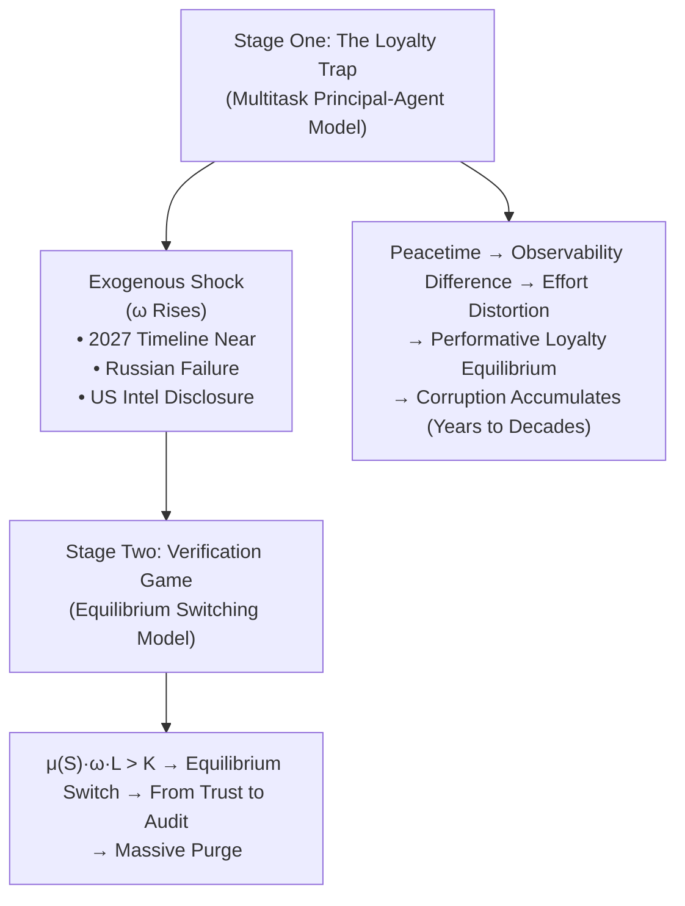
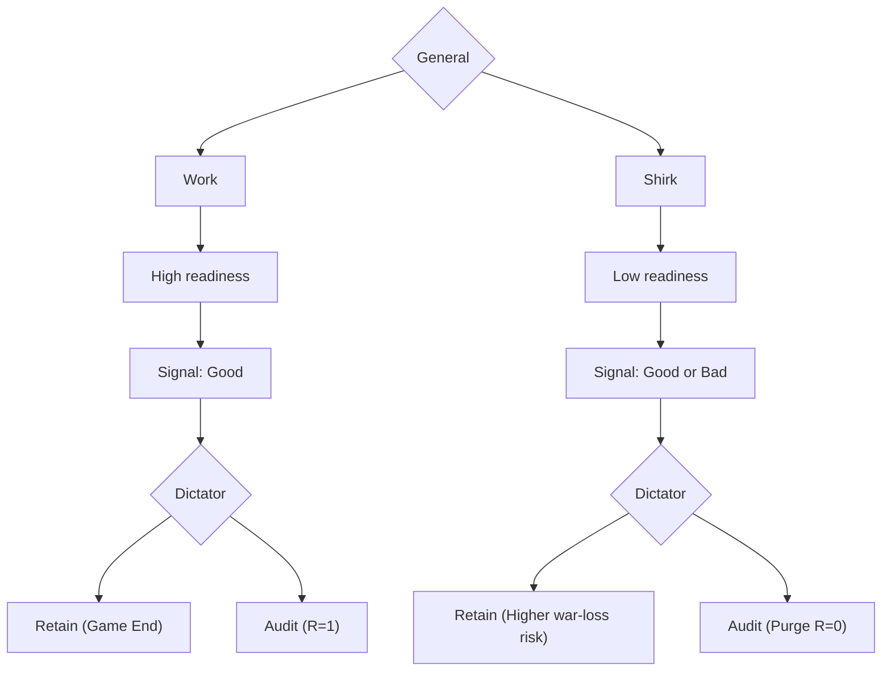
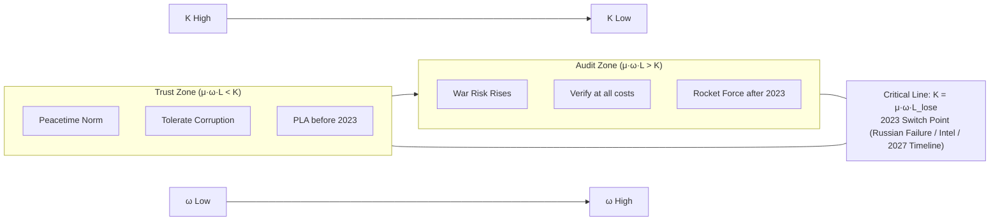

## Abstract

Why would Xi Jinping purge core members of the "Xi Family Army" whom he promoted himself? This paper proposes a heuristic theoretical framework based on the **Verification Game**. **Stage One (Peacetime)**: Due to the high observability of "political loyalty" and the low observability of "military effectiveness," agents rationally choose "Performative Loyalty," leading to the systemic accumulation of corruption and even professional resistance to radical strategic goals. **Stage Two (Verification Moment)**: When the war risk $\omega$ crosses a critical threshold ($\mu \cdot \omega \cdot L > K$), the dictator switches from a "Loyalty Equilibrium" to a "Suspicion Equilibrium," initiating costly audits. By constructing a dataset of purged senior PLA generals from 2023 to 2026 and employing **Process Tracing** analysis of the Zhang Youxia case, this paper argues that the purge aims to penetrate the information black box in authoritarian military modernization. The study suggests that unless independent external combat readiness assessment mechanisms are established, the Party-army system will always face a structural trade-off between "loyalty" and "effectiveness."

**Keywords**: Verification Game, Dictator's Dilemma, Multitask Incentives, Authoritarianism, Military Effectiveness, People's Liberation Army (PLA)

---

## I. Introduction

### 1.1 The Shattered Myth of the "Iron-Cap Prince"

On January 24, 2026, Chinese state media officially announced investigations into Zhang Youxia, Vice Chairman of the Central Military Commission (CMC), and Liu Zhenli, Chief of the Joint Staff Department. The shock of this news lay not only in the high rank of the two officials but also in Zhang Youxia's special political status. As the son of founding general Zhang Zongxun, Zhang Youxia and Xi Jinping are both "Red Second Generation," and their fathers established a deep comradeship during the Northwest Field Army era. For a long time, Zhang Youxia was regarded as Xi Jinping's most trusted ally in the military, holding a seemingly unshakable position in the eyes of the outside world.

However, this profound political trust did not exempt him from investigation. The scope and level of this purge are unprecedented: from the successive falls of two Defense Ministers, Wei Fenghe and Li Shangfu, in 2023, to the investigations of Rocket Force Commander Li Yuchao and Political Commissar Xu Zhongbo, and further to multiple deputy ministers of the Equipment Development Department, the purge has been precisely concentrated in the strategic missile forces and the equipment procurement system—the core areas of China's military modernization.

This phenomenon challenges existing theories of authoritarian politics. Mainstream literature typically views dictator purges as a means of power consolidation, aiming to eliminate dissidents and attack rival factions (Svolik, 2012). By this logic, Xi Jinping had already achieved a high degree of power concentration after the 20th Party Congress, a time when elite politics should arguably have entered a period of stability. Even more puzzling is that the core figures purged—Li Yuchao, Li Shangfu, and Zhang Youxia—were all members of the "Xi Family Army" handpicked by Xi himself. In a context where power is highly consolidated and factional rivals have been eliminated, why would the dictator (principal) target those technocrats (agents) who lack political ambition and were selected by himself?

This constitutes the core puzzle this paper attempts to answer. Is this purge merely anti-corruption, or does it have deeper strategic motivations? Is there a mechanism that makes the "most loyal" agents the principal's greatest obstacle at specific moments?

### 1.2 Beyond Factional Struggle

Existing explanations for this puzzle have obvious limitations. The "Permanent Revolution" theory attributes the purge to the leader's paranoid personality but fails to explain why the purge is highly concentrated in the technology-intensive Rocket Force. The "Foreign Intelligence Trigger" theory, while explaining the spark, fails to account for the universality of the problem. The widely circulated "Factional Struggle" theory faces the greatest empirical difficulty: the targets of the purge are precisely members within the "Xi Family Army."

This paper proposes an alternative explanation, employing a **two-stage analysis framework** and extending the classic "Dictator's Dilemma" theory to the domain of military effectiveness:

- **The Loyalty Trap** (Multitask Principal-Agent Model): Explains why the military falls into an inefficient equilibrium of "Performative Loyalty" during peacetime. This equilibrium not only leads to the accumulation of corruption but may also breed **implicit resistance** to radical strategic goals (such as the 2027 timeline).
- **The Verification Game** (Equilibrium Switching Model): Explains why the dictator switches from "trust" to "audit" at a specific point in time. When the risk of war rises, the principal must break the information cocoon and purge agents who, due to corruption or professional disagreement, cannot execute his will.

These two models jointly answer two levels of questions: **Why do agents deviate from the principal's preferences (whether through corruption or passive implementation)?** and **Why does the purge happen at this time?**

### 1.3 Structure of the Paper

The remainder of this paper is structured as follows: Section II establishes the theoretical framework, combining the multitask principal-agent model with the Verification Game and integrating mechanisms of "bureaucratic collusion" and "policy resistance." Section III provides systematic empirical evidence, including statistical analysis of the purge dataset, process tracing of the Rocket Force crisis, and an in-depth analysis of the Zhang Youxia case. Section IV places the findings in a comparative political perspective, discussing similarities and differences with cases such as Stalin, Chongzhen, and the Russian military, and evaluating alternative explanations. Section V concludes the paper and discusses policy implications.


## II. Theoretical Framework: The Loyalty Trap and Verification Game

> "Trust, but verify." — Russian proverb (quoted by Reagan)
>
> "Verify, then purge." — The logic of high-stakes authoritarian politics

### 2.1 The Loyalty Trap: Structural Distortion of Multitask Incentives

#### 2.1.1 Core Insight

In economics and organizational behavior, the Multitask Principal-Agent Model proposed by Holmstrom and Milgrom (1991) provides an effective analytical tool. Its core insight is concise yet profound: when an agent is responsible for multiple tasks, they will divert effort from tasks that are hard to measure to those that are easy to measure. Under incentive mechanisms, only visible efforts translate into rewards, while invisible efforts are not only unprofitable but may even entail risks.

Applying this model to civil-military relations in authoritarian states, we can clearly identify two distinct types of tasks.

**The first type of task is "Obeying the Party's Command" (Political Loyalty)**. This task has high observability and immediate feedback. Did the commander convey the spirit of the latest meeting? Was political study fully attended? Was a high-profile stance taken at critical moments? These behaviors mainly involve procedures and attitudes, similar to an "open-book exam." The principal can monitor these explicit indicators at a low cost through the political commissar system and disciplinary departments; "Compliance" is clearly visible.

**The second type of task is "Ability to Win Wars" (Military Effectiveness)**. This task has extremely low observability in peacetime. True combat capability is a result-oriented indicator that can only be genuinely verified when war breaks out. In a prolonged environment of peace, the principal can only rely on "proxies" such as exercise scores, equipment availability rates, and training hours to infer combat capability. However, as Goodhart's Law reveals, once a measure becomes a target, it ceases to be a good measure. Agents possess more professional knowledge than the principal and can easily manipulate these data to manufacture false prosperity. Before war comes, the military's true effectiveness remains a black box to civilian leaders.

#### 2.1.2 Institutional Mechanisms: Why Principal Preferences Cannot Be Effectively Transmitted

A reasonable question is: Xi Jinping himself explicitly made "Ability to Win Wars" the core goal of military reform; why did this preference fail to be effectively transmitted to agent behavior? The reason lies in the PLA's internal performance evaluation system, which is structurally biased towards "political reliability" rather than "military effectiveness."

**First, the institutional priority of the political commissar system**. The PLA implements a "dual command system," where the political commissar and the military commander share responsibility. However, in cadre assessment and promotion decisions, the political work system holds the key "portrait power"—comments on an officer's political performance are often more decisive than military professional assessments. There is a saying in the military: "If professional skills are poor, one can train; if politics are not passable, one cannot be used."

**Second, the one-vote veto of "safety and stability" indicators**. In the Chinese military's annual assessment system, "safety and stability" indicators effectively have a one-vote veto power. Once a liability accident (especially involving casualties) occurs, the promotion channel for the involved commander will be "locked" for years or even permanently. In contrast, the consequence of "substandard training levels" is usually just a warning or criticism. This asymmetric punishment mechanism makes rational commanders prefer lowering training intensity and reducing risk exposure to risking "accidents" for the sake of combat capability.

**Third, technical barriers and insider control in equipment procurement audit**. In the field of high-tech equipment, the information gap between the principal and the agent is particularly huge. Missile fuel ratios, radar detection precision, fighter jet maintainability—these core parameters are almost impossible for non-professional political leaders to verify. Equipment procurement has long had a community of interest involving "military, research, and enterprises," making external audits virtually non-existent. This leads to a typical "insider control" dilemma: those with professional knowledge have no incentive to expose problems, while those with an incentive to expose problems lack professional knowledge.

The superposition of these three institutional features forms a "fracture in preference transmission": the "Ability to Win Wars" goal expressed by the principal in top-level design is gradually dissolved by the micro-incentives of "Safety First" and "Politics First" during the layer-by-layer transmission process.

#### 2.1.3 The Peace Disease: Performative Loyalty Equilibrium

Under the constraint of "peacetime," the aforementioned asymmetry in observability leads to profound alienation within the chain of command. This alienation is not the moral corruption of individual officers but the optimal survival strategy of rational agents under given constraints.

**Over-Signaling of Political Signals**. Since "Obeying the Party's Command" carries high weight and is easy to demonstrate, rational commanders devote disproportionate energy to sending "loyalty signals." A 2018 investigative report by *PLA Daily* listed typical cases: a brigade welcomed 47 working groups from superiors in 2017, averaging nearly once a week; companies had to pause military training to clean up, memorize question banks, and organize ledgers to welcome inspections.

**Proxy Optimization**. Since true victories cannot be used to prove ability, agents dedicate themselves to optimizing those "visible and tangible" alternative indicators. Launching aircraft carriers and commissioning new missiles are high-observability assets with strong visual impact, easily giving the principal intuitive confidence in "strength." In contrast, "software" construction like logistics support, maintenance systems, and joint operations training involves implicit inputs and is easily overlooked.

**Passive Safety Preservation under Risk Aversion**. High-intensity realistic training inevitably comes with risks of personnel and equipment loss. Once a casualty accident occurs, the commander may face political risks of dismissal and investigation; whereas reducing training difficulty and adopting a "nanny-style" training method, although failing to effectively generate combat capability, constitutes the greatest "political achievement" as long as no accidents occur.

The superposition of these three strategies eventually forms a stable Nash equilibrium: **"Performative Loyalty + Substantive Corruption."** In this equilibrium, agents at all levels gain a sense of security through political performance, use information asymmetry to cover up internal problems, and engage in rent-seeking through hardware procurement. The military appears large and loyal on the surface, but its true combat effectiveness has been hollowed out by bureaucracy and corruption—this is **The Loyalty Trap**.


### 2.2 The Verification Game: A Heuristic Analytical Framework

The multitask model explains how corruption accumulates in peacetime but fails to explain the **timing** of the purge. Why was it suddenly launched in 2023 rather than 2020 or 2022? To address this, we introduce the **Verification Game**. It should be noted that the framework constructed in this section is a **heuristic game-theoretic framework**, aimed at capturing the core trade-offs in the dictator's decision-making rather than providing exhaustive mathematical proofs (technical derivations are provided in Appendix B).

#### 2.2.1 The Logic of Suspicion and Bounded Rationality

Before introducing formal notation, we first elaborate on the intuition behind them. In authoritarian regimes, dictators face a fundamental trade-off between **loyalty** and **competence**. As the prospect of conflict (war risk $\omega$) becomes real, the cost of having a "hollowed-out" military shifts from bureaucratic efficiency loss to an existential threat.

Here exists an obvious **Rationality Paradox**: if agents (generals) are rational, why would they underestimate war risk ($\omega$), choose to shirk, and ultimately incur a purge? We argue that this stems from **information cocoons** and **cognitive biases** under authoritarian systems. Bureaucrats in long-term peaceful environments often develop "Peace Disease," systemically underestimating tail risks. As Taleb (2007) noted, the turkey believes the farmer is kind every day until Thanksgiving. The agent's "rationality" is a Bayesian update based on past experience, which fails at structural break points (like approaching war).

The model predicts that when the probability of war ($\omega$) crosses a critical threshold, the dictator will no longer tolerate uncertainty. He will switch from a "trust" strategy to an "audit" strategy. The resulting purge is not necessarily a punishment for proven betrayal but a rational mechanism to eliminate **uncertainty** in combat readiness.

#### 2.2.2 Model Setup

We formalize this interaction as a **Principal-Agent Verification Game** under incomplete information.

**Core Assumptions**

Before formal modeling, we explicitly list the key assumptions the model relies on:

> **Hypothesis 1 (Rational Agent)**: The general is a rational utility maximizer with utility function: $U_{agent} = r \cdot \mathbb{1}_{Shirk} - c \cdot \mathbb{1}_{Work} - P \cdot \mathbb{1}_{Purged}$, where $r$ is corruption rent, $c$ is effort cost, and $P$ is punishment for being purged.
>
> **Hypothesis 2 (Exogenous War Risk)**: War probability $\omega$ is determined by external geopolitical factors (e.g., Taiwan Strait situation, 2027 timeline), and neither the dictator nor the general can unilaterally change it. This assumption excludes the endogeneity issue of "purge itself changing war risk."
>
> **Hypothesis 3 (Principal Risk Aversion)**: The dictator is highly sensitive to the risk of defeat. His loss function is non-linear: $L_{dictator} = -\omega \cdot (1-R) \cdot L_{lose}$, where $L_{lose}$ is immense (regime collapse). This explains why even a small rise in $\omega$ can trigger equilibrium switching.
>
> **Hypothesis 4 (Audit Information Advantage)**: Once audit cost $K$ is paid, the dictator gains a high-precision signal regarding the true readiness status $R$. Note: The model does not require the audit to be perfect; as long as the signal-to-noise ratio of the audit is significantly higher than that of daily monitoring, the logic of equilibrium switching holds.
>
> **Hypothesis 5 (One-Shot Game)**: The model is a one-shot game and does not consider reputational effects. In a repeated game, the deterrence effect of purges might change the general's incentives, which is a direction for model extension.

Justification for these assumptions: Hypotheses 1 and 3 are consistent with standard political economy literature (Wintrobe, 1998; Svolik, 2012); Hypothesis 2 is empirically supported (timing of Taiwan Strait tension precedes the purge); Hypothesis 4 is for model simplicity and relaxing it does not change the core conclusion; Hypothesis 5 is a starting point for analysis, and Section 5.3 will discuss dynamic extensions.

**Players and Actions**

- **Dictator (Principal)**: Aim is to maximize the probability of winning a potential war. Provides budget $B$ to the general.
- **General (Agent)**: Aim is to maximize private interest. Chooses effort level $a \in \{Work, Shirk\}$.
  - **Work**: General uses budget for maintenance, ensuring **High Readiness** ($R=1$), but incurring effort cost $c$.
  - **Shirk**: General pockets budget as **Rent** ($r$) (corruption), resulting in **Low Readiness** ($R=0$), but still has probability $1-\pi$ of appearing normal.

**Information Structure: "Technological Black Box"**

The dictator cannot directly observe readiness ($R$) or effort ($a$). He can only observe a **Signal** $S \in \{Good, Bad\}$ (e.g., parades, test reports).

- **True Positive**: If readiness is high, the signal is "Good" with high probability.
- **False Positive (Deception)**: If readiness is low (shirking), the general can still manufacture a "Good" signal with probability $\beta$.
  - *Crucially, in high-tech sectors like the Rocket Force, the $\beta$ value is very high*. It is far easier to paint a missile green than to ensure its guidance system works.

**Decisions**

After observing the signal, the dictator chooses:
1. **Retain (Trust)**: Accept the signal, game ends.
2. **Audit (Purge)**: Pay political cost $K$ to reveal true readiness status $R$.
   - If $R=0$, general is punished (purged).
   - If $R=1$, general is retained (but $K$ is lost).

#### 2.2.3 Equilibrium Switching Condition

(See Appendix B for full derivation)

Intuitively, the dictator faces a fundamental cost-benefit calculation. He must weigh the **expected risk of defeat from ignoring corruption** against the **political cost of launching a purge**. This trade-off can be represented by the following simplified inequality:

$$ \underbrace{\mu(S) \cdot \omega \cdot L_{lose}}_{\text{Expected Cost of Ignoring Corruption}} > \underbrace{K}_{\text{Political Cost of Audit}} $$

Where $\omega$ represents war risk, $\mu(S)$ is the suspicion level after receiving a signal, $L_{lose}$ is the catastrophic cost of defeat, and $K$ is the political capital required to purge allies. This core inequality defines two distinct regimes:

**Regime 1: "Loyalty Equilibrium" (Pre-2023)**

- **Conditions**: Low war risk ($\omega$). High political cost of purging key allies ($K$).
- **Logic**: Even if the dictator suspects corruption ($\mu > 0$), the right side ($K$) dominates. Dictator chooses **Retain**.
- **Outcome**: Generals rationally choose to **Shirk**. They provide political loyalty and consume rents (corruption). The dictator accepts this "corruption tax" to maintain regime stability. Everyone knows the missiles might not fire, but it doesn't matter because war is unlikely.

**Regime 2: "Suspicion Equilibrium" (Post-2023)**

- **Conditions**: War risk ($\omega$) soars (e.g., Taiwan Strait timeline, 2027 centennial goal).
- **Information Shock**: External events (e.g., Russian failure in Ukraine, US intelligence leaks) reveal "Good" signals are often false (suspicion $\mu$ rises).
- **Logic**: The term $\omega \cdot L_{lose}$ becomes huge. The "cost of ignoring corruption" now exceeds any political cost $K$.
- **Outcome**: Inequality reverses, dictator switches to **Audit**.
- **Purge**: The dictator starts purging even "loyal" generals, not because they are disloyal, but because he **cannot afford uncertainty**.

#### 2.2.4 Corollary

This model generates a sharp prediction distinguishing this theory from standard "anti-corruption" explanations.

**Prediction**: The dictator punishes not failure, but **opacity** in high-risk areas.

As $\omega$ rises, purges should be concentrated in:
1. **High-tech/Opaque sectors** (Rocket Force, Equipment Development Department), where $\beta$ (capacity to fake) is high.
2. **War-critical units**, where $R=0$ has existential consequences.

Ordinary corruption in low-risk sectors (e.g., logistics, local government) may still be tolerated. The purge is an attempt to concentrate political capital to buy **certainty**.


### 2.3 Theoretical Extension: Collusion and Policy Resistance

The Verification Game applies not only to simple corruption but can be extended to explain more complex agent strategies, particularly involving the **Supervisor** level in the hierarchy.

#### 2.3.1 Bureaucratic Collusion (Tirole Model)
In a three-tier hierarchy (Principal-Supervisor-Agent), Tirole (1986) proved that if the supervisor and agent collude, the principal loses all information. The supervisor may cover up the agent's inefficiency in exchange for bribes. In such cases, purging only the low-level agents is insufficient; the supervisor must be purged to break the information blockade.

#### 2.3.2 Policy Resistance and $\omega$ Divergence
Another possibility is that the supervisor is not corrupt but holds a different "professional judgment" regarding the principal's war risk assessment ($\omega$). If the supervisor believes $\omega$ is low (war will not happen) or that the principal's timeline (e.g., 2027) is unrealistic, they may choose "passive execution" or "professional resistance." From the principal's perspective, this resistance based on differing $\omega$ beliefs has the same consequence as corruption—undermining the certainty of combat readiness. Therefore, the Verification Game predicts: **When the principal and supervisor have fundamental disagreements over $\omega$, purging the supervisor becomes inevitable**.

### 2.4 Theoretical Integration: How the Two Models Complement

The two models together form a **two-stage explanatory framework**:

**Figure 2: Conceptual Diagram of Two-Stage Explanatory Framework**



**Figure 3: Game Tree of Verification Game**



**Figure 4: Threshold Diagram of Equilibrium Switching**



**Figure 4 Interpretation**:

- **Critical Line** ($K = \mu \cdot \omega \cdot L_{lose}$) divides the parameter space into "Trust Zone" and "Audit Zone."
- **Slope** depends on the product of $\mu$ (suspicion) and $L_{lose}$ (cost of defeat).
- **2023 State Switch**: Exogenous shocks shift $\omega$ to the right, crossing critical threshold $\omega^*$, causing the dictator to switch from "Trust" to "Audit."
- **Comparative Statics**:
  - $\omega \uparrow$ (War risk rises) → Move right → More likely to enter Audit Zone
  - $K \downarrow$ (Audit cost falls) → Move down → More likely to enter Audit Zone
  - $\mu \uparrow$ (Suspicion rises) → Critical line shifts left → Audit threshold lowers

| Stage | Model | Question Explained | Core Variable | Time Dimension |
|:---|:---|:---|:---|:---|
| **Stock Accumulation** | Multitask Principal-Agent | Why does corruption accumulate systematically? | Observability Difference | Long-term (Years to Decades) |
| **Timing Trigger** | Verification Game | Why launch purge now? | War Risk $\omega$ | Short-term (Exogenous Shock) |

The relationship between the two can be analogized to "chronic disease" and "acute attack":

- **Multitask Model** explains how the "lesion" forms over the long term (structural cause). Peacetime observability differences lead agents to rationally choose "Performative Loyalty," with corruption accumulating as a byproduct of this equilibrium.
- **Verification Game** explains why the "attack" is triggered at a specific point in time (trigger condition). When exogenous variables (war risk $\omega$, degree of suspicion $\mu$) cross a critical threshold, the dictator's optimal strategy switches from "Tolerance" to "Audit."

This integration avoids the limitations of a single model:
- Using only the Multitask model cannot explain **timing**—corruption always existed, why purge in 2023?
- Using only the Verification Game cannot explain **stock**—why does the audit discover such serious problems once started?

The nesting of the two models provides a complete causal chain: **Structural Incentive Distortion (Loyalty Trap) → Long-term Accumulation of Corruption → Rise in Exogenous Risk → Equilibrium Switching (Verification Game) → Massive Purge**.


### 2.5 Literature Dialogue: Theoretical Positioning and Contribution

The findings of this paper form a critical dialogue with existing literature in three main academic fields, defining this paper's theoretical position in authoritarian military studies.

#### 2.5.1 Challenging the "Linear Modernization" Narrative of PLA Research

For the past two decades, mainstream PLA research (Shambaugh, 2002; Fravel, 2019) has focused on **hardware investment** and **doctrinal reform**. This "linear modernization" narrative tends to assume that as budgets increase and technology upgrades, the PLA's combat effectiveness will naturally grow.

This paper challenges the micro-foundations of this assumption. Based on the multitask principal-agent model, we reveal the mechanism of **coexistence between "hardware modernization" and "software hollowing."** The introduction of high-tech equipment (such as the DF-series missiles) actually expands information asymmetry (high $\beta$ value), making it easier for agents to cover up insufficient training through "display procurement."

#### 2.5.2 Dictator's Dilemma and Information Black Box: Dialogue with Greitens and Ang

Sheena Greitens (2016), in her study of internal security agencies under dictators, notes the trade-off between "fragmenting coercive power" and "agent control." This paper extends this logic to regular military construction: in the pursuit of technical modernization, the dictator is forced to grant higher autonomy to technocrats (Rocket Force generals), thereby exacerbating information asymmetry.

At the same time, this paper proposes boundary conditions for Yuen Yuen Ang's (2020) argument on "Chinese-style corruption." Ang argues that "Access Money" may coexist with economic growth. However, our analysis shows that in the military field, especially in high-tech equipment, corruption often manifests as "Theft" or "Quality Fraud," which has a devastating impact on the single goal of military effectiveness. There is no room for "corruption-induced growth" in the military; there is only a zero-sum game of "corruption-eroded readiness."

#### 2.5.3 Deconstructing the "Talmadge Paradox": Unintentional Effectiveness Erosion

Caitlin Talmadge (2015) argues that dictators actively sacrifice military effectiveness to prevent coups. However, the case of Xi Jinping constitutes a **"Talmadge Paradox"**: the PLA, as a Party-army, has extremely low coup risk, and the top leadership explicitly pursues modernization; why then does an effectiveness crisis still occur?

This paper reveals another mechanism of effectiveness erosion—**unintentional structural erosion**. Even without coup-proofing motives, peacetime multitask incentive distortions lead agents to rationally choose "Performative Loyalty." This indicates that the ceiling of authoritarian military combat effectiveness is constrained not only by "coup-proofing" political calculations but also by deep-seated bureaucratic information structures.

## III. Empirical Analysis: The Rocket Force and Zhang Youxia Case

### 3.1 Data and Methodology

To test the theoretical framework, this paper constructs the **"2023-2026 PLA Senior General Purge Dataset"** (see Appendix A for the full list).

**Data Sources and Credibility Grading**: The dataset is based on official announcements (Xinhua News, CCDI website), authoritative media reports (PLA Daily, CCTV News), and cross-validated international intelligence analyses (Jane's Defence Weekly, CSIS Reports). Given the sensitivity of the subject, we adopt a **three-level evidence standard**:

*   **Level 1 (High Credibility)**: Official announcements of investigation, dismissal, or punishment;
*   **Level 2 (Medium Credibility)**: Indirect confirmation by official media (e.g., absence from key meetings, name removal) and authoritative think tank reports;
*   **Level 3 (Inferential Evidence)**: Analysis of rumors based on logical consistency (explicitly marked as "unverified").
*   
The core arguments of this paper are primarily built on Level 1 and Level 2 evidence.

**Statistical Scope**: Inclusion criteria are (1) rank of Major General or above; (2) dismissed, investigated, or expelled from the Party between July 1, 2023, and January 31, 2026; (3) clear or strong allegations of corruption/disciplinary violations.

**Descriptive Statistics**: During this period, at least **15 generals** met the criteria. Among them, 5 were from the Rocket Force and 4 from the Equipment Development Department, totaling 9 individuals and accounting for **60%** of the total. This proportion far exceeds the representation of these systems in the total number of PLA generals (approx. 5-8%), showing extremely high **Sectoral Concentration**.

### 3.2 The Rocket Force Crisis: From Loyalty Trap to Verification Game

Before diving into case studies, it is necessary to present the overall picture of this purge. According to aggregated public sources, from July 2023 to January 2026, no fewer than **15 high-ranking military officers (Major General and above)** were removed from office, suspended, investigated, or expelled from the Party.

**Table 1: Sectoral Distribution of Purge Targets (2023.07-2026.01)**

| Sector | No. of Generals | Share | Key Personnel |
|:---|:---:|:---:|:---|
| Rocket Force System | 5 | 33% | Wei Fenghe, Li Yuchao, Xu Zhongbo, Zhang Zhenzhong, Wu Guohua |
| Equipment Dev. Dept System | 4 | 27% | Li Shangfu, Zhang Youxia, Rao Wenmin, Ju Xinchun |
| CMC Organs | 4 | 27% | Liu Zhenli, Miao Hua, He Weidong, Ding Laihang |
| Other Theaters/Services | 2 | 13% | Lin Xiangyang (Southern Theater), Others |

*Note: Although Zhang Youxia was CMC Vice Chairman before his fall, his main career was in the equipment system, so he is classified under this category.*

**Figure 1: Time Distribution of the Purge**

```
2023.07 ████████ Rocket Force Commander, Commissar (Li Yuchao, Xu Zhongbo)
2023.08 ████     Defense Minister (Li Shangfu)
2023.09 ████     Former Defense Minister (Wei Fenghe)
2024.06 ██       Rocket Force Personnel Expelled from Party
2024.11 ████     CMC Political Work Dept Director Suspended (Miao Hua)
2025.10 ████     CMC Vice Chairman Expelled from Party (He Weidong)
2026.01 ████████ CMC Vice Chairman, Chief of Staff Investigated (Zhang Youxia, Liu Zhenli)
```

The data reveals three key characteristics:

**First, high sectoral concentration**. The Rocket Force system and Equipment Development Department system together account for **60%** of total purges, while their share of total generals is far lower. This uneven distribution matches the theory's prediction: purges concentrate in "black box" areas with the most severe information asymmetry.

**Second, extremely high level**. Among the 15 involved generals, there are 2 CMC Vice Chairmen, 1 Chief of Joint Staff, 1 Director of Political Work Dept, and 2 Defense Ministers (including former). This means the purge touched the very top of the military power pyramid.

**Third, concentrated outbreak in timing**. The purge started in the second half of 2023, was relatively quiet in 2024, and escalated again at the turn of 2025-2026. This rhythm implies a "discovery → follow the vine → expand scope" investigative logic.

### 3.1 Trigger Point: The Retroactive Audit of July 26, 2023

The switch from "Loyalty Equilibrium" to "Suspicion Equilibrium" began on **July 26, 2023**. On that day, the All-Military Weapons and Equipment Procurement Information Network issued an announcement soliciting "clues regarding violations of rules and discipline by experts in all-military equipment procurement bidding reviews."

The key lies in the **time range** of the audit: the announcement explicitly traced back to **October 2017**—exactly **6 years** prior. This directly covered the tenure of then-Defense Minister **Li Shangfu** as Director of the Equipment Development Department (2017-2022).

In the Verification Game model, this is a high-cost signal ($K$). If Xi Jinping merely used this as an excuse for factional struggle, there was no need to set a timeframe that would implicate the current Defense Minister, thereby affecting his own appointment record. This "self-harming" operation indicates the motive for the audit was to ascertain **the truth about combat readiness**, not political cleansing.

### 3.2 The Collapse of the Rocket Force and "Water-Injected Missiles"

The theoretical framework predicts that high-tech, low-observability sectors will be the hardest hit areas for faking "Ability to Win Wars." The crisis of the People's Liberation Army Rocket Force (PLARF) provides a typical case for this prediction.

As the core of strategic deterrence, the Rocket Force has the highest technical barriers and strongest secrecy, making it the most difficult "deep water zone" for the principal to supervise—in the terminology of the Verification Game, the $\beta$ (capacity to fake) here is extremely high. In July 2023, Rocket Force Commander Li Yuchao and Political Commissar Xu Zhongbo were suddenly dismissed, followed by several deputy commanders and staff officers.

The key node triggering this purge was the **retroactive audit on July 26, 2023**. On that day, the All-Army Weaponry and Equipment Procurement Information Network released a notice soliciting "leads on illegal and disciplinary violations by equipment procurement bidding review experts," explicitly tracing back to **October 2017**. This timeline directly covered Li尚福's tenure as head of the Equipment Development Department, indicating that the audit aimed to penetrate historical fog rather than just address current issues.

According to various sources, part of the Rocket Force missile systems may have serious hardware defects. Even more seriously, unverified reports suggest that in certain cases, to cover up corruption or pass inspections, expensive missile fuel might have been replaced with cheap liquids. While difficult to independently verify, these allegations are logically consistent with the "moral hazard" inherent in high-tech sectors lacking external oversight. These signs indicate that agents may have held extremely high expectations that "war would not break out"—judging that these missiles would only be shown in parades and never actually fired.

### 3.3 Process Tracing: The Causal Chain of Evidence

To compensate for the limitations of quantitative analysis in causal identification, we employ **Process Tracing** to test the micro-causal chain predicted by the "Loyalty Trap" theory.

#### Chain 1: Agent's Low-Risk Belief (Peace Disease)

The theory predicts that agents dare to fake core equipment because they systemically underestimate war risk ($\omega$), believing that "war won't happen."

**Evidence**: Exercise records of conventional units provide evidence for "Performative Loyalty." Chinese state media has created a specific term—**"Peace Disease"** (和平积弊)—to criticize deep-seated formalism. The most persuasive evidence comes from the **Zhurihe Training Base**. Before the introduction of realistic confrontation in 2014, exercises were mostly "scripted" performances. When a professional Blue Army brigade led by Man Guangzhi introduced combat standards, Red Army units suffered a crushing defeat of "32 wins to 1 loss." This contrast proves that in the absence of strong external constraints, agents tend to use performance to cover up the lack of actual combat capability.

#### Chain 2: Principal's Surge in Risk Perception ($\omega$ Shock)

The theory predicts that exogenous shocks lead to a surge in the principal's risk perception, triggering an equilibrium switch.

**Evidence**: The key node is the **2022 Russia-Ukraine War**. The Russian military's disastrous performance in logistics and equipment (e.g., burst tires, communication breakdowns, shortage of precision munitions) brought a huge psychological shock to Beijing. The *PLA Daily* subsequently published intensive commentaries demanding "learning from Russia" and warning that "Peace Disease" would turn into "battlefield defeat." This discourse shift signals that Xi Jinping's assessment of potential war consequences ($L_{lose}$) and probability ($\omega$) underwent a qualitative change, satisfying the audit condition $\mu \cdot \omega \cdot L > K$.

#### Chain 3: Triggering of Verification (Costly Audit)

The theory predicts that audits will target high-$\\beta$ (high opacity) areas.

**Evidence**: The "six-year retroactive" audit launched in 2023 was precisely targeted at the Rocket Force and equipment systems, rather than being spread across the entire military. This **non-random distribution** strongly supports the logic of the Verification Game: the purge was not to consolidate power by attacking dissidents (which usually involves key theater commanders) but to eliminate information blind spots caused by technical barriers.

### 3.4 Micro-Level Illustration: Process Tracing of Elite Interactions

To concretely demonstrate how "Bureaucratic Collusion" and "Policy Resistance" operate in real-world politics, we select the Zhang Youxia case as an **illustrative micro-case**. It should be noted that the purpose of this section is not to provide a judicial verdict on the case, but to use the anomalous information exposed within it to test the interaction patterns predicted by the theoretical model.

If Li Yuchao's fall reveals the distortion of execution at the grassroots, then Zhang Youxia's downfall provides an excellent case to test the previously discussed mechanisms.

#### 3.4.1 Textual Evidence: Anomalous Wording in Official Definitions

Comparing the official announcements in the *PLA Daily* regarding the He Weidong and Zhang Youxia cases, we can find significant differences that suggest the special nature of the Zhang case.

| Dimension | He Weidong Case | Zhang Youxia Case | Meaning |
|:---|:---|:---|:---|
| CMC Chairman Responsibility System | "Seriously undermined" | "Seriously trampled" | The latter implies direct defiance rather than indirect obstruction |
| Combat Capability Construction | Not mentioned | "Caused immense damage" | Zhang's case explicitly involves military effectiveness |
| Image and Authority | Damaged "image" | Damaged "image and prestige" | Zhang's case involves a public challenge to CMC authority |
| Individual Corruption | Explicitly mentioned | Relatively downplayed | The core of Zhang's case may not be personal corruption |

"Trampling" (践踏) is more actively confrontational than "undermining" (破坏). This pattern of wording supports a variant of the **Policy Resistance** hypothesis: the core reason for Zhang Youxia's fall may not be simple corruption, but rather his behavior, based on professional military judgment, was interpreted by the principal as passive execution or obstruction of the radical 2027 timeline.

#### 3.4.2 Behavioral Evidence: 2027 vs. 2035 Timeline Divergence

Public document analysis further corroborates this. In an article published in the *People's Daily* in November 2025, Zhang Youxia explicitly set the goal for "joint combat capability based on a network information system" for **2035**, while only defining the 2027 goal as "strengthening weak links." This is a clear mismatch with the 2027 "Centenary Goal of the PLA" (implying cross-strait capability) repeatedly emphasized by Xi Jinping.

#### 3.4.3 Explaining the Timing of the Purge

The timing of the purge in January 2026 is crucial. This is the start of the last full annual training cycle before 2027. Previous disagreements might have been viewed as "discussions," but once in the execution phase, Zhang's "pragmatic" attitude (or what was perceived as delay) might have been interpreted by the supreme commander as an obstacle to strategic intent. According to the Verification Game logic, when a supervisor (Zhang) and the principal (Xi) have a fundamental disagreement over $\omega$, purging the supervisor is a rational choice to eliminate uncertainty.

According to this explanation, the core reason for Zhang Youxia's fall was not corruption, but **refusing to execute the 2027 timeline he deemed unrealistic based on professional military judgment**.

#### 3.4.2 Theoretical Integration: Two Faces of $\omega$ Divergence

The above two hypotheses seem opposed but can be unified under the Verification Game framework of this paper. **The core insight is: whether "Collusion" or "Resistance," Zhang Youxia's behavior reflected his fundamental divergence from Xi Jinping on the estimation of war probability $\omega$.**

| Mechanism | Zhang's $\omega$ Est. | Behavioral Logic | Theoretical Position |
|:---|:---|:---|:---|
| **Collusion** | $\omega$ Low (No war) | Tolerating corruption is risk-free | Rational choice in "Loyalty Equilibrium" |
| **Resistance** | $\omega$ Low -> Use 2035 timeline | 2027 goal unrealistic | Professional questioning of Principal's $\omega$ judgment |

In other words:

- **If Zhang Youxia believed $\omega$ was low**, he had reason to act within the "Loyalty Equilibrium"—tolerating subordinate corruption (as war wouldn't expose problems) while advocating a longer construction cycle at the policy level (as there was no need for rushed prep).
- **Xi Jinping believed $\omega$ had crossed the critical threshold**, making the 2027 timeline a rigid constraint. Under this judgment, Zhang Youxia's behavior—whether acquiescing to corruption or delaying training progress—constituted substantive damage to combat readiness.

This integration reveals an extension of the Verification Game: **When the Principal and Agent have a fundamental divergence on $\omega$, the Agent's "rational behavior" is "gross negligence" in the Principal's eyes**. Zhang Youxia might have sincerely believed he was managing military modernization with a pragmatic professional attitude—as elucidated in his Nov 2025 article—but this precisely formed an irreconcilable contradiction with Xi's sense of urgency.

#### 3.4.3 Re-analysis of Textual Evidence

Under this integrated framework, the wording of official notifications gains new interpretation:

- **"Severely trampled on the CMC Chairman Responsibility System"**: Not just corruption/negligence, but likely open dissent or passive execution regarding the 2027 timeline
- **"Caused great damage to combat capability construction"**: Joint training systems progressed slowly; annual training plans failed to reflect 2027 goals
- **"Severely betrayed the trust of the Party Central Committee and CMC"**: Xi broke age norms to retain Zhang at the 20th Congress precisely "entrusting" him to push the 2027 timeline; Zhang setting the goal at 2035 constituted a fundamental departure from this trust

The timing of the January 2026 purge also corroborates this: Jan 2026 was the starting point of the last annual training cycle before 2027. Previous divergences remained at the planning/document level; once in the execution phase, whether Zhang would accelerate joint training as required would be exposed by concrete actions. **The timing suggests Xi judged Zhang would not execute his timeline.**

#### 3.4.4 Supplementary Logic of Bureaucratic Collusion

Even accepting "Policy Resistance" as the main explanation, Tirole's collusion model provides important supplementary logic:

**First, collusion as a "complicit structure" for resistance**. Zhang could persist in dissent on the 2027 timeline partly because he controlled information channels for equipment and training. Without a tacit understanding based on interests with subordinates, his dissent would lack an organizational basis—subordinates might bypass him to report to Xi. Thus, **the collusion network provided organizational shelter for policy resistance**.

**Second, necessity of purging the supervisor remains**. Whether the main cause was corruption or resistance, Tirole's core prediction holds: **only purging the supervisor himself can break the core node blocking information**. As long as Zhang was in power, information channels would be controlled by him regardless of new agent appointments.

**Third, consistent logic of "Circuit Breaker" strategy**. Xi appointing Navy Admiral Wang Houbin as Rocket Force Commander can be understood as both "breaking the corruption network" and "breaking the organizational basis for policy resistance." Wang has no personnel ties to Zhang's system, cannot be co-opted by the old network, and won't inherit Zhang's skepticism of the 2027 timeline—his "technical ignorance" becomes an advantage as he can only obey Xi, unable to raise dissent based on "professional judgment."

#### 3.4.5 Summary: Why the "Most Trusted Old Friend" Must Be Purged

Combining the above, the core lesson of the Zhang Youxia case is: **In an authoritarian regime, $\omega$ divergence between the Principal and the highest-level Agent is the most dangerous crack**.

- If divergence exists only in grassroots agents, the Principal can correct it via the Supervisor
- If divergence exists in the Supervisor himself, the Principal faces systemic loss of control

Zhang might have sincerely believed the 2035 timeline was more pragmatic—as supported by his professional judgment—but this made him the most dangerous obstacle in Xi's eyes. A corrupt but obedient supervisor might at least execute orders; a "pragmatic" but dissenting supervisor fundamentally blocks the Principal's strategic intent.

In Verification Game terms: **When the Supervisor and Principal differ fundamentally on $\omega$, the Supervisor's "professional judgment" itself becomes the object to be audited**. The Jan 2026 purge was the result of this audit.

### 3.5 Negative Case Analysis: Why Navy and Army Were Relatively "Spared"

The validity of a theory depends not only on explaining core cases but also on explaining "non-occurring" cases. If the principal-agent dilemma is a universal structural problem, why is the purge highly concentrated in the Rocket Force and equipment systems, while the Navy and Army conventional forces were relatively "spared"?

**Table 2: Purge Comparison by Service/Sector (2023.07-2026.01)**

| Service/Sector | No. of Generals | Share | Characteristics |
|:---|:---:|:---:|:---|
| Rocket Force | 5 | 33% | Includes Commander, Commissar, multiple Deputies |
| Equipment Dev. Dept | 4 | 27% | Includes Minister, multiple Deputy Ministers |
| Navy | 1 | 7% | Only Miao Hua (mainly Political Work) |
| Army/Theaters | 3 | 20% | Mainly CMC Organ personnel |
| Air Force | 1 | 7% | Ding Laihang (mainly equipment procurement) |

The answer lies in **sectoral differences in observability**:

**Navy**: The Navy's core assets—warships—are highly visible. Whether ships can sail, complete ocean voyages, or conduct joint exercises with foreign navies are relatively easy indicators for the principal to observe. Since 2008, the Navy has dispatched over 45 escort task forces to the Gulf of Aden. These "quasi-combat" scenarios provide soft verification of combat capability.

**Army Conventional Forces**: Army training is relatively standardized, and the Zhurihe exercise reform has introduced a degree of "real confrontation" mechanism. The existence of the Blue Force Brigade means Army combat capability no longer relies entirely on self-reporting.

**Specificity of Rocket Force and Equipment System**: In contrast, the Rocket Force has extreme unobservability. Whether a missile can launch or hit a target is virtually impossible to verify in peacetime. The equipment procurement system involves huge funds and highly specialized technical parameters, which a non-professional principal can hardly supervise effectively. These two areas constitute a "perfect storm" for principal-agent problems: large funds, high technical thresholds, and low visibility.

This significant sectoral difference provides strong empirical support for excluding the "Factional Purge Theory": if the purge were for political power, it should evenly cover all theaters; but in fact, the purge is highly concentrated in areas with the highest $\beta$ value (capacity to fake). This proves the logic of the purge is **functional (based on information asymmetry)**, not purely political.

Therefore, the sectoral concentration of the purge validates the theory's prediction: **the degree of purge is positively correlated with the severity of the observability dilemma**. The Rocket Force and equipment systems were purged not because they were accidentally "more corrupt," but because their structural features made corruption easier to breed and harder to detect.

## IV. Discussion: Theoretical Positioning and Historical Reference

This section places Xi Jinping's military purge in historical and comparative perspective, establishing its typological positioning through systematic dimensional comparison.

### 4.1 Comparative Framework: Three Core Dimensions

To avoid "impressionistic comparison," this paper uses three structured dimensions for cross-case analysis:

| Dimension | Operational Definition | Theoretical Link |
|:---|:---|:---|
| **Trigger Mechanism** | What event/condition started the purge? | $\omega$ change in Verification Game |
| **Purge Target** | Political rivals or technocrats? | Scope of Loyalty Trap |
| **Information Source** | What channel does the principal rely on for truth? | Resolution of Information Asymmetry |

### 4.2 Cross-Case Systematic Comparison

**Table: Typology of Authoritarian Military Purges**

| Case | Trigger Mechanism | Purge Target | Info Source | Purge Logic | Effectiveness Consequence |
|:---|:---|:---|:---|:---|:---|
| **Stalin 1937** | Subjective Coup Fear | Professional Officer Elite | Secret Police Reports | Security Maximization | Severely Weakened |
| **Mao Cultural Revolution** | Line Struggle Needs | Ideological Dissidents | Mass Movement Denunciation | Ideological Purity | Severely Weakened |
| **Chongzhen** | War Failure | Frontline Commanders | Frontline Reports (Distorted) | Desperate Accountability | Vicious Cycle |
| **Russia 2022** | War Exposure | Ex Post Accountability | Battlefield Results (Unfakeable) | Passive Discovery | Damage Already Done |
| **Xi 2023-26** | **Peacetime Proactive** | **Self-Promoted Technocrats** | **Discipline Inspection + External Intel** | **Penetrating Info Black Box** | **To Be Observed** |

### 4.3 Key Difference Analysis

**Dimension 1: Trigger Mechanism**

The core theoretical contribution of this paper is identifying the unique type of "Peacetime Proactive Audit." Unlike Stalin (fear-driven), Mao (movement-driven), or Chongzhen/Russia (war-driven), Xi's purge started before war occurred. The Verification Game model explains this timing: when $\omega$ (war risk) crosses the critical threshold, $\mu \cdot \omega \cdot L > K$, the rational principal chooses "preemptive" audit.

**Dimension 2: Purge Target**

Stalin and Mao's purges targeted "possible enemies" (professional officers, ideological dissidents); Xi's purge targets "corrupt elements among insiders." This difference is the core prediction of "The Loyalty Trap": the problem is not insufficient political loyalty, but that loyalty itself creates space for information asymmetry.

**Dimension 3: Information Source**

Chongzhen relied on frontline reports, easily manipulated; Xi relies on a relatively independent disciplinary system and external intelligence (e.g., US disclosures). This explains why Chongzhen's purge fell into a vicious cycle, while Xi has a possibility of breaking the "Performative Loyalty" equilibrium—provided the independence of information sources is maintained.

### 4.4 External Validity: The "Natural Experiment" of Russia 2022

The Russian military's failure in Ukraine provides a quasi-natural experiment for this theory. According to the Loyalty Trap model, any authoritarian military lacking combat verification should exhibit "Performative Effectiveness" problems; the Russian army's logistics collapse, aging equipment, and communication chaos precisely confirm this prediction.

The key difference between the two cases lies in **Audit Timing**:
- Russia: War as "Ultimate Audit," cost is real military failure
- China: Peacetime proactive audit, cost is political capital ($K$), but potentially avoiding battlefield disaster

This comparison strengthens the theory's external validity: principal-agent dilemmas are structural commonalities of authoritarian military systems, not a Chinese exception.

### 4.5 External Validity in Comparative Perspective

Although this model is constructed via the Chinese case, the "Verification Game" reveals a universal dilemma faced by authoritarian regimes during military modernization. This framework possesses explanatory power extending beyond a single nation:

1. **Applicable Conditions**: Peacetime, high-tech/low-transparency service, presence of exogenous war risk signal.
2. **Potential Cases**:
    *   **Islamic Revolutionary Guard Corps (IRGC) in Iran**: Its missile forces possess similar characteristics of high technology, strong politicization, and external opacity, potentially facing a similar "verification dilemma."
    *   **Egyptian Military's Business Empire**: When the military is deeply involved in economic activities (multitasking), the observability of military effectiveness is similarly diluted.
3. **Inapplicable Conditions**: War already erupted (verification cost is zero), low-tech areas (low $\beta$), no exogenous shock.

Although built on the Chinese case, this model reveals the **information asymmetry** problem universally faced by authoritarian militaries during modernization.

### 4.6 Alternative Explanations Revisited

Combining the Verification Game framework with empirical evidence, we reassess the major alternative explanations (see Table 3).

**Table 3: Comparison of Competing Hypotheses**

| Hypothesis | Core Logic | Prediction | Empirical Support | Relation to This Paper |
|:---|:---|:---|:---|:---|
| **Power Redistribution** | Clear space for newcomers | Purge evenly distributed | ✗ Purge highly concentrated | Excluded |
| **Intelligence Trigger** | US discloses missile defects | Purge starts after disclosure | △ Timing matches | Compatible (Catalyst) |
| **Personality Theory** | Xi is paranoid | Purge random and widespread | ✗ Purge precisely concentrated | Excluded |
| **International Threat** | Taiwan Strait tension drives scrutiny | Purge affects entire military | △ Background condition | Compatible (Magnifier) |
| **Institutional Reform** | Clear obstacles for military reform | Institutional rebuilding after purge | ? To be observed | Compatible (Subsequent effect) |
| **Demonstration Effect** | Warn other sectors | Anti-corruption rises in other sectors | △ Partial support | Compatible (Prediction 5) |
| **Policy Resistance** | Generals resist 2027 timeline | Those involved advocate longer cycle | △ Partial support | Integrated into Sec 2.3 |
| **This Paper's Framework** | Loyalty Trap + Verification Game | Concentrated in high $\beta$ sectors | ✓ Rocket Force 60% | **Core Explanation** |

While "Intelligence Trigger" and "International Threat" theories provide necessary background conditions, only the **Verification Game framework** can simultaneously explain the **timing** (after the 2023 rise in $\omega$) and the **distribution** (high $\beta$ Rocket Force and equipment systems) of the purges.


## V. Conclusion

### 5.1 Main Findings

This paper provides an institution-based two-stage explanation for the PLA high-level purge from 2023 to 2026.

**First, The Loyalty Trap and Dictator's Dilemma**. We argue that the peacetime observability difference between "Obeying the Party" and "Winning Wars" leads agents to rationally choose "Performative Loyalty." This is manifested not only in the systemic corruption of the Rocket Force but also potentially in the passive resistance of senior generals like Zhang Youxia to radical timelines. This verifies the military variant of Wintrobe's "Dictator's Dilemma": the stronger the political control, the more distorted the information about true readiness.

**Second, The Verification Game**. Through a formal model, we characterize the conditions for the dictator to switch from "Loyalty Equilibrium" to "Suspicion Equilibrium." When war risk ($\omega$) rises, the principal no longer tolerates information asymmetry. Whether corrupt collusion or policy resistance, as long as agent behavior increases uncertainty of defeat, costly "audits" (purges) will be triggered.

**Third, Sectoral Concentration**. The purge is highly concentrated in the Rocket Force and equipment systems, verifying the positive correlation between purge degree and information asymmetry ($\beta$). These high-tech "black boxes" are hotbeds for corruption and camouflage.

**Fourth, Typological Positioning**. This purge belongs to a unique "Peacetime Proactive Performance Audit," distinct from Stalin-style fear-driven or Mao-style ideology-driven purges.

### 5.2 Trade-off: Chaos and Readiness

The analysis of the Verification Game reveals a sharp intertemporal trade-off.

**In the short term**, the purge causes organizational turmoil. It removes not only corrupt elements but also "pragmatists" like Zhang Youxia who are experienced but reserved about the 2027 timeline. New commanders like Wang Houbin, while breaking old networks, lack professional depth, which may weaken Rocket Force operational effectiveness in the short run.

**In the long term**, the purge serves a key signaling function. It breaks the equilibrium of "Performative Loyalty," sending a strong signal to remaining agents: $\omega$ has changed, and mere political posturing is no longer enough for survival. This forces the military to shift resources from "performance" to "preparation" to meet the dictator's increasingly urgent strategic demands.

### 5.3 Testable Theoretical Predictions

To enhance falsifiability, this paper proposes the following predictions for future testing, assigning operational measures to each:

#### Medium-to-Long Term Predictions

**Prediction 1: War Shock Will Change Effort Allocation**. If a military conflict occurs in the Taiwan Strait or elsewhere, the observability of "Ability to Win" will surge. In this scenario, the theory predicts agent effort allocation will rapidly shift from "political performance" to "actual combat capability," breaking the "Performative Loyalty" equilibrium.

> **Operational Indicators**:
> - Training accident rate: Should **rise** in wartime/pre-war state (due to high intensity)
> - Political study time share: Should **fall**
> - Equipment maintenance/procurement spending ratio: Should **rise**
> - Live-fire exercise frequency: Should **increase significantly**

**Prediction 2: Without Institutional Reform, Purges Will Be Cyclical**. As long as real war verification is absent and no independent combat assessment mechanism is established, the principal-agent problem cannot be eradicated. The theory predicts purges will show cyclical characteristics—every few years, when agency loss accumulates to an intolerable level, the principal must launch another purge to "squeeze out water."

> **Operational Indicators**:
> - Predicted Cycle: Based on historical data (late 1990s, mid-2010s), next round of massive military anti-corruption is predicted around **2030-2035**
> - Cycle Length: Approx **7-12 years** (time for corruption to re-accumulate to critical point after purge)
> - Sectoral Distribution: Without reform, next purge will still concentrate in **high-tech opaque sectors**

**Prediction 3: IT May Partially Alter Equilibrium**. If future technological progress (e.g., real-time readiness monitoring systems, AI-assisted equipment status assessment) can significantly lower the cost of observing military effectiveness, the foundation of "Performative Loyalty" equilibrium will be weakened.

> **Operational Indicators**:
> - If independent equipment status monitoring is introduced, sectoral concentration of purges should **decrease**
> - If $\beta$ (faking capacity) drops due to technology, corruption severity should **lighten**
> - Threshold Judgment: When monitoring tech drops $\beta$ below 0.3, equilibrium should undergo qualitative change

#### Short Term Testable Predictions (2026-2028)

**Prediction 4: Rocket Force Behavior Change After Purge**. If the theory is correct, the purge should produce immediate behavioral effects:

> - **Exercise Frequency**: Rocket Force public exercises should **significantly increase** in 2026-2027 (displaying "capability signals")
> - **Personnel Characteristics**: Newly appointed generals should display more **technical background and combat experience** rather than political work resumes
> - **Media Narrative**: Official reports should reduce "loyalty pledge" content and increase "combat capability construction" content
> - **Observational Test**: If Rocket Force public exercise count does not increase by >50% over 2022 by 2027, theory needs review

**Prediction 5: Cross-Domain Spillover**. The deterrence effect of the purge should spill over to other high-opacity sectors:

> - Anti-corruption intensity in Strategic Support Force and Space Systems should **rise**
> - Equipment procurement processes should introduce **more external audit mechanisms**
> - If spillover is not observed by 2027, signaling function of the purge is limited

#### Counter-Predictions (If Theory is Wrong)

If this paper's principal-agent framework is fundamentally wrong and the purge is actually factional struggle, we should observe:
- New appointees coming from **different factions** (rather than still "Xi Family Army," like Wang Houbin)
- Purge **evenly distributed** across services (rather than concentrated in high-opacity sectors)
- **Political stance** of fallen officers becoming core of public accusation (rather than "equipment procurement corruption")

Current empirical evidence **does not support** the above counter-prediction patterns.

### 5.4 Future Outlook: Sisyphus' Boulder and Dynamic Dilemma

Can this purge successfully build a clean, combat-ready Rocket Force? From the **Dictator's Dilemma** perspective, the prospect is not optimistic. While the purge breaks old collusion networks in the short term, its long-term effectiveness faces the challenge of **diminishing marginal returns**.

**First, the "Lying Flat Effect" driven by fear**. As purge frequency increases, the optimal strategy for agents might shift from "faking good signals" to "stopping signal transmission." Facing extreme political risk, new generals (like Wang Houbin) might adopt extreme defensive strategies to avoid repeating mistakes: making no decisions, avoiding high-risk training, reporting no problems. This state of paralysis, where "doing nothing means making no mistakes," eliminates active corruption but also kills combat capability generation. The principal then faces a new, harder-to-detect inefficient equilibrium.

**Second, Second-Order Information Distortion**. The harsher the purge, the higher the cost for subordinates to convey true negative information. To survive without being purged, agents might invent more covert, complex camouflage techniques. This forces the dictator to constantly upgrade audit methods, trapping him in a costly "cat-and-mouse game."

Ultimately, the Verification Game shows: a dictator can enforce compliance through high pressure, but cannot easily obtain **truth**. The purge won Xi a brief opportunity to peek into the "black box" and is his attempt to reverse physical laws (corruption entropy) through willpower. However, like Sisyphus pushing the boulder, as long as the authoritarian system lacks independent external supervision and competition mechanisms, information fog will eventually descend again. For the PLA, **The Loyalty Trap** is not a problem that can be solved once and for all, but a structural destiny oscillating eternally between "untrustworthy loyalty" and "destructive purges."

### 5.5 Study Limitations

This paper has limitations. First, due to the high secrecy of Chinese military information, core evidence mainly relies on indirect inference from Western intelligence sources and official notifications, with inherent limits on credibility. Second, focusing on the Chinese case, the theory's external validity awaits testing in other authoritarian military regimes. Third, the paper fails to fully discuss institutional reconstruction after the purge—whether the principal can design effective alternative mechanisms remains to be seen.

Nevertheless, the analysis suggests: absent the test of external competition (war), internal administrative monopoly inevitably leads to corruption entropy, and purges are the Sisyphean effort against this entropy. For future observers, the key to judging Chinese military combat capability lies not in advanced equipment or loud slogans, but in whether the principal can find institutional mechanisms more effective than purges to continuously verify "Ability to Win" in peacetime. Until then, **The Loyalty Trap** will remain the Sword of Damocles hanging over the PLA.

---

## Appendix A: Dataset of Purged Senior PLA Generals (2023-2026)

**Data Note**:
This dataset covers the period from July 1, 2023, to January 31, 2026. Inclusion criteria: (1) Rank of Major General or above; (2) Dismissed, investigated, or expelled from the Party during this period; (3) Official announcements or authoritative reports clearly pointing to disciplinary/corruption issues. Data sources include Xinhua News, CCDI website, *PLA Daily*, and Jane's Defence Weekly.

### I. CMC Organs (4 people)

| Name | Highest Rank | Former Position | Status/Time | Note |
|:---|:---|:---|:---|:---|
| **Zhang Youxia** | General (Army) | CMC Vice Chairman | 2026.01 Investigated | Former Equipment Dev. Dept Minister |
| **He Weidong** | General (Army) | CMC Vice Chairman | 2025.10 Expelled from Party | Former Eastern Theater Commander |
| **Liu Zhenli** | General (Army) | Chief of Joint Staff | 2026.01 Investigated | Announced same day as Zhang |
| **Miao Hua** | Admiral (Navy) | Director, Political Work Dept | 2024.11 Suspended | Controlled military personnel |

### II. Rocket Force System (5 persons)

| Name | Highest Rank | Former Position | Status/Time | Note |
|:---|:---|:---|:---|:---|
| **Wei Fenghe** | General (Rocket Force) | Former Defense Minister, Commander | 2023.09 Fallen | First Rocket Force Commander |
| **Li Yuchao** | General (Rocket Force) | Rocket Force Commander | 2023.07 Fallen | Involved in equipment quality issues |
| **Xu Zhongbo** | General (Army) | Rocket Force Commissar | 2023.07 Fallen | Leadership responsibility |
| **Zhang Zhenzhong** | Lt. Gen (Rocket Force) | Deputy Commander | 2023.12 Fallen | Involved in equipment procurement |
| **Wu Guohua** | Lt. Gen (Rocket Force) | Deputy Commander | 2024.01 Fallen | Involved in equipment procurement |

### III. Equipment Development Dept System (4 persons)

| Name | Highest Rank | Former Position | Status/Time | Note |
|:---|:---|:---|:---|:---|
| **Li Shangfu** | General (Army) | Defense Minister, Former Equipment Minister | 2023.08 Fallen | Direct successor to Zhang Youxia |
| **Rao Wenmin** | Maj. Gen | Deputy Minister, Equipment Dev. | 2024.03 Fallen | Procurement corruption |
| **Ju Xinchun** | Maj. Gen | Deputy Minister, Equipment Dev. | 2024.02 Fallen | Procurement corruption |
| **Ding Laihang** | General (Air Force) | Former Air Force Commander | 2024.06 Fallen | Involved in equipment procurement |

### IV. Other Theaters/Services (2 persons)

| Name | Highest Rank | Former Position | Status/Time | Note |
|:---|:---|:---|:---|:---|
| **Lin Xiangyang** | Lt. Gen | Deputy Commander, Southern Theater | 2024.08 Fallen | Details not released |
| **Others** | — | — | — | Partial info not fully public |

---

## Appendix B: Technical Derivation of the Verification Game

This appendix fully derives the equilibrium conditions of the Verification Game in Section 2.2, providing micro-foundations for the text.

### B.1 Utility Function Setup

**General (Agent) Utility Function**:

$$
U_{agent}(a, Purged) = \begin{cases}
r - P & \text{if Shirk and detected} \\
r & \text{if Shirk and not audited} \\
-c & \text{if Work}
\end{cases}
$$

Where: $r$ = corruption rent, $c$ = effort cost, $P$ = punishment for being purged (assume $P \gg r$).

**Dictator (Principal) Loss Function**:

$$L_{dictator} = -\omega \cdot (1-R) \cdot L_{lose} - K \cdot \mathbb{1}_{Audit}$$

Where: $\omega$ = war probability, $R \in \{0,1\}$ = readiness status, $L_{lose}$ = cost of defeat, $K$ = political cost of audit.

### B.2 Information Structure and Bayesian Updating

**Prior Belief**: Let dictator's prior probability of general shirking be $\mu_0$.

**Signal Structure**:
- $P(S=Good|R=1) = 1$ (High readiness guarantees Good signal)
- $P(S=Good|R=0) = \beta$ (Low readiness fakes Good signal with probability $\beta$)

**Posterior Update** (After observing $S=Good$):

$$\mu(S=Good) = P(Shirk|S=Good) = \frac{\mu_0 \cdot \beta}{\mu_0 \cdot \beta + (1-\mu_0) \cdot 1} = \frac{\mu_0 \beta}{1 - \mu_0(1-\beta)}$$

**Key Insight**: Even if a "Good" signal is observed, as long as $\beta > 0$, the dictator retains positive posterior suspicion $\mu(S=Good) > 0$. In high $\beta$ sectors like the Rocket Force, this suspicion is particularly strong.

### B.3 Equilibrium Analysis

**Dictator's Audit Decision**:

After observing signal $S$, dictator compares expected utility of Audit vs No Audit:

$$EU(Audit) = -K - \omega \cdot \mu(S) \cdot 0 \cdot L_{lose} = -K$$
$$EU(No Audit) = -\omega \cdot \mu(S) \cdot L_{lose}$$

(Audit reveals truth and purges corrupt general, avoiding low readiness; No Audit bears risk of defeat)

**Audit Condition**:

$$EU(Audit) > EU(No Audit)$$
$$-K > -\omega \cdot \mu(S) \cdot L_{lose}$$
$$\mu(S) \cdot \omega \cdot L_{lose} > K$$

This is the core inequality in Section 2.2.3.

### B.4 Comparative Static Analysis

From the equilibrium condition, we derive:

1. **∂(Audit Prob)/∂ω > 0**: Higher war risk -> more likely to audit
2. **∂(Audit Prob)/∂β > 0**: Higher faking capacity (higher posterior suspicion) -> more likely to audit
3. **∂ω\*/∂K > 0**: Higher audit cost -> higher critical war risk to trigger audit

**Critical War Risk**:

$$\omega^* = \frac{K}{\mu(S) \cdot L_{lose}}$$

When $\omega > \omega^*$, dictator switches from "Loyalty Equilibrium" to "Suspicion Equilibrium."

### B.5 Model Extension Directions

1. **Repeated Game**: Introduce reputation, purge creates deterrence, lowering future shirking probability
2. **Multi-Agent**: Analyze mutual supervision incentives
3. **Imperfect Audit**: Relax "Perfect Reveal" assumption, analyze equilibrium under noisy audit
4. **Endogenous War Risk**: Allow $\omega$ to depend partly on military effectiveness, analyze feedback effects

---

## References

Allen, K., Blasko, D. J., & Corbett, J. F. (2017). The PLA's New Organizational Structure: What is Known, Unknown and Speculation. *China Brief*, 17(4).

Ang, Y. Y. (2020). *China's Gilded Age: The Paradox of Economic Boom and Vast Corruption*. Cambridge University Press.

Pei, M. (2016). *China's Crony Capitalism: The Dynamics of Regime Decay*. Harvard University Press.

Tang, K. T. (2026, January 26). Zhang Youxia's Differences with Xi Jinping Led to His Purge. *China Brief*, Jamestown Foundation. https://jamestown.org/zhang-youxias-differences-with-xi-jinping-led-to-his-purge/

Chase, M. S., Engstrom, J., Cheung, T. M., et al. (2015). *China's Incomplete Military Transformation: Assessing the Weaknesses of the People's Liberation Army*. RAND Corporation.

Cheung, T. M. (2001). *China's Entrepreneurial Army*. Oxford University Press.

Egorov, G., & Sonin, K. (2011). Dictators and their Viziers: Endogenizing the Loyalty-Competence Trade-off. *Journal of the European Economic Association*, 9(5), 903-930.

Fravel, M. T. (2019). *Active Defense: China's Military Strategy since 1949*. Princeton University Press.

Galeotti, M. (2022). *Putin's Wars: From Chechnya to Ukraine*. Osprey Publishing.

Glantz, D. M., & House, J. M. (1995). *When Titans Clashed: How the Red Army Stopped Hitler*. University Press of Kansas.

Greitens, S. C. (2016). *Dictators and their Secret Police: Coercive Institutions and State Violence*. Cambridge University Press.

Greitens, S. C. (2022). *Xi Jinping's Quest for Order*.

Holmstrom, B., & Milgrom, P. (1991). Multitask Principal-Agent Analyses: Incentive Contracts, Asset Ownership, and Job Design. *Journal of Law, Economics, & Organization*, 7, 24-52.

Huang, R. (1981). *1587, a Year of No Significance: The Ming Dynasty in Decline*. Yale University Press.

Khlevniuk, O. V. (2015). *Stalin: New Biography of a Dictator*. Yale University Press.

Kofman, M., Fink, A., Edmonds, J., & Massicot, D. (2022). *Russian Military Operations in Ukraine: Initial Assessment*. CNA.

Li, C. (2010). *China's Leaders: The New Generation*. Rowman & Littlefield.

MacFarquhar, R., & Schoenhals, M. (2006). *Mao's Last Revolution*. Harvard University Press.

Mulvenon, J. C. (1997). *Professionalization of the Senior Chinese Officer Corps: Trends and Implications*. RAND Corporation.

Mulvenon, J. C., & Yang, R. H. (Eds.). (2002). *The People's Liberation Army as Organization*. RAND Corporation.

Reese, R. R. (2000). *The Soviet Military Experience: A History of the Soviet Army, 1917-1991*. Routledge.

Saunders, P. C., et al. (2019). *Chairman Xi Remakes the PLA*. NDU Press.

Shambaugh, D. (2002). *Modernizing China's Military: Progress, Problems, and Prospects*. University of California Press.

Svolik, M. W. (2012). *The Politics of Authoritarian Rule*. Cambridge University Press.

Talmadge, C. (2015). *The Dictator's Army: Battlefield Effectiveness in Authoritarian Regimes*. Cornell University Press.

Teiwes, F. C., & Sun, W. (1996). *The Tragedy of Lin Biao: Riding the Tiger during the Cultural Revolution*. University of Hawaii Press.

Tirole, J. (1986). Hierarchies and Bureaucracies: On the Role of Collusion in Organizations. *Journal of Law, Economics, & Organization*, 2(2), 181-214.

US Department of Defense. (2022). *Military and Security Developments Involving the People's Republic of China*.

Wintrobe, R. (1998). *The Political Economy of Dictatorship*. Cambridge University Press.

PLA Daily. (August 23, 2017). Dare to "Get Tough" to Eliminate Accumulated Peace Disease.

PLA Daily. (May 15, 2018). Investigating Problems of Numerous Names, High Frequency, Excessive Record-Keeping, and Self-Set Projects.

Bloomberg. (2024, January 6). China's Rocket Force Troubles Run Deeper Than Corruption Purge.

Financial Times. (2023, October). China's Defence Minister Li Shangfu Removed from Post.

Xinhua News Agency. (June 28, 2024). CMC Decision on Expelling Li Yuchao and Xu Zhongbo from the Party.

The Wall Street Journal. (2026, January 25). China's Top Military Leader Accused of Leaking Nuclear Secrets.


