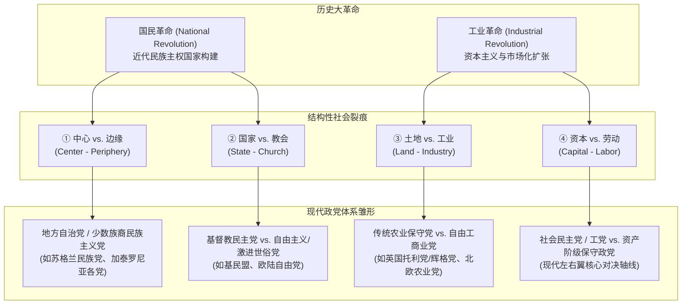
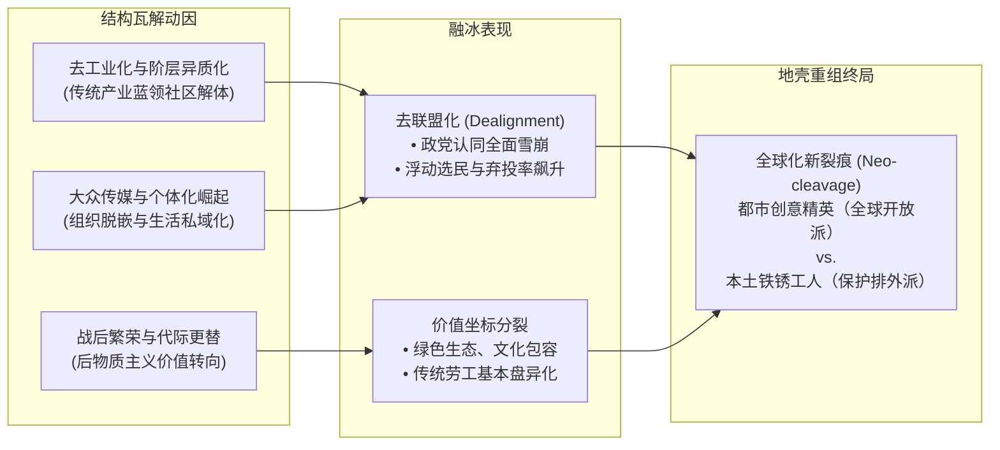

> **导语**  
> 为什么在一个世纪沧海桑田的巨变之后，当代西方主流政党的名称、对垒格局与利益代表，依然惊人地锚定在百年前的历史断层之上？我们常常将当下的政治撕裂与民粹主义狂潮归咎于社交媒体算法或某些激进政客的鼓动，但这往往遮蔽了更深沉的结构力量。政治社会学的经典洞见告诉我们：政党绝非议会殿堂里凭空设计的选举工具，而是历史大变革在社会肉体上切开深深伤口后长出的组织缝合线。基于西摩·马丁·利普塞特（Seymour Martin Lipset）与斯坦·罗坎（Stein Rokkan）的“裂痕理论”（Cleavage Theory）及“冰冻假说”（Freezing Hypothesis），本文试图拆解两次历史大革命所砍出的四大社会深渊，剖析由微观生活网络与宏观制度护城河构筑的百年“冷冻机”，并以一种历史地质学家的冷静视角，诊断当代民主在经历百年未遇的“解冻与地壳重组”时所面临的深层震荡。

---

## 一、历史疑案：跨越百年的“冷冻选民”

设想一个政治科学领域的思想实验。时间回到 1920 年代的欧洲，一位年轻的英国采煤工人刚刚依据普选权改革法案，平生第一次获得了走进投票站的权利。然而，在前往投票所的路上，某种科学幻想中的低温冷冻机制意外降临在他身上，将他的生命体征瞬间封存。

整整一个世纪过去了。当他在今天重新苏醒，穿过林立的玻璃幕墙与立交桥，面对一个经历了两次世界大战、人类登月、冷战解体与移动互联网全面重塑的世界时，他理应感到彻底的眩晕与错位。旧日帝国的疆域早已瓦解，蒸汽机与煤矿工业退居历史边缘，智能算法渗透至人类日常生活的每一个毛孔。在这个一切生产方式与生活节奏都面目全非的全新时代，百年前的任何经验似乎都已失效。

然而，当他依照指引再次步入当代的选民登记处，拿起那张全新的选票时，一幕足以令所有社会科学家深思的景象出现了：选票上那些最为醒目的政党名字——工党（Labour Party）、保守党（Conservative Party），抑或欧陆的社会民主党（SPD）与基督教民主联盟（CDU）——依然与一百年前如出一辙。不仅如此，这些政党在讲台上互相攻讦的核心词汇、所宣称捍卫的基本盘利益，诸如劳工权益、私有产权、资本税率、传统家庭伦理与世俗权力之争，竟依然是他当年在矿井酒馆和工会集会中耳熟能详的冲突母题。

这并非历史的偶然巧合，而是现代比较政治学与政治社会学中最著名的经验谜题之一。1967年，社会学家西摩·马丁·利普塞特与挪威政治学家斯坦·罗坎在里程碑式的合著《政党体系与选民对齐》（*Party Systems and Voter Alignments*）中，正式确立了著名的“冰冻假说”（Freezing Hypothesis）。他们通过详尽的历史跨国比较指出，20世纪60年代西欧各国的政党体系，在极高的置信度上精确反映了1920年代大众普选权确立时期的社会裂痕结构；除了少数边缘个案，各主要政党在长达半个世纪的风雨飘摇中展现出了惊人的制度稳定性。

> [!NOTE] 概念微解码：冰冻假说（Freezing Hypothesis）  
> 利普塞特与罗坎提出的政治学命题。指西方主要政党并非随选民偏好瞬时变动的“政治超市”，而是历史大变革创伤留下的“组织缝合线”。1920年代普选确立时沉淀下的阶级与宗教裂痕，通过代际家庭认同与制度护城河被长久封存，使政党格局跨越半个世纪展现出惊人的冷冻稳定性。

常识常常诱导我们将现代政党体系理解为一个“自由竞争的政治超市”：政治家是货架上的商品提供者，选民是精明自利的消费者，选举则是周期性的比价采购。选民在走进投票站前，理应审慎审视各党派最新的竞选纲领，挑选最能满足自己当下效用最大化的政策组合包。如果这种新古典理性选择假说完全成立，那么随着工业社会的消亡、传统产业工人阶级的急剧缩减以及宗教世俗化浪潮的冲刷，建立在旧时代生产关系之上的传统政党理应迅速破产退场，被更加多元、灵活的政治形态所取代。

然而，现实无情地击碎了这种线性的超市模型。旧时代的政治结构不仅没有随风而逝，反而在长达一个世纪的风雨飘摇中展现出惊人的韧性与反向塑造力。政党为何能够将近百年前的社会恩怨完好无损地“冷冻”至今？要解答这桩历史疑案，我们必须穿透议会政治的表象，深入到撕裂现代社会的几道原始地堑之中。

---

## 二、历史的伤口与缝合线：两次大革命与四大社会裂痕

在政治社会学的分析范式中，政党绝不是政客们为了竞逐权力而在议事厅里发明的纯粹技术工具。**政党是历史大变革在社会肉体上切割出深层伤口后，逐渐生长出来的组织缝合线。**

利普塞特与罗坎将这种不可调和、长周期存在且具备结构性身份认同的社会冲突界定为“裂痕”（Cleavage）。必须严格区分一般的政策偏好分歧与结构性社会裂痕：前者是流动的、可妥协的，例如税率应当设定为百分之二十还是百分之二十二；而后者则是一道将全体国民切割为截然对立阵营的深层断层，它深植于人们的社会身份、生活方式与历史创伤之中，具有极强的非妥协性与排他性。

西欧走向现代化的漫长历程，本质上被两次震古铄今的地质级巨震所重塑：国民革命（National Revolution）与工业革命（Industrial Revolution）。这两场革命如同两柄开山巨斧，在欧洲大陆的社会肌理上劈砍出四道难以愈合的宏大裂痕。

> [!TIP] 核心机制闭环：宏观裂痕生成逻辑  
> 近代国家构建（国民革命）激化了中央集权对地方自治、世俗政权对教会教权的剥夺，铸就了中心与边缘、国家与教会两大地缘文化裂痕；资本主义工业化（工业革命）则撕开了农业地租与工商业利润、资本支配与劳工生计之间的阶级深渊，孕育了土地与工业、资本与劳动两大经济断层；这两场历史巨震劈砍出的四道深渊，最终制度化为现代西方政党体系相互制衡的承重骨架。

国民革命的核心政治任务，是在封建割据与教权笼罩的废墟之上，建立统一、主权排他、法度均一的现代官僚制民族国家。这一强行推进的同质化进程，引爆了前现代社会最剧烈的两重冲突：中心对边缘的规训，以及世俗国家对教会特权的剥夺。

中心与边缘的裂痕（Center-Periphery Cleavage），源于现代国家建设中行政、财政与语言文化的全面集权。中央政府派遣征税官与征兵官，强行深入偏远行省与自治共同体，要求边缘地带放弃古老的自治习惯法与方言，服从中央法令和统一国语。这一进程在欧陆边缘激起了长达数个世纪的血腥抵抗。由此诞生的政党，并非为了争夺全国执政权，而是为了捍卫边缘社群独特的文化根基、语言特权与自治权利。从英国的苏格兰民族党、北爱尔兰民族主义派系，到西班牙的加泰罗尼亚与巴斯克民族党派，皆是这道帝国整合裂痕沉淀至今的制度活化石。

与地缘整合并行的是国家与教会的裂痕（State-Church Cleavage）。在传统秩序中，罗马天主教会与各地方教会垄断了从初生洗礼、婚姻缔结到临终安葬的人生全周期认证，更牢牢掌控着教育与意识形态解释权。然而，羽翼丰满的现代世俗国家要求将公民身份的定义权收归国有，强行剥夺教会的法权垄断，推行世俗化国民公立教育。这场争夺下一代灵魂管辖权的生死博弈，将欧洲无数普通家庭推入了撕裂深渊。每个星期天早晨，家长究竟该将孩子送往宣讲上帝戒律的教区神父那里，还是送往宣讲现代科学与国家效忠的公立学校？为了抵御世俗自由派政府的步步紧逼，天主教徒与保守宗教力量结成了庞大的政治动员同盟，这直接孕育了战后主导西欧政坛数十载的庞然大物——以德国基民盟、意大利天主教民主党为代表的基督教民主政党谱系。

如果说国民革命确立了国家的政治骨架，那么随后席卷而来的工业革命，则从根本上解构并重组了人类社会的物质肉身。机器大工业将千百年来依附于土地的人口剥离，汇聚成拥挤嘈杂的近代都市，由此催生出麦田与烟囱、资本与劳动的另外两道深不见底的裂痕。

土地与工业的裂痕（Land-Industry Cleavage），代表着传统封建农业贵族与新兴工业资产阶级之间的存亡博弈。最经典的缩影莫过于19世纪上半叶英国围绕《谷物法》（*Corn Laws*）长达数十年的国运之争。地主贵族要求维持严苛的农产品进口关税，以维系其庄园地租收益与乡村宗法特权；而曼彻斯特的棉纺资本家则组建反谷物法同盟，要求彻底拥抱自由贸易、进口廉价海外粮食，从而压低工人的基本生存生活成本，提升英国工业品的国际价格竞争力。这场麦田与烟囱、乡村与都市的利益对决，催生了早期代表农业寡头利益的保守主义政党（如英国托利党），以及代表自由贸易与商贸城市利益的自由派政党。在北欧诸国，这道裂痕甚至直接制度化为影响深远的农业党（Agrarian Parties）。

最后一道裂痕，则是现代人最为熟悉、开掘最深且动员能量最为磅礴的资本与劳动裂痕（Capital-Labor Cleavage）。随着工业资本主义进入垄断与规模化阶段，雇主与产业雇工之间的权力不对称性被推向了极限。这不再仅仅关乎每日多拿几便士工资的技术性谈判，而关乎人类在非人化流水线上的基本尊严、工作时长、工伤庇护以及社会财富增量的根本分配原则。这道裂痕在19世纪末期喷薄而出，最终催生了横扫欧洲的大众政党模式——英国工党、德国社会民主党、法国工人党以及各类社会主义与共产主义党派。与之相对，形形色色的资产阶级与中产阶级力量则在其对立面结成联合阵线。自此，“左翼对决右翼”的阶级经济裂痕，正式成为了贯穿整个20世纪现代代议民主的核心中轴。

---

## 三、百年不融：冷冻机内部的精密齿轮

当大众普选制在经历了漫长的罢工、示威与议会拉锯，最终于第一次世界大战结束后的 1920 年代全面尘埃落定时，一个戏剧性的制度临界点出现了：这台巨大的社会冷冻机彻底闭合上了它的安全阀。

令人惊叹的是，进入 20 世纪中叶以后，支撑上述四大裂痕的历史社会物质基础正在以前所未有的速度消解。传统农业贵族早已衰亡，教会对世俗事务的影响力持续式微，第三产业蓬勃兴起导致传统重工业蓝领阶层急剧萎缩，现代福利国家制度的建立更抚平了早期野蛮资本主义的绝对赤贫。然而，政党体系并没有随之崩解重组，反而将 1920 年代的政治版图完整封存。实证政治学研究揭示，政党冷冻机之所以百年不融，依赖于两枚在微观与宏观层面严密咬合的精密齿轮：微观层面的全景生活方式锁定，以及宏观层面的制度规则护城河。

在二十世纪中前期的成熟工业社会，支持某一个政党绝不是现代选民在大选前夕浏览几则新闻后做出的一次性算计，它是一种深度嵌入个体生命周期的全景式生活方式。以一名 1930 年代生活在德国鲁尔区或英国约克郡的煤矿工人为例，他在清晨阅读的是工会出资发行的工人报纸；下班后，他步入由工党支部直接运营的工人俱乐部和工人酒馆，与同阶层的弟兄们举杯畅饮；他的业余爱好是工党工会赞助的工人铜管乐队或业余足球队；当他在矿井遭遇塌方受伤，向他伸出援手提供救济金的是工党所属的职工互助会；他甚至在工会大厅迎娶同阶层的妻子，而在其行将就木之时，他的遗体将被安葬在由工会集资购得的产业工人专属公墓之中。

对于教会派系控制下的天主教选民而言，这一幕在教区维度同样上演得天衣无缝。政党通过其毛细血管般的附属组织，为个体提供了生命周期中至关重要的安全感、社交圈与阶层归属。政治学密歇根学派学者安格斯·坎贝尔（Angus Campbell）等人在 1960 年划时代名著《美国选民》（*The American Voter*）中精辟指出，政党认同（Party Identification）在本质上是一种在个体童年与青年期即被家庭、社区与阶级烙印的深层心理依附，它犹如一副带有特定滤镜的眼镜，决定了个体未来如何过滤、转译和解释复杂的政治现实。这种认同的坚固程度，与现代狂热的足球死忠球迷毫无二致。如果你出生在默西塞德郡一个世代支持利物浦队的家庭，即便该球队在某几个赛季连连惨败、教练战术屡屡失误，你可能会在酒馆里破口大骂，但在迎战宿敌曼联时，你依然会毫不犹豫地披上红色战袍。在冷冻机的微观机制下，选民的投票行为不是在采购政策，而是在确认与重申自身的社会身份。这种跨越代际的社会化遗传，使得政党获得了超脱于具体政策得失之外的强大抗震能力。

与微观的身份网络相呼应的，是执政精英在宏观维度精心构筑的制度规则护城河。当由旧裂痕塑造的大党成功入主议会、掌握立法国家机器后，理性的执政精英迅速利用公权力将自身垄断地位法制化。在实行单一选区相对多数决制的英美国家，迪韦尔热定律发挥着无情的制度绞杀效应，选民由于害怕浪费选票而不敢支持新兴小党，草根新党即便在全国斩获百分之十五的总选票，在单一选区赢者通吃的铁律下也很难获得实质性的国会席位。在实行比例代表制的欧陆国家，主流政党则联手设立了严苛的全国得票率门槛，规定只有突破百分之五甚至更高得票率的政党才能进入议会分得席位，名义上是为了防范碎片化危机，实质上构筑了排斥竞争者的制度高墙。与此同时，大党还推动了竞选公费补贴立法，将政党运作经费收编入国家财政预算，依据历史席位分配数以亿计的补贴资金，从而在物质资源上对缺乏根基的初创政党实施降维打击。

为了检验这种制度冷冻在现实中到底有多么坚固，政治学家斯特凡诺·巴托里尼（Stefano Bartolini）与彼得·梅尔（Peter Mair）在 1990 年出版了政治学量化实证研究的巅峰之作——《认同、竞争与选举可得性》（*Identity, Competition, and Electoral Availability*）。两位学者构建了一项涵盖西欧十三国、横跨 1885 年至 1985 年整整一个世纪、涉及三百多次全国大选的浩瀚数据库。

在分析选举波动时，巴托里尼与梅尔做出了极其关键的方法论创新：他们不仅计算了选举总波动率，更独创性地将其剥离为阵营内部波动与跨阵营净波动。检验政党冰冻体系是否真正瓦解的试金石，绝不是选民在温和工党与激进社会党之间的内部微调，而是选民是否真正发生了跨越阶级与宗教裂痕的“阵营叛变”——即工人阶级是否大规模转投保守党，或者天主教选民是否成建制地流向激进世俗左翼。量化检验给出的实证答案极具震撼力：在经历了大萧条、世界大战与战后重建的长达百年的历史颠簸中，西欧各国跨阵营净波动率的中位数始终维持在百分之三至百分之八的极低区间。绝大多数所谓的选举震荡，不过是选民在自身所属的社会身份堡垒内部进行的极微幅调整。数据以无可辩驳的力度宣告，欧洲选民的选择在长达百年的尺度上，被牢牢锁死在由历史深渊所筑就的制度与心理围栏之中。

> [!NOTE] 概念微解码：跨阵营净波动率（Net Cross-Block Volatility）  
> 巴托里尼与梅尔检验政党冰冻稳定性的核心指标。它剔除了选民在同属左翼或右翼内部（如温和工党流向激进社会党）的表层微调，专门度量选民是否真正发生跨越阶级或宗教护城河的“阵营叛变”。在长达百年的西欧大选中，该指标始终维持在百分之三至百分之八的极低区间，成为冷冻机坚不可摧的实证铁证。

---

## 四、融冰纪元：去联盟化、后物质主义与全球化新裂痕

然而，人类历史上没有任何一台机器能够实现永动，也没有任何制度冰层能够永不消融。当历史的年轮驶入 20 世纪 70 年代中后期，支撑这台冷冻机平稳运转了半个多世纪的底层社会组织基石，开始以不可逆的态势一片片锈蚀剥落。

> [!TIP] 核心机制闭环：融冰与新裂痕重构  
> 去工业化瓦解了传统阶级社区，大众传媒与后物质主义转向促使选民心理脱嵌，引爆了政党认同全面雪崩的去联盟化危机；旧阶级与宗教护城河的消融并未带来绝对均质的原子化社会，反而伴随全球产业链重组催生出受惠精英与铁锈工人之间剧烈对抗的全球化新裂痕；传统大党若无法弥合这一开放与保护之争，必将在政治地壳重组中面临基本盘瓦解与民粹海啸的残酷清洗。

冷冻机赖以生存的社会基石，是高度均质化、组织化的传统阶级社区。然而随着去工业化浪潮的降临，煤矿、钢铁厂与大型重工流水线成片关闭，取而代之的是松散、灵活且流动性极强的现代服务业与技术产业。传统的工会会员人数遭遇断崖式下跌，曾经庇护工人一生的组织化网络分崩离析。与此同时，电视机与随后的移动互联网彻底打破了传统教区和工人俱乐部的社交垄断，大众不再需要聚在工会酒馆里听取政党干事的宣讲，而是在私域化的客厅与屏幕前独立消费碎片化资讯。

其直接后果，便是政治学家拉塞尔·道尔顿（Russell J. Dalton）在《公民政治》（*Citizen Politics*）中所揭示的全球性趋势——去联盟化（Partisan Dealignment）。自 1970 年代以来，美、英、法、德等核心工业国中，自认属于某一特定政党坚实支持者的选民比例普遍下降了百分之二十至百分之三十五。大量新一代选民拒绝在精神上向任何传统大党归顺，转而成为政治市场上随风摆动的游荡选民。政党认同不再是代际相传的出厂配置，欧洲各国的选举波动指数开始不可逆地全面上扬，冷冻机的密封舱出现了纵深裂纹。

在组织网络瓦解的同时，选民的内心精神世界也爆发了一场根本性的地质位移。政治学巨擘罗纳德·英格尔哈特（Ronald Inglehart）在其 1977 年的奠基之作《无声的革命》（*The Silent Revolution*）中，提出了著名的后物质主义价值转向假说。基于个体最珍惜其成长环境中匮乏之物的稀缺假说，以及个体核心价值观在成年早期基本定型的社会化假说，英格尔哈特指出，二战后成长起来的西方年轻一代沐浴在长达三十年的空前和平、充沛物质与健全社会福利之中。对于他们而言，温饱与基本生存安全已不再是终日焦虑的稀缺物，因此他们的政治关注点开始向更高层次的马斯洛需求演进——环境保护、生活方式自由、性别平等、言论表达与少数族群权利，逐渐取代了老一辈人对最低工资与退休金保障的绝对偏执。

这场静悄悄的革命给予了传统政党体系致命的一击。传统中左翼大党陷入了极其痛苦的身份精神分裂：如果它们迎合大学校园与都市知识精英提出的激进环保与多元文化主张，就会直接疏离那些在文化观念上保守、在经济上唯恐失去工厂职位的传统蓝领工人基本盘；如果它们固守传统的阶级经济纲领，则会被崛起中的新兴力量——绿党与新左翼政党毫不留情地掏空选票后院。

面对政党格局的剧烈震荡，政治学界分化出两大解释流派。以拉塞尔·道尔顿和彼得·梅尔为代表的全面解冻论（Dealignment）认为，传统社会裂痕已经彻底碎裂，政党体系正在不可逆地走向空心化与原子化，选民变得极其不可预测，导致任何偶发性的政治煽动都能引发选举海啸。然而，以汉斯彼得·克里西（Hanspeter Kriesi）和赫伯特·基切尔特（Herbert Kitschelt）为代表的新裂痕学派（Realignment）则提出了更为深刻的假说。他们认为，社会系统并没有无序融化，而是旧的阶级与宗教裂痕褪色后，一道崭新的全球化大裂痕（Globalization Cleavage）已经成型并完成制度化。

这道全球化新裂痕横亘在两群命运迥异的国民之间。裂痕的一端，是受过高等教育、从事知识与金融生产、盘踞在超大都会的全球化获益者，他们从无边界的商品流动、资本扩张与文化多元中汲取红利，高举开放、环保与个人自由的旗帜；而裂痕的另一端，则是缺乏技能溢价、世代居住在内陆工业小镇、被去工业化彻底抛弃的全球化受害者，他们在全球产业链转移中沦为廉价替代品，在汹涌的移民浪潮中感受到切肤的文化窒息与身份贬损。

当英国曾经数十年雷打不动投给工党的英格兰北部传统矿区“红墙选区”在脱欧公投及随后的选举中成片沦陷、转投保守党；当美国五大湖铁锈带的工会产业工人成群结队地背弃民主党、将选票投给高呼关税壁垒与制造业回流的特朗普；当法国北部的旧工业衰败区化作极右翼国民联盟最坚不可摧的权力堡垒——我们目睹的绝非什么不可理喻的癫狂，而是旧冷冻层彻底融化之后，地壳深处由全球化新裂痕主导的大规模地质重组。

---

## 五、现实投影：当代民主病理学的地质学诊断

当我们完成了这场跨越百年的政治社会学溯源，再来凝视当下西方世界无处不在的政治极化、体制僵局与民粹主义狂飙，我们将获得一种截然不同的认知景深。

大众传媒与通俗评论往往倾向于将当下的民主衰退归咎于浅层的技术或道德因素：是社交媒体的推荐算法制造了信息茧房，是硅谷科技巨头在贩卖情绪极化，还是某些野心勃勃的民粹政客凭借煽动性的话术绑架了无辜的大众。然而，如果我们将视线退回到利普塞特与罗坎描绘的历史地堑之上，就会清醒地意识到，上述归因无异于将一场破坏力惊人的大地震，轻浮地归咎于地表晃动打碎的几只玻璃杯。算法与政客充其量只是震颤的放大器，真正的能量积聚在板块交界处的地幔深处。

政党体系在本质上是现代大规模民主政治不可或缺的制度减震器与政治发电机。一百年前，正是这台精密的冷冻机，将国民革命与工业革命中几乎要将文明彻底焚毁的阶级仇恨与文化流血，成功制度化为议会体制内有规则、可预期、能妥协的程序化博弈。没有这套成熟的政党减震过滤系统，大众民主早已在激烈的直接对抗中分崩离析。

而在过去三十年里，西方世界所经历的，恰恰是这台减震器的全面失灵。首先是中介功能的系统性丧失，工会、教区与紧密社区网络的消亡，使政党失去了与普通公民日常生活的活生生联系，传统政党彻底演化为依赖国家财政补贴、高居庙堂之上的专业竞选机器。其次是政治代表性的灾难性断裂，主流中左与中右政党在过去数十年里不约而同地拥抱新自由主义与全球化技术官僚共识，从而在实质上剥夺了底层受害者在建制体制内寻找代言人的可能性。最终导致的结果，是深层应力的终极释放——长期积压在社会深渊内部的创伤与怨恨，无法再通过传统的政党减震系统得到缓慢吸收与代际稀释，最终只能以最具破坏力的方式，借由反建制的民粹海啸冲垮脆弱的地表秩序。

面对这一切，单纯指责选民非理性或指责个别政客破坏规则是苍白无力的。正如一位严谨的地质学家不会对板块挤压引发的地震感到道德上的愤怒，一个清醒的政治科学观察者，也应当学会剥开喧嚣的舆论迷雾，洞悉深层制度与结构板块的推移逻辑。在这个充满不确定性的融冰纪元，旧的冷冻活化石正在分崩离析，而新的制度缝合线尚未生成。我们注定要在这场政治地壳的剧烈重组中，经历一段漫长而动荡的阵痛期。

---

## 六、延伸阅读与学术引注

为便于希望进一步系统探索政治社会学、政党起源与裂痕理论的读者，精选以下六部里程碑式的经典著作：

1. **Seymour Martin Lipset & Stein Rokkan (eds.), *Party Systems and Voter Alignments: Cross-National Perspectives* (Free Press, 1967).**  
全书的开篇长篇导论是现代比较政治学的奠基之作，系统提出了国民革命与工业革命砍出的四大裂痕，并正式确立了“冰冻假说”。任何研究政党起源与选举政治的学者都无法绕开的经典源头。

2. **Stefano Bartolini & Peter Mair, *Identity, Competition, and Electoral Availability: The Stabilisation of European Electorates, 1885–1985* (Cambridge University Press, 1990).**  
政治学经验实证计量的最高峰之一。作者耗时数年收集西欧十三国百年间三百多次大选的选票数据，通过精湛的阵营内部与跨阵营净流动率分解，为“冰冻假说”的有效性奠定了最牢不可破的实证基石。

3. **Angus Campbell, Philip E. Converse, Warren E. Miller, & Donald E. Stokes, *The American Voter* (John Wiley & Sons, 1960).**  
政治学“密歇根学派”的立派之作。首次系统阐述了“政党认同”（Party ID）作为一种代际传承的心理依附机制，成功击碎了将选民假定为纯自利经济人的机械超市模型。

4. **Ronald Inglehart, *The Silent Revolution: Changing Values and Political Styles Among Western Publics* (Princeton University Press, 1977).**  
后物质主义价值转向理论的奠基之作。利用世界价值观调查的大规模实证追踪，解释了战后繁荣一代如何从关注物质温饱转向关注自我表达与生态，从而拉开了冷冻机解冻的序幕。

5. **Russell J. Dalton, *Citizen Politics: Public Opinion and Parties in Advanced Industrial Democracies* (7th edition, CQ Press, 2018).**  
追踪去工业化时代西方选民与传统政党全面脱嵌的集大成著作，详实展现了英美德法等国选民认同滑坡、浮动选民激增的去联盟化实证图景。

6. **Hanspeter Kriesi et al., *West European Politics in the Age of Globalization* (Cambridge University Press, 2008).**  
“新裂痕学派”的标杆性著作。系统论证了全球化背景下“开放对决封闭”（Integration vs Demarcation）如何取代传统的阶级裂痕，成为重塑当代西方政治版图的全新主干断层。
